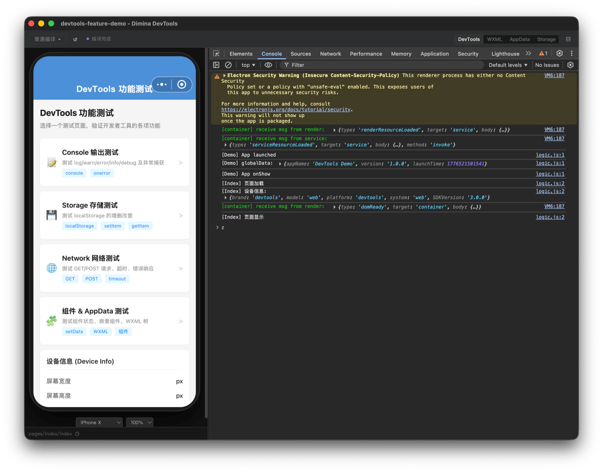

# Dimina Kit

[Dimina](https://github.com/didi/dimina) 小程序生态的开发者工具集。包含可独立使用的编译与预览工具包，以及基于 Electron 的模块化开发者工具。

## Packages

- [`@dimina-kit/devkit`](./packages/devkit) — Dimina 小程序编译与 H5 容器预览工具包，支持文件监听热更新，可独立使用或作为 devtools 的编译后端
- [`@dimina-kit/devtools`](./packages/devtools) — 基于 Electron 的模块化小程序开发者工具，提供模拟器、Chrome DevTools 面板以及 WXML / AppData / Storage / Console 等内置面板
- [`@dimina-kit/electron-deck`](./packages/electron-deck) — devtools host 集成框架：`electronDeck()` 单入口接管 Electron 装配、IPC、生命周期，供下游 host 与 dimina-devtools 自身共用

---

## Contributing

[Contributing](./CONTRIBUTING.md)

## License

[MIT](./LICENSE) © EchoTechFE and dimina-kit contributors
