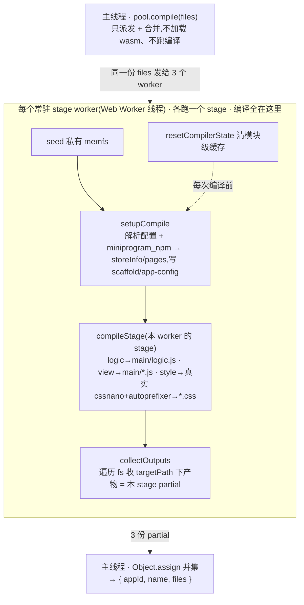

# @dimina-kit/compiler

把小程序源码编译成 dimina 产物的编译器——**不需要真实文件系统**，浏览器（Web Worker）和 Node 都能跑。

真正干活的是 `dimina` 子模块 fe workspace 里的 `@dimina/compiler`（通篇 `import fs from 'node:fs'` + `fs.xxx`）。本包把 `node:fs` 换成一个**无后端的转发 shim**，并且**自己不带任何 fs 实现**——由下游注入一个 `node:fs` 替代品（`compileMiniApp({ fs })`），compiler 一行不改就跑在你的 fs 上；项目目录（`workPath`）也由下游指定。最省事的 fs 就是 [memfs](https://github.com/streamich/memfs)。

**三种接入，按需选择：**

| 导出 | 用途 | 编排（并行/复用/合并）由谁做 |
| --- | --- | --- |
| `@dimina-kit/compiler/pool` | 浏览器**推荐**：编排好的编译池——默认 3 个常驻 stage worker（logic/view/style 各 1 个）、stage 级并行、realm 复用，一个 `compile()` 拿合并产物 | **本包** |
| `@dimina-kit/compiler/pool-node` | Node **推荐**（devtools/devkit 在用）：常驻 worker_threads 编译池 + dmcc `build()` 的 drop-in 替身，产物写真实磁盘，watch 热重编 1.6–4× | **本包** |
| `@dimina-kit/compiler` / `./browser` | 底层 core 接缝（`compileMiniApp` + `setupCompile`/`compileStage`/`collectOutputs`/`resetCompilerState`），自定义编排时用 | 下游 |

构建产出六个 bundle：

| 产物 | 运行环境 | 内容 |
| --- | --- | --- |
| `dist/compile-core.node.js` | Node | core；原生 esbuild/oxc 保持 external，运行时从 node_modules 解析 |
| `dist/pool.node.js` | Node 主线程 | Node 常驻编译池 `createNodeCompilerPool` + dmcc drop-in `build()` |
| `dist/stage-worker.node.js` | Node worker_threads | Node 常驻 stage worker（真实 fs） |
| `dist/compile-core.browser.js` | 浏览器 / Worker | core；wasm 工具链不打包，由宿主注入 |
| `dist/stage-worker.browser.js` | 浏览器 Worker | 常驻 stage worker（已内联 core + memfs），pool 用它做并行 |
| `dist/pool.browser.js` | 浏览器主线程 | 编排池 `createCompilerPool` |

## 架构

本包是**编译器与文件系统之间的一层适配**，再往上叠一层**编排**。真正的编译逻辑在 `dimina` 子模块的 `@dimina/compiler`，本包用一个**无后端的 fs 转发 shim** 把它每一次 `fs.xxx` 指向下游注入的 fs；`pool` 则在上面替下游管好 worker 池与并行——下游不再手写任何 worker/合并逻辑。

```
   下游（浏览器主线程）——只提供 createWorker + 工具链 URL + 源码
   ┌──────────────────────────────────────────────┐
   │ @dimina-kit/compiler/pool  createCompilerPool
   │  常驻 3 个 stage worker · 派发 · 并集合并 · realm 复用
   └───────────────┬───────────────┬──────────────┘
      stage worker │  stage worker │  stage worker   (dist/stage-worker.browser.js)
      logic        │  view         │  style
                   ▼               ▼
   ┌──────────────────────────────────────────────┐
   │ core: fs 实现 memfs（各 worker 私有,seed 源码）│
   │  src/shims/fs.js  无后端转发层 setFs/resetFs    │  每次 fs.xxx → 转到该 worker 的 memfs
   │  src/shims/*      oxc/esbuild/less… 浏览器替身  │  (wasm 工具链由宿主注入)
   └───────────────────────┬──────────────────────┘
                           │ 相对引用，不改子模块
                           ▼
   ┌──────────────────────────────────────────────┐
   │ dimina 子模块 · @dimina/compiler（实体编译逻辑）│  import fs from 'node:fs'
   └──────────────────────────────────────────────┘
```

## 快速接入：编排好的 pool（推荐）

**不用写任何 worker / coordinator / 合并逻辑。** 下游只提供三样宿主本就该管的东西：怎么起 worker、wasm 工具链在哪、源码。

```js
import { createCompilerPool } from '@dimina-kit/compiler/pool'

const pool = createCompilerPool({
  // 工厂函数:告诉 pool "要起一个 stage worker 时怎么起"。pool 会按 stage 数(默认 3:
  // logic/view/style)调用它多次,自己起满整个常驻 worker 池——你只负责这一句怎么写
  // (URL 如何解析取决于你的 bundler/托管)。
  createWorker: () => new Worker(new URL('@dimina-kit/compiler/stage-worker', import.meta.url), { type: 'module' }),
  // 一个 ESM 的 URL,worker 导入它来装 wasm 工具链(见下)
  toolchainSetupURL: '/toolchain-setup.js',
  onLog: (e) => console.warn(`[${e.stage}] ${e.message}`),   // 可选:拿到编译器诊断
})

await pool.warmup()                                 // 起 3 个常驻 stage worker;每个各自初始化一次 wasm,之后 compile 复用
const { appId, name, files } = await pool.compile({ files: source, workPath: '/project' })
// 入参 source 与返回 files 都是文本 map:{ 相对路径: 文本内容 };二进制资源不能靠返回 files,见「已知限制」
pool.dispose()                                       // 用完终止 worker
```

> **上面是最小接入代码,但浏览器环境有前置要求**(不满足会在别处报错,不像示例不完整):页面与 worker 开 COOP/COEP;`toolchainSetupURL` 能被 worker 运行时 import;esbuild browser ESM 与 `esbuild.wasm` 可作静态资源访问;npm 用户需显式装 `@oxc-parser/binding-wasm32-wasi`(`cpu:wasm32` 会被跳过);本包经 `file:`/link 引用时要配 Vite `server.fs.allow`。逐条见本节末尾的「故障排查」。

`compile()` 内部：三个常驻 worker **各跑一个完整 stage**（logic / view / style），各自 seed 私有 memfs、各自 `setupCompile` + 编译该 stage，产物取并集回传；跨 `compile()` 复用同一批 worker（每次编译前自动 `resetCompilerState`）。多个 `compile()` 会自动串行（共享常驻 realm 不能并发）。

> **连续触发（watch / 保存即编）要自己收敛：** pool 只保证串行，**不合并**——编译进行中再调 N 次 `compile()` 就排队 N 个全量编译，一个不少地跑完（正确性没问题，但白烧算力、垫高最后一次的延迟）。源码快照在**轮到该次编译派发时**才结构化克隆，不是调用时。触发侧应收敛成"至多一个在跑 + 一个待跑"（dirty-flag / debounce）。另外**整个应用共用一个 pool 单例**：多实例之间 realm 全隔离、不会互相污染，但结果没有跨实例顺序保证（旧编译可能晚于新编译返回，按到达顺序应用产物会拿旧盖新），还多付一份工具链常驻内存。

```ts
createCompilerPool(options: {
  createWorker: () => Worker      // 必填:起 stage worker 的工厂;pool 按 stage 数(默认 3)调用它多次
  toolchainSetupURL: string       // 必填:worker 导入它以装 __esbuildTransform / __oxcParseSync
  stages?: string[]               // 默认 ['logic','view','style']
  workPath?: string               // 默认 '/work'
  onLog?: (e: { level: 'log'|'warn'|'error', message: string, stage: string }) => void
                                  // 可选:worker 内编译器的诊断(缺组件/不支持 wx API/样式降级…)转发出来
}): {
  warmup(): Promise<void>
  compile(input: { files: Record<string,string>, workPath?: string })
    : Promise<{ appId: string, name: string, files: Record<string,string> }>
  dispose(): void
  stages: string[]
}
```

> **`createWorker` 两种写法都行**，取决于你怎么托管 `dist/stage-worker.browser.js`：
> - 用 bundler（Vite/Webpack…）按包解析：`() => new Worker(new URL('@dimina-kit/compiler/stage-worker', import.meta.url), { type: 'module' })`
> - 把 bundle 当静态资源托管：`() => new Worker('/stage-worker.browser.js', { type: 'module' })`
>
> **`compile` 是单参**：`{ files, workPath }` 一个对象——不要拆成两个参数、也别把 `workPath` 塞进别处。`onLog` 让你不碰 worker 就能拿到编译器那些原本只在 worker 内 `console.*` 的诊断（见「已知限制」）。

### toolchainSetupURL：宿主提供的 wasm 工具链

wasm 工具链（`esbuild-wasm` + `oxc-parser`）由**宿主**提供、本包不内置,原因有三:

1. **打不进 bundle。** esbuild-wasm 自带 Go 运行时、oxc-parser 是 wasm32-wasi 绑定(带 WASI worker + 相对 wasm fetch),用 bundler 打包都会损坏它们的运行时。所以本包的浏览器 bundle 只把它们别名到 shim,shim 转发到两个全局钩子。
2. **`.wasm` 大二进制得由宿主用 URL 托管**(esbuild.wasm 13MB、oxc 的 1.5MB),放哪个路径/CDN 是部署方的事。
3. **oxc 的解析只有宿主的 bundler 做得了**(`import('oxc-parser')` 要你的 bundler 去解析包 + 配套取 wasm)。

**版本一致性靠 `peerDependencies`。** 本包把 `esbuild-wasm`、`oxc-parser`(及其 wasm 绑定 `@oxc-parser/binding-wasm32-wasi`)声明为 **peerDependencies**,版本范围以本包为准——宿主安装本包时,npm/pnpm 会要求装上**兼容版本的单一份**,版本不符会告警。这样即便 .wasm 由宿主提供,版本仍与编译器对齐(AST/transform 不会因版本偏差产生错误产物)。⚠️ npm 会因 `cpu: wasm32` **跳过**那个 oxc 绑定(所以它标为 optional peer),浏览器场景需**显式**安装,见「故障排查」。

宿主用一个 ESM(`toolchainSetupURL` 指向它)在 stage worker warmup 时装好两个全局钩子。用本包助手 `@dimina-kit/compiler/toolchain`,这个模块就两行:

```js
// toolchain-setup.js —— 在 stage worker 里被 import(顶层 await)
import { installOxc, installEsbuildFromURL } from '@dimina-kit/compiler/toolchain'

installOxc(await import('oxc-parser'))                       // oxc 只能由你的 bundler 解析,所以传进来
await installEsbuildFromURL('/esbuild-browser.mjs', '/esbuild.wasm')   // 见下,已内置 Blob-URL 兜底
```

- **`installOxc(oxcModule)`**：把 `await import('oxc-parser')`（你的 bundler 才能解析它 + 取它的 wasm）装成 `__oxcParseSync`。
- **`installEsbuildFromURL(moduleURL, wasmURL)`**：从**静态资源 URL** 加载 esbuild-wasm 浏览器 ESM 并 `initialize`，装成 `__esbuildTransform`。

> **不是每个 worker 都会加载它：** style stage 的编译链路不调用这两个 wasm 钩子（CSS 工具链已内联，见下），所以 **style worker 在 warmup/compile 时会直接跳过 `import(toolchainSetupURL)`**——省掉一份 esbuild.wasm（~13MB）+ oxc 的加载与常驻内存。因此 **setup 模块只应安装这两个钩子**，不要在里面夹带编译所依赖的其他全局（style worker 看不到它们）；未知的自定义 stage 会保守照旧加载。
>
> **为什么是 URL 而不是 `import`：** esbuild-wasm 的浏览器构建通常只能当**静态资源**托管（把它的 Go 运行时打包会坏），而 bundler（Vite/Webpack/Rollup）**不允许** `import()` 一个静态资源目录里的 JS——`installEsbuildFromURL` 内部用 `fetch + Blob URL` 绕过 bundler 的模块图,替你把这个坑填了。若你的 esbuild-wasm 是 npm 依赖（bundler 能解析），也可以自己 `import * as esbuild from 'esbuild-wasm'` + `esbuild.initialize({ wasmURL })` + 设 `globalThis.__esbuildTransform`,不必用这个助手。
>
> **cross-origin isolation：** oxc 的 wasm32-wasi 绑定用到 SharedArrayBuffer，页面与 worker 需开 COOP/COEP（`Cross-Origin-Opener-Policy: same-origin` + `Cross-Origin-Embedder-Policy: require-corp`）。**CSS 工具链不用宿主管**：浏览器 bundle 已内联真实 `cssnano` + `autoprefixer`（autoprefixer pin 到 node 版 `compile-core.node.js` 运行时解析的同一份，当前 10.5.2），CSS 产物与 node 版逐字节一致。宿主只需提供 esbuild + oxc 两个 wasm 钩子。

参考实现与验证：`dimina-web-client` 的 `demo/toolchain-setup.js`（用上面两个助手）+ `demo/pool-test.html`，`npm run test:pool`（三项目产物与单线程逐结构一致，并演示 `onLog`）。

### 故障排查（接入环境）

pool 的 API 本身很小，但**浏览器/bundler/包管理器环境**有几个已知坑，报错往往指向别处、很难一眼看出是环境问题。按现象对号入座：

- **worker 请求 403 `outside of Vite serving allow list`（本包通过 `file:` / `pnpm link` / monorepo workspace 引用时）。** `new Worker(new URL('@dimina-kit/compiler/stage-worker', import.meta.url))` 是**运行时懒解析**,不走 Vite 依赖爬虫的预热白名单,而本包真实目录在你项目 root 之外 → 被 `server.fs.allow` 拦。把本包的**真实目录**（symlink resolve 后的 realpath,不是 node_modules 里的软链）加进 `server.fs.allow`：
  ```js
  // vite.config.js
  import fs from 'node:fs'; import path from 'node:path'
  const wcDir = fs.realpathSync(path.dirname(new URL('./node_modules/@dimina-kit/compiler/package.json', import.meta.url).pathname))
  export default defineConfig({ server: { fs: { allow: ['.', wcDir] } }, /* … */ })
  ```
  （静态 `import` 的 `pool` 能穿透是因为它被爬虫预热了——这个不对称很反直觉。）
- **`Failed to resolve import "@oxc-parser/binding-wasm32-wasi"`（用 npm、非 pnpm 时）。** `oxc-parser` 的 wasm binding 的 `package.json` 写了 `"cpu": "wasm32"`,**npm 会把它当成和 arm64/x64 互斥的真实架构而跳过安装**（optionalDependencies 平台过滤）。把它**显式**列进你自己的 `dependencies`（别指望 optional 自动装）：`npm i @oxc-parser/binding-wasm32-wasi`。pnpm 一般不会踩这个。
- **`toolchainSetupURL` 这个文件放哪。** 它被 worker 在运行时 `import(url)`。放 `public/`（静态资源、URL 稳定）最省心,dev/prod 都成立;若放 `src/` 用 bundler 处理,dev 能过但 `vite build` 需要把它声明为独立 entry（`build.rollupOptions.input`），否则生产构建不产出这个文件。
- **dev 模式下 3 条 `[vite] connecting…` 噪音**：3 个 stage worker 各建一条 HMR 连接,属正常,不是 worker 池重复初始化。

## Node 常驻 pool（`./pool-node`，devtools 在用）

Node 宿主（Electron devtools、CLI watch 服务等）用这个导出替代直接依赖 dmcc（`@dimina/compiler`）。它复刻 dmcc 的磁盘编译流程——主线程准备（配置/产物目录/npm 包）→ 3 个 stage worker 并发写共享 staging → 发布到 `outputDir/{appId}`——**产物与 dmcc 逐字节等价**（含 sourcemap 与自定义 `fileTypes`），区别只有一个：**worker 常驻**。

dmcc 每次 `build()` 都新建 3 个 worker_threads、编完销毁，每次重编都要重新加载 sass/postcss/esbuild/oxc 并重启 esbuild 服务进程；本 pool 只在第一次付这笔钱。实测 watch 热重编（`dimina/fe/example` 全部 5 个 demo）比 dmcc 快 1.6–4×（base 826→207ms、weui 2716→763ms）；冷启动略慢于 dmcc（3 个 worker 首次加载 bundle），"打开一次、保存无数次"的 devtools 场景下净赚。数据与方法见 [`docs/compile-fs-experiments.md`](./docs/compile-fs-experiments.md)。

**dmcc drop-in（默认导出）**——签名、返回值、日志面貌与 dmcc `build()` 一致，宿主原有的日志抓取（`✔ 输出编译产物` / `✖ <stage>` / `<workPath> 编译出错:`）不用改：

```js
import build from '@dimina-kit/compiler/pool-node'

// 首次调用起常驻 worker,后续调用(watch 重编)复用
const appInfo = await build(outputDir, workPath, true, { sourcemap: true, fileTypes })
// 成功 → { appId, name, path };失败 → undefined(错误已打到 stderr,同 dmcc)
```

**结构化用法（`createNodeCompilerPool`）**——要抛错误对象、显式回收 worker 时用：

```js
import { createNodeCompilerPool } from '@dimina-kit/compiler/pool-node'

const pool = createNodeCompilerPool()
try {
  const info = await pool.build(outputDir, workPath, true, { sourcemap: true })
} catch (e) {
  console.error(e.stage, e.message)   // e.stage: 'logic' | 'view' | 'style'
} finally {
  await pool.dispose()                // 结束常驻 worker;之后再 build 会 reject
}
```

几个值得知道的行为：

- **写真实磁盘**（不经 `files` map），二进制静态资源完好——不受浏览器 `collectOutputs` utf8 限制。
- **build 全局串行**：编译经过 dmcc 的进程级全局状态,所以同进程内所有 pool 实例的 build 共用一条串行链（并发调用会排队,不会互相污染产物）。
- **worker 崩溃自愈**：某个 stage worker 意外退出时,当次 build 以该 stage 的错误结束,下一次 build 自动补一个新 worker,不会永久挂起。
- 运行时依赖（sass/postcss/esbuild/oxc 等）已声明为本包 dependencies,宿主无需再装 `@dimina/compiler`。

## core 接缝（自定义编排）

pool 覆盖不了的场景才用 core。它导出 `compileMiniApp`（单线程整份编译）与四个可单独调用的**接缝**（node / browser 两个 bundle 都导出）：

```ts
compileMiniApp({ fs, workPath? }): Promise<{ appId, name, files }>    // = setup + 三 stage + collect 的单-realm 组合
setupCompile({ fs, workPath?, options? }): Promise<{ storeInfo, pages, appId, name, targetPath, workPath }>
compileStage({ stage, pages, storeInfo, fs }): Promise<void>          // stage: 'logic'|'view'|'style';产物写回 fs
collectOutputs({ fs, targetPath }): Record<string,string>            // 遍历 fs 收 targetPath 前缀下产物
resetCompilerState(): void                                           // 清模块级缓存;常驻 realm 复用前必调
STAGE_NAMES: string[]                                                // ['logic','view','style']
initToolchain(): Promise<void>                                       // no-op,占位保 API 稳定
```

| 接缝 | 职责 |
| --- | --- |
| `setupCompile({ fs, workPath, options, npmScanExclude })` | 解析 app 配置 + 构建 miniprogram_npm，**并往 fs 写 dist scaffold / `main/app-config.json`**；返回 `{ storeInfo, pages, appId, name, targetPath, workPath }`（`storeInfo` 可序列化跨 worker）。`options.fileTypes` 可自定义识别的文件类型（`compileMiniApp` 不透传 options）。miniprogram_npm 扫描只覆盖寻址可达空间：`node_modules`、点开头目录、staging 目录及 `npmScanExclude`（绝对路径数组，`pool-node` 会传入 publish `outputDir`）子树一律跳过——项目内的历史编译产物不会被当作 npm 输入回流 |
| `compileStage({ stage, pages, storeInfo, fs })` | 编译单个 stage，产物写回 fs；三 stage 各自写出的编译产物互不相交 |
| `collectOutputs({ fs, targetPath })` | 遍历 fs，把 `targetPath` 前缀下的**所有**产物读成 `{ 相对路径: 内容 }`（无 stage 过滤；含 setup 写的公共产物如 `app-config.json`） |
| `resetCompilerState()` | 清编译器模块级缓存；**常驻 realm/worker 复用前必调**，否则第二次编译被污染。它清缓存但**不**重新 seed fs |

> **stage 并行的正确姿势**（pool 内部就是这么做）：每个 stage worker **各自** `setupCompile`——因为它会往 fs 写 dist scaffold、`main/app-config.json`、`miniprogram_npm` 构建产物，只把 `storeInfo`/`pages` 发给 worker 而不重跑 setup 会丢这些文件。各 worker 用**私有 fs**，`collectOutputs` 收到的 partial 会含公共 setup 产物（内容相同，`Object.assign` 合并时相互覆盖无害）+ 本 stage 产物。**同一 realm 内不要并发调用接缝**（它们改全局 fs shim 与 compiler env）——并行必须落在不同 worker/realm；`compileMiniApp` 已内部串行化，接缝由调用方自己串行。view stage 不要再按页/分包细拆，必须让单个 view stage 看完整 `pages`（app 级模块去重才成立）。

**pool 的线程边界与编译流程**：主线程**只**派发 + 合并(不加载 wasm、不跑编译);`setupCompile → compileStage → collectOutputs` 整条流程都在**每个 stage worker(Web Worker 线程)内**跑。



> 用 **core 的 `compileMiniApp`**(单线程)时,是同一条 `setupCompile → 三个 stage → collectOutputs`,只是在**一个 realm、你调用它的那个线程**里跑完——你在主线程调就阻塞主线程,放进自己的 worker 就在那个 worker 跑。

### Node（用 memfs 当 fs）

memfs 完整实现了 fs 契约，`Volume.fromJSON(files, cwd)` 的第二参就是项目目录，键写相对路径即可：

```js
import { Volume, createFsFromVolume } from 'memfs'
import { compileMiniApp } from '@dimina-kit/compiler'

const workPath = '/project'
const vol = Volume.fromJSON({
  'app.json': JSON.stringify({ pages: ['pages/index/index'] }),
  'pages/index/index.js': 'Page({})',
  'pages/index/index.wxml': '<view>hello</view>',
  'pages/index/index.wxss': '.x{color:red}',
}, workPath)

const { appId, name, files } = await compileMiniApp({ fs: createFsFromVolume(vol), workPath })
```

Node 下原生 `esbuild` / `oxc-parser` 等保持 external，运行时需能从 node_modules 解析。仓库自带的 resolve hook 用法：`node --import ./scripts/register-kit.js your-script.js`（从 dimina-kit workspace 根兜底解析 `esbuild`/`sass`/`less`/`postcss`/`autoprefixer`/`cssnano`/`oxc-parser` 等）；生产宿主需自己保证这些可解析。

### 浏览器单线程（core 直接用）

只编一次、不需要并行时，直接用 core：宿主先把 wasm 工具链装成两个全局钩子（`esbuild` 必须先 `initialize`，`oxcParseSync` 来自 `oxc-parser`），再建 fs、调 `compileMiniApp`。

```js
import * as esbuild from 'esbuild-wasm'
import { parseSync as oxcParseSync } from 'oxc-parser'
import { Volume, createFsFromVolume } from 'memfs'
import { compileMiniApp } from '@dimina-kit/compiler/browser'

await esbuild.initialize({ wasmURL: '/esbuild.wasm', worker: true })
globalThis.__esbuildTransform = (input, options) => esbuild.transform(input, options)
globalThis.__oxcParseSync = oxcParseSync

const vol = Volume.fromJSON(files, '/project')   // files: { 相对路径: 源码文本 }
const result = await compileMiniApp({ fs: createFsFromVolume(vol), workPath: '/project' })
```

### OPFS 源分发（可选，零克隆）

pool 默认把源码 postMessage 给每个 worker（结构化克隆）。源码大、worker 多时，可用 OPFS（page 和 worker 共享的 per-origin fs）把源码写一次、给 worker 递目录 handle、worker 端读 handle → memfs——源码零克隆。

⚠️ **内置 pool / stage worker 只接收 `files` map,不接受 OPFS handle**——`pool.compile()` 固定 postMessage `files`。要真正零克隆,必须**自定义 worker 编排**:在你自己的 worker 里把 OPFS handle hydrate 成 `{ relPath: content }`,再调 **core 接缝**(`setupCompile`/`compileStage`/`collectOutputs`)。若仍用内置 pool,只能先把 OPFS 读回 `files` 再传给 `pool.compile()`,这一步**不是**零克隆。**本包不认识 OPFS,全部是下游的事。** 下面是自定义 worker 里读 handle 的两个片段:

```js
// —— 页面（下游）：源码写进 OPFS 一次(先清旧 token 目录),拿目录 handle 递给 worker ——
async function writeSourceToOpfs(token, files) {          // files: { 相对路径: 内容 }
  const root = await navigator.storage.getDirectory()
  await root.removeEntry(token, { recursive: true }).catch(() => {})   // 清旧,免 stale 文件残留
  const base = await root.getDirectoryHandle(token, { create: true })
  for (const rel of Object.keys(files)) {
    const parts = rel.split('/'); const name = parts.pop()
    let dir = base
    for (const seg of parts) dir = await dir.getDirectoryHandle(seg, { create: true })
    const fh = await dir.getFileHandle(name, { create: true })
    const w = await fh.createWritable(); await w.write(files[rel]); await w.close()
  }
  return base                                             // FileSystemDirectoryHandle
}
const srcDir = await writeSourceToOpfs('proj-1', files)
worker.postMessage({ srcDir })                            // handle 结构化克隆=零拷贝,源码不过 postMessage

// —— worker（下游）：读递来的 handle → { 相对路径: 内容 } → 交给 core / memfs ——
async function filesFromDir(dir, prefix = '') {           // 只读递来的 handle,不碰 navigator.storage
  const out = {}
  for await (const [name, h] of dir.entries()) {
    const rel = prefix ? `${prefix}/${name}` : name
    if (h.kind === 'directory') Object.assign(out, await filesFromDir(h, rel))
    else out[rel] = await (await h.getFile()).text()
  }
  return out
}
```

> OPFS 只是**源码分发的真相源**（一次写、多 worker 独立读、零克隆），编译仍在 memfs 上；不需要 SharedArrayBuffer（但上面 oxc wasm 钩子仍需 COOP/COEP）。示例只处理**文本** fixture——真实图片/svg 资源要保留二进制（见「已知限制」）。

## fs 契约与约定

> 这套 fs 契约只针对 **core / 自定义编排**(你自己注入 fs 的场景)。**用内置 pool 时下游不接触 fs**——只传 `{ files, workPath }`,stage worker 内部会为每次编译建私有 memfs 承载 `files`。

- **core 不带 fs 实现。** `src/shims/fs.js` 是转发层，`compileMiniApp({ fs })` / 接缝在一次编译期间把 compiler 的 `fs.xxx` 指向你的 fs（`setFs`/`resetFs`）；不注入则任何 `fs.*` 调用直接抛错。
- **项目目录由下游定。** `workPath`（默认 `/work`）就是你 seed 源码的目录。
- **产物写回同一个 fs。** compiler `writeFileSync` 把产物写进你的 fs，所以传入的 fs 必须**可写**。产物目录 `targetPath` 见下。
- **编译会修改你的 fs。** 缺 `project.config.json`/appid 时，会往 `${workPath}/project.config.json` 写入一个 appid（`dmlocalpreview`）——传入的 fs 不能当成只读快照。
- **同步契约，不需要 `fs.promises`。** `DiminaFs` 只要求同步方法（`existsSync`/`readFileSync`/`readdirSync{withFileTypes}`/`statSync`/`writeFileSync`/`mkdirSync{recursive}`/`copyFileSync`/`rmSync`）——编译路径不碰 async fs。纯异步后端（只有 Promise 版读写）没法当 fs 用。

`@dimina/compiler` 自己并不知道 fs 被换掉了。

## 已知限制与错误处理

- **`files` 目前只可靠承载文本产物。** `collectOutputs` 用 utf8 读回 `targetPath` 下所有产物；图片/svg 等二进制静态资源（compiler `copyFileSync` 到 `main/static`）会被按 utf8 读坏。纯文本项目/fixture 无碍；要用真实二进制资源，需下游自行从注入的 fs 读 `main/static` 的字节，别依赖返回的 `files`。
- **`targetPath` 来自环境。** compiler 产物目录取 `process.env.TARGET_PATH`，否则 `os.tmpdir()/dimina-fe-dist-<时间戳>`（浏览器 os shim 下通常 `/tmp/...`）。`setupCompile` 会先 `rmSync` 清空它——别把 `TARGET_PATH` 指到源码目录或共享目录。用 `setupCompile` 返回的 `targetPath` 喂 `collectOutputs`。
- **不是全 fail-fast。** 缺 fs 方法、坏 appid、坏 `project.config.json`、miniprogram_npm 构建失败会 **reject**；但**样式预处理器失败（如当前浏览器构建暂不支持 `.less`）会被吞掉、降级用原始 CSS**，PostCSS 解析失败返回空串，资源拷贝失败只 `console.log`，logic esbuild 压缩失败回退未压缩代码。**用 pool 时把这些拿出来的办法是 `createCompilerPool({ onLog })`**——它把 worker 内编译器的 `console.*` 诊断（带 stage 标签）转发给你；也可在产物为空/缺失时二次校验。

## 依赖前置

编译器实体源码在 `dimina` 子模块里，dart-sass 等在其 fe workspace。构建前确保子模块已初始化、依赖已装：

```bash
git submodule update --init dimina
pnpm install
```

## 构建

```bash
pnpm --filter @dimina-kit/compiler build          # node + 三个 browser bundle
pnpm --filter @dimina-kit/compiler build:browser  # 仅 browser(core + stage-worker + pool)
pnpm --filter @dimina-kit/compiler build:node     # 仅 node
```

## 测试

测试里用 memfs 扮演「下游 fs」：

```bash
pnpm --filter @dimina-kit/compiler test:node        # 编译 base 示例、校验产物
pnpm --filter @dimina-kit/compiler test:appid       # appId fallback 守卫
pnpm --filter @dimina-kit/compiler test:decompose   # stage 接缝各自独立、产物互不相交
pnpm --filter @dimina-kit/compiler test:realm-reuse # resetCompilerState 后复用 realm 与全新 realm 一致
pnpm --filter @dimina-kit/compiler test:pool-node   # Node pool 与 dmcc 冷+热逐字节等价(含 sourcemap 与返回值)
```

`pool` 的浏览器端到端验证在 `dimina-web-client`（`npm run test:pool`，Playwright 驱动，产物与单线程逐结构一致）。`pool-node` 的宿主端验证在 `@dimina-kit/devkit` 测试套件（真实 fork + `openProject`）。

## 结构

- `src/compile-core.js` — 内联编排 dmcc 的 compile 函数；导出 `compileMiniApp` 与四个接缝 `setupCompile`/`compileStage`/`collectOutputs`/`resetCompilerState`（+ `STAGE_NAMES`）。相对路径引用 `dimina` 子模块的 compiler 源码。
- `src/browser-entry.js` — 浏览器 core 入口，导出上述接缝 + `initToolchain()`（no-op）。
- `src/pool.js` — **浏览器编排池** `createCompilerPool`：常驻 stage worker 池、并行派发、并集合并、realm 复用；不含编译器（轻量，~3KB）。
- `src/stage-worker.js` — **包自带的常驻 stage worker**（内联 core + memfs）：warmup 时 `import(toolchainSetupURL)` 装 wasm 钩子，每次编译 seed 私有 memfs → `setupCompile` + 指定 stage → `collectOutputs`；并把编译器 `console.*` 诊断转发给 pool 的 `onLog`。
- `src/pool-node.js` — **Node 编排池** `createNodeCompilerPool` + dmcc drop-in 默认导出 `build()`：常驻 worker_threads、真实磁盘、全局 build 串行、死 worker 懒复活。
- `src/stage-worker-node.js` — Node 常驻 stage worker：恢复 storeInfo → `runStage(stage, { sourcemap })`，写共享 staging 目录。
- `src/toolchain.js` — 写 `toolchainSetupURL` 模块的可选助手（`installOxc` / `installEsbuildFromURL`，后者内置 esbuild-wasm 静态资源的 Blob-URL 兜底）。导出为 `@dimina-kit/compiler/toolchain`。
- `src/shims/fs.js` — **无后端的 fs 转发层**（`setFs`/`resetFs`/`getFs`）；compiler 所有 `fs.xxx` 走它，未注入即抛错。
- `src/shims/*` — 其余 node 内置与原生依赖的浏览器替身（oxc/esbuild/less/`os.homedir`/…）。
- `scripts/build-compiler.js` — esbuild 打包。onLoad 给 logic/view/style-compiler 与 utils 追加 `__reset*` 导出（喂 `resetCompilerState`，不改子模块源码）；浏览器分支内联真实 `cssnano`+`autoprefixer`（autoprefixer pin 到 node 运行时解析的同一份，避免 esbuild 解析到多加 `-ms-` 前缀的另一版本）；browser 模式产出 core / stage-worker / pool 三个 bundle。
- `scripts/{register-kit,kit-resolve-hook}.js` — node 用的 ESM resolve hook（默认解析优先、从 dimina-kit workspace 根兜底解析 bare 依赖）。
