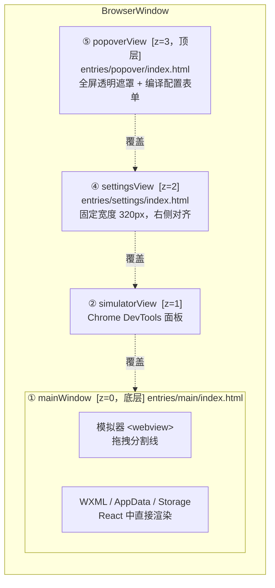
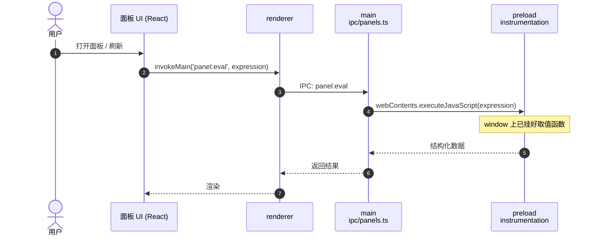

# Dimina DevTools

基于 Electron 的小程序模块化开发者工具。提供模拟器、Chrome DevTools 面板、WXML/AppData/Storage 面板、编译配置等功能。

所有功能拆分为独立可导入的模块，第三方可按需组装，最大程度支持自定义。

---

## 三种接入方式

| 级别         | 入口                   | 控制力             | 适合场景             |
| ------------ | ---------------------- | ------------------ | -------------------- |
| **零配置**   | `launch()`             | 无                 | 直接运行             |
| **配置驱动** | `createWorkbenchApp()` | 开关模块、选择面板 | 简单定制             |
| **模块组装** | 单独 import 各模块     | 完全控制           | 深度定制、自定义 IPC |

### 零配置

```typescript
import { launch } from '@dimina-kit/devtools/launch'
launch()
```

### 配置驱动

```typescript
import { createWorkbenchApp } from '@dimina-kit/devtools/app'

createWorkbenchApp({
  appName: 'My DevTools',
  adapter: myAdapter,
  panels: ['console', 'storage'], // 只显示这两个内置面板
  modules: { settings: false }, // 禁用设置面板模块
  window: { width: 1400, height: 900 },
}).start()
```

### 宿主扩展（推荐用于品牌化 / 自定义功能）

基于 `createWorkbenchApp()` 的配置驱动模式，通过 hooks 注入宿主逻辑，无需手动组装模块：

```typescript
import { suppressEpipe } from '@dimina-kit/devtools/bootstrap'
import { createWorkbenchApp } from '@dimina-kit/devtools/app'
import { rendererDir } from '@dimina-kit/devtools/paths'
import { ipcMain, Menu } from 'electron'

suppressEpipe()

createWorkbenchApp({
  appName: '我的开发工具',
  adapter: myAdapter,
  preloadPath: '/path/to/my-preload.js',
  rendererDir,
  apiNamespaces: ['my'],
  brandingProvider: () => ({ appName: '我的开发工具' }),
  toolbarActions: () => [
    { id: 'deploy', label: '发布' },
    { id: 'preview', label: '预览' },
  ],
  icon: '/path/to/icon.png',
  menuBuilder: (mainWindow, ctx) => {
    // 自定义菜单，ctx 是 WorkbenchContext
    Menu.setApplicationMenu(/* ... */)
  },
  onSetup: ({ mainWindow, context }) => {
    // 注册自定义 IPC handler
    ipcMain.handle('toolbar:action:deploy', async () => {
      // 通过 service 访问状态：context.workspace.getProjectPath()、context.workspace.hasActiveSession()
    })
  },
  onBeforeClose: ({ context }) => {
    // 窗口关闭前的自定义清理逻辑
    // session 关闭和 view 销毁由框架自动处理
  },
}).start()
```

### 模块组装（仅在需要完全控制时使用）

```typescript
import { app, globalShortcut } from 'electron'
import path from 'path'
import { createMainWindow } from '@dimina-kit/devtools/create-window'
import { createWorkbenchContext } from '@dimina-kit/devtools/context'
import { registerSimulatorIpc } from '@dimina-kit/devtools/ipc-simulator'
import { registerPanelsIpc } from '@dimina-kit/devtools/ipc-panels'
import { registerToolbarIpc } from '@dimina-kit/devtools/ipc-toolbar'
import { registerPopoverIpc } from '@dimina-kit/devtools/ipc-popover'
import { registerProjectsIpc } from '@dimina-kit/devtools/ipc-projects'
import { registerSessionIpc } from '@dimina-kit/devtools/ipc-session'
// registerSettingsIpc 不需要，不导入
import { rendererDir, defaultPreloadPath } from '@dimina-kit/devtools/paths'

app.whenReady().then(() => {
  const mainWindow = createMainWindow({
    title: 'My DevTools',
    indexHtml: path.join(rendererDir, 'index.html'),
  })

  const ctx = createWorkbenchContext({
    mainWindow,
    adapter: myAdapter,
    preloadPath: defaultPreloadPath,
    rendererDir,
  })

  registerProjectsIpc(ctx)
  registerSessionIpc(ctx)
  registerSimulatorIpc(ctx)
  registerPanelsIpc(ctx)
  registerToolbarIpc(ctx)
  registerPopoverIpc(ctx)

  // 添加自定义 IPC — 通过 ctx.workspace 访问会话状态
  ipcMain.handle('my:action', () => {
    console.log('current project:', ctx.workspace.getProjectPath())
  })

  mainWindow.on('resize', () => ctx.views.repositionAll())
  mainWindow.on('close', async (e) => {
    if (ctx.workspace.hasActiveSession()) {
      e.preventDefault()
      await ctx.workspace.closeProject()
      ctx.notify.windowNavigateBack()
    }
  })
})

app.on('window-all-closed', () => {
  globalShortcut.unregisterAll()
  app.quit()
})
```

---

## 目录结构

```
src/
  shared/
    types.ts                             # 跨层共享类型
    constants.ts                         # 跨层共享常量
    ipc-channels.ts                      # IPC 频道名称常量
  main/
    api.ts                               # 公共 API 聚合入口（package main）
    app/
      launch.ts                          # 零配置入口
      app.ts                             # createWorkbenchApp 工厂
      bootstrap.ts                       # suppressEpipe / setupCdpPort
      lifecycle.ts                       # Electron app 生命周期注册
    windows/
      main-window/                       # 主窗口创建 + 事件接线
      settings-window/                   # 独立设置窗口
    ipc/                                 # 只做 handler 注册，不写业务
      index.ts                           # 聚合 register 函数导出
      simulator.ts                       # simulator attach/detach/resize
      panels.ts                          # panel:list / panel:eval / selectSimulator
      toolbar.ts                         # 品牌 / 工具栏配置
      popover.ts                         # 编译配置弹窗
      settings.ts                        # 项目设置 + workbench 设置
      projects.ts                        # 项目列表管理
      session.ts                         # 编译会话 open/close/status
    services/                            # 按业务领域分，真正的业务能力
      settings/                          # 用户级 workbench 设置读写 + 主题应用
      projects/                          # 项目列表 CRUD（持久化）
      layout/                            # 布局常量 + bounds 计算
      mcp/                               # MCP server
      automation/                        # 自动化 WebSocket 服务
      simulator/                         # simulator dir / referer
      workbench-context.ts               # 共享状态类型 + 工厂 + 辅助函数
      default-adapter.ts                 # 默认 CompilationAdapter
    menu/                                # 应用菜单
    utils/paths.ts                       # rendererDir / defaultPreloadPath

  preload/                               # 按注入目标分
    windows/                             # contextBridge 类型 preload
      main.ts                            # 主窗口 preload，可组合导出 install*Instrumentation
      simulator.ts                       # simulator webview 的默认 preload
    shared/                              # preload 之间共享
      api-compat.ts                      # setupApiCompatHook
      constants.ts
      types.ts
    instrumentation/                     # 注入到小程序 runtime 的探针
      console.ts                         # 控制台拦截
      storage.ts                         # localStorage 拦截
      app-data.ts                        # Worker setData 拦截
      wxml.ts                            # Vue 组件树提取
    runtime/
      bridge.ts                          # installSimulatorBridge
      host.ts

  renderer/
    entries/                             # 各窗口 HTML + React 挂载点
      main/ popover/ settings/ workbench-settings/
    modules/                             # 先按窗口分，再按区域
      main/
        app/                             # 主窗口 App 根
        features/                        # 主窗口内的业务区域
          project-runtime/               # 项目视图 + 工具栏 + 右侧面板切换
          right-panel/                   # WXML / AppData / Storage 面板
      popover/ settings/ workbench-settings/
    shared/
      components/                        # UI 组件（ui / layout / json-viewer / ...）
      lib/                               # ipc / simulator-url / utils / ...

  simulator/                             # 小程序容器运行时（独立 webview 入口）
    simulator.html
    main.tsx
    simulator-api.ts
    simulator-api-storage.ts
    simulator-api-device.ts
    simulator-api-media.ts
    simulator-api-fs.ts
```

渲染层使用 **React + shadcn/ui + Tailwind CSS**，通过 Vite 构建，产物输出到 `dist/renderer/`。

---

## 配置参考

### WorkbenchConfig

`launch()` 和 `createWorkbenchApp()` 共用：

| 字段               | 类型                    | 默认值              | 说明                               |
| ------------------ | ----------------------- | ------------------- | ---------------------------------- |
| `appName`          | `string`                | `'Dimina DevTools'` | 窗口标题                           |
| `adapter`          | `CompilationAdapter`    | 内置                | 项目编译适配器                     |
| `panels`           | `BuiltinPanelId[]`      | 全部四个            | 显示哪些内置面板                   |
| `preloadPath`      | `string`                | 内置                | 自定义 preload 脚本路径            |
| `apiNamespaces`    | `string[]`              | `[]`                | 自定义 API 命名空间（如 `['qd']`） |
| `brandingProvider` | `() => { appName }`     | —                   | 品牌信息 provider                  |
| `toolbarActions`   | `() => ToolbarAction[]` | —                   | 工具栏动作按钮 provider            |

### WorkbenchAppConfig（扩展 WorkbenchConfig）

`createWorkbenchApp()` 额外支持：

| 字段            | 类型                                        | 默认值      | 说明                                              |
| --------------- | ------------------------------------------- | ----------- | ------------------------------------------------- |
| `modules`       | `Partial<Record<BuiltinModuleId, boolean>>` | 全部 `true` | 开关 IPC 模块组                                   |
| `rendererDir`   | `string`                                    | 内置        | 自定义 renderer HTML 目录                         |
| `icon`          | `string`                                    | —           | 窗口/任务栏图标路径（macOS 使用 app bundle 图标） |
| `menuBuilder`   | `(mainWindow, context) => void`             | 内置菜单    | 自定义菜单构建器                                  |
| `onSetup`       | `(instance) => void`                        | —           | 窗口和 context 创建后的回调，用于注册自定义 IPC   |
| `onBeforeClose` | `(instance) => void`                        | —           | 窗口关闭前的回调，session 关闭由框架自动处理      |
| `window`        | `WorkbenchWindowConfig`                     | —           | 窗口尺寸覆盖                                      |

### 内置面板 ID

`'wxml'` \| `'console'` \| `'appdata'` \| `'storage'`

### 内置模块 ID

`'projects'` \| `'session'` \| `'simulator'` \| `'popover'` \| `'settings'`

---

## CompilationAdapter

实现此接口接入自定义构建流程：

```typescript
import type { CompilationAdapter } from '@dimina-kit/devtools/types'

const myAdapter: CompilationAdapter = {
  async openProject(opts) {
    // opts.projectPath  — 小程序项目绝对路径
    // opts.sourcemap    — 是否生成 sourcemap
    // opts.onRebuild    — 热更新回调
    // opts.onBuildError — 构建错误回调
    return {
      port: 3000,
      appInfo: { appName: 'my-app' },
      close: async () => {},
    }
  },
}
```

---

## Preload Instrumentation

模拟器 webview 注入 preload 脚本在全局安装 instrumentation。内置 preload（`preload/windows/simulator.ts`）组装了以下模块：

| Instrumentation                           | 捕获内容                                        |
| ----------------------------------------- | ----------------------------------------------- |
| Console (`installConsoleInstrumentation`) | `console.*`、`window.onerror`、未捕获 rejection |
| Storage (`installStorageInstrumentation`) | `localStorage.setItem/removeItem`、全量快照     |
| AppData (`installAppDataInstrumentation`) | Worker `type='u'` 消息、setData 调用            |
| WXML (`installWxmlInstrumentation`)       | Vue 组件树提取、MutationObserver 自动更新       |

所有 install\* 函数从 `@dimina-kit/devtools/preload` 统一导出，调用后通过 `installSimulatorBridge` 暴露的内部桥接通道把数据推到宿主。面板打开时调用 `panel:eval` 通过 `executeJavaScript` 拉取当前状态。

### 自定义 Preload

按需组合或追加自定义逻辑（`src/preload/windows/simulator.ts` 作为参考）：

```typescript
// my-preload.ts
import {
  installSimulatorBridge,
  installConsoleInstrumentation,
  installStorageInstrumentation,
  setupApiCompatHook,
} from '@dimina-kit/devtools/preload'
// 不需要 WXML/AppData，不导入

setupApiCompatHook()
installSimulatorBridge()
installConsoleInstrumentation()
installStorageInstrumentation()

// 自定义 hook
window.addEventListener('error', (e) => {
  console.error('[my-preload]', e.message)
})
```

编译后传入路径：

```typescript
launch({ preloadPath: '/absolute/path/to/my-preload.js' })
```

---

## 模块导出一览

### Stable public exports

`@dimina-kit/devtools` 的稳定入口，签名遵循 semver；新版本不会做破坏性改动（除非 major bump）。

```
@dimina-kit/devtools                        launch, createWorkbenchApp, buildDefaultMenu,
                                       openSettingsWindow, suppressEpipe, setupCdpPort,
                                       createWorkbenchContext, createMainWindow,
                                       createViewManager, registerAppIpc, ...
                                       （api.ts 聚合了所有公共 API；优先从根入口导入）
@dimina-kit/devtools/launch                 launch(config?), buildDefaultMenu, openSettingsWindow
@dimina-kit/devtools/app                    createWorkbenchApp(config?)
@dimina-kit/devtools/types                  TypeScript 类型定义
@dimina-kit/devtools/bootstrap              suppressEpipe(), setupCdpPort()
@dimina-kit/devtools/paths                  rendererDir, defaultPreloadPath, simulatorDir,
                                       getRendererDir, getPreloadDir, getRendererHtml
@dimina-kit/devtools/preload                installConsoleInstrumentation,
                                       installStorageInstrumentation,
                                       installAppDataInstrumentation, sendAllAppData,
                                       installWxmlInstrumentation, sendWxmlTree,
                                       setupWxmlObserver, installSimulatorBridge,
                                       setupApiCompatHook
```

### Experimental exports (v0.x — signatures may change in minor versions)

下列子路径主要用于"模块组装"等深度定制场景。在 0.x 阶段，函数签名和模块边界可能在 minor 版本之间调整；如果你不需要逐模块组装，请优先使用上方的 stable 入口或根 barrel。

```
@dimina-kit/devtools/context                createWorkbenchContext(opts),
                                       hasBuiltinPanel(ctx, panelId), getDefaultTab(ctx)
@dimina-kit/devtools/create-window          createMainWindow(opts)
@dimina-kit/devtools/ipc-simulator          registerSimulatorIpc(ctx)
@dimina-kit/devtools/ipc-panels             registerPanelsIpc(ctx)
@dimina-kit/devtools/ipc-toolbar            registerToolbarIpc(ctx)
@dimina-kit/devtools/ipc-popover            registerPopoverIpc(ctx)
@dimina-kit/devtools/ipc-settings           registerSettingsIpc(ctx)
@dimina-kit/devtools/ipc-projects           registerProjectsIpc(ctx)
@dimina-kit/devtools/ipc-session            registerSessionIpc(ctx), sendStatus(ctx, status, msg)
@dimina-kit/devtools/workbench-settings     loadWorkbenchSettings(), saveWorkbenchSettings(), applyTheme()
```

> 注：以下子路径在过去版本曾被导出，已收敛到根 barrel 或内部实现，请改从 `@dimina-kit/devtools` 根入口导入（`createViewManager`、`registerAppIpc`、`simulatorDir`、`Project` 等类型）：
>
> - `@dimina-kit/devtools/view-manager` → `import { createViewManager, type ViewManager } from '@dimina-kit/devtools'`
> - `@dimina-kit/devtools/ipc-app` → `import { registerAppIpc } from '@dimina-kit/devtools'`
> - `@dimina-kit/devtools/projects` → 通过 `ctx.workspace.listProjects()` 等服务方法访问；`Project` 类型从 `@dimina-kit/devtools` 根入口导入
> - `@dimina-kit/devtools/layout` → 内部布局细节，不再作为公共 API 暴露
> - `@dimina-kit/devtools/simulator-dir` → `import { simulatorDir } from '@dimina-kit/devtools/paths'`

---

## WorkbenchContext

`WorkbenchContext` 是所有 IPC 模块共享的状态入口。配置字段直接暴露，运行时状态通过三个 service 访问：

```typescript
interface WorkbenchContext {
  mainWindow: BrowserWindow
  adapter: CompilationAdapter
  preloadPath: string
  rendererDir: string
  panels: string[]
  apiNamespaces: string[]
  appName: string
  toolbarActions?: () => Promise<ToolbarAction[]> | ToolbarAction[]
  brandingProvider?: () => Promise<{ appName: string }> | { appName: string }
  workbenchSettingsWindow: BrowserWindow | null

  // ── Services（运行时状态封装在内部，通过方法访问）──
  views: ViewManager // ctx.views.repositionAll(), ctx.views.getSimulatorWebContentsId(), ...
  notify: RendererNotifier // ctx.notify.projectStatus(), ctx.notify.windowNavigateBack(), ...
  workspace: WorkspaceService // ctx.workspace.getProjectPath(), ctx.workspace.hasActiveSession(), ...
}
```

会话和视图状态不再作为 ctx 的直接字段暴露，而是封装在对应 service 的私有闭包中：

| 旧写法                       | 新写法                                                            |
| ---------------------------- | ----------------------------------------------------------------- |
| `ctx.currentProjectPath`     | `ctx.workspace.getProjectPath()`                                  |
| `ctx.currentSession`         | `ctx.workspace.getSession()` / `ctx.workspace.hasActiveSession()` |
| `ctx.simulatorWebContentsId` | `ctx.views.getSimulatorWebContentsId()`                           |
| `ctx.devToolsViewAdded`      | `ctx.views.isSimulatorAdded()`                                    |
| `ctx.lastSimWidth`           | `ctx.views.getLastSimWidth()`                                     |

---

## 整体架构

### 视图层级（从上到下 = 从顶层到底层）



层级由 `addChildView()` 调用顺序决定，后添加的 View 在上层。内置面板（WXML / AppData / Storage）不使用独立 WebContentsView，直接在主窗口 React 中渲染；只有 Chrome DevTools / settings / popover 需要 View 覆盖。

### 数据流

内置面板采用**拉取式**数据流，避免长期订阅：



Console 输出等推送场景仍由 preload 通过 `installSimulatorBridge()` 经由 webview ipcRenderer 送至宿主，再由 renderer 分发到相应面板。

---

## IPC 通信总览

| 频道                              | 方向  | 说明                                           |
| --------------------------------- | ----- | ---------------------------------------------- |
| `projects:list`                   | R→M   | 获取项目列表                                   |
| `projects:add`                    | R→M   | 添加项目                                       |
| `projects:remove`                 | R→M   | 删除项目                                       |
| `dialog:openDirectory`            | R→M   | 打开目录选择对话框                             |
| `project:open`                    | R→M   | 编译并启动项目                                 |
| `project:close`                   | R→M   | 停止编译，清理 View                            |
| `project:status`                  | M→R   | 编译状态推送                                   |
| `project:getPages`                | R→M   | 读取 app.json pages                            |
| `project:getCompileConfig`        | R→M   | 读取编译配置                                   |
| `project:saveCompileConfig`       | R→M   | 保存编译配置                                   |
| `app:getPreloadPath`              | R→M   | 获取 preload 脚本路径                          |
| `app:getBranding`                 | R→M   | 读取品牌信息（`brandingProvider`）             |
| `toolbar:getActions`              | R→M   | 读取自定义工具栏按钮                           |
| `workbench:getPanelConfig`        | R→M   | 获取 panels 配置                               |
| `workbench:getApiNamespaces`      | R→M   | 获取自定义 API namespaces                      |
| `simulator:attach`                | R→M   | 绑定 simulator webContents，创建 simulatorView |
| `simulator:detach`                | R→M   | 销毁所有 View                                  |
| `simulator:resize`                | R→M   | 更新 View 位置（分割线拖动）                   |
| `simulator:setVisible`            | R→M   | 显示/隐藏 simulator 面板                       |
| `workbench:reset`                 | R→M   | 通知主窗口重置面板状态                         |
| `panel:list`                      | R→M   | 获取启用的内置面板列表                         |
| `panel:eval`                      | R→M   | 在 simulator webContents 执行 JS 并返回结果    |
| `panel:select`                    | R→M   | 切换到指定内置面板                             |
| `panel:selectSimulator`           | R→M   | 切换到 simulator tab                           |
| `popover:show`                    | R→M   | 创建弹窗                                       |
| `popover:hide`                    | R→M   | 销毁弹窗                                       |
| `popover:init`                    | M→P   | 初始化弹窗数据                                 |
| `popover:relaunch`                | P→M→R | 重新编译                                       |
| `popover:closed`                  | M→R   | 弹窗关闭通知                                   |
| `settings:setVisible`             | R→M   | 显示/隐藏设置视图                              |
| `settings:init`                   | M→P   | 初始化设置面板                                 |
| `settings:configChanged`          | P→M→R | 编译配置变更通知                               |
| `settings:projectSettingsChanged` | P→M   | 项目级设置（如 sourcemap）落盘                 |
| `settings:closed`                 | M→R   | 设置面板关闭通知                               |
| `workbenchSettings:get`           | R→M   | 读取用户级 workbench 设置                      |
| `workbenchSettings:save`          | R→M   | 保存 workbench 设置并应用主题                  |
| `workbenchSettings:setTheme`      | R→M   | 仅切换主题                                     |
| `workbenchSettings:getCdpStatus`  | R→M   | 读取当前 CDP 端口状态                          |
| `workbenchSettings:setVisible`    | R→M   | 打开/关闭独立设置窗口                          |

R=渲染进程，M=主进程，P=子 WebContentsView

---

## 已知限制：Electron `chrome.devtools.panels.create()` 不可用

Electron 对 `chrome.devtools.panels.create()` 的支持**长期不稳定**。该 API 调用成功（无报错，返回 panel 对象），但面板 tab 永远不出现在 DevTools UI 中。

**影响范围**：从 Electron 7 到 39 均有报告（[#23662](https://github.com/electron/electron/issues/23662)、[#41613](https://github.com/electron/electron/issues/41613)、[#48705](https://github.com/electron/electron/issues/48705)），非特定版本 bug，而是系统性实现缺陷。官方文档声称完全支持，但实际因竞态条件和实现不完整导致面板无法可靠渲染。Electron 团队无修复计划。

**当前方案**：内置面板（WXML / AppData / Storage）直接在主窗口 React 中渲染，通过 `panel:eval` IPC 调用 `webContents.executeJavaScript()` 从 simulator 拉取数据；Chrome DevTools 仍作为独立 `WebContentsView` 通过 `setDevToolsWebContents()` 挂载。面板切换由 renderer toolbar 的 tab 栏控制，主进程负责 simulator/settings/popover View 的创建、定位和显隐。详见 `src/main/ipc/panels.ts` 和 `src/main/ipc/simulator.ts`。

---

## 调试

- **Cmd+Shift+I** / **Ctrl+Shift+I** — 打开 mainWindow 的 Electron DevTools（调试 React 渲染层）
- 模拟器 webview 的 Chrome DevTools 在编译完成、`dom-ready` 后自动打开
- 开发模式（`!app.isPackaged`）下 mainWindow DevTools 自动以 detach 模式打开

---

## 开发

```bash
pnpm build              # 构建全部（main + preload + renderer）
pnpm build:main         # 仅构建主进程 TypeScript
pnpm build:preload      # 仅构建 preload TypeScript
pnpm build:renderer     # Vite 构建渲染层
pnpm dev                # Watch 模式 + Electron
pnpm check-types        # 类型检查
pnpm test               # 运行测试
```

---

## 安全说明

- 本工具仅用于本地开发调试，不应部署到生产环境
- 为方便开发调试，BrowserWindow 启用了 `nodeIntegration` 并禁用了 `contextIsolation`，这在生产环境中存在安全风险
- 仅在受信任的本地开发环境中使用本工具
- 不要在 devtools 窗口中加载不受信任的远程内容
- 如需在非本地环境使用，请自行评估并加固安全配置

### MCP Server 风险

内置的 MCP server 默认关闭，由 `startMcpServer` 入口显式启动，或通过 workbench 设置中的 `mcp.enabled` 开启。开启后会在本机监听 SSE 端点，向任何可以连接到该端点的 MCP 客户端暴露一组工具，能力包括：在页面上下文执行任意 JS（`evaluate`）、读取 DOM 结构、截屏、拉取网络日志、触发导航等。

由于 workbench 主窗口出于调试需要启用了 `nodeIntegration` 并关闭了 `contextIsolation`，通过 MCP 客户端执行的 `evaluate` 实际拥有 Node API 访问权限。换言之，开启 MCP 等同于允许已连接的本机 MCP 客户端在 DevTools 进程中执行 Node 代码，读写本机文件和启动子进程均在其能力范围内。

因此仅在连接到可信的本机 MCP 客户端或被信任的 AI 工具时启用该功能；不要在公共 WiFi、共享机器或存在远程 SSH 端口转发的场景下开启，以免监听端口被非预期的客户端访问。

作为收窄 RCE 面的默认策略，`workbench_evaluate` 已从 MCP 工具集中移除，workbench 只暴露只读诊断工具（截屏、console 日志、DOM、网络日志等）。`simulator_evaluate` 仍然保留，因为 simulator 使用 `<webview>`，默认 `nodeIntegration=false`，其 `evaluate` 仅在页面 JS 上下文执行，不具备 Node API 访问能力。
