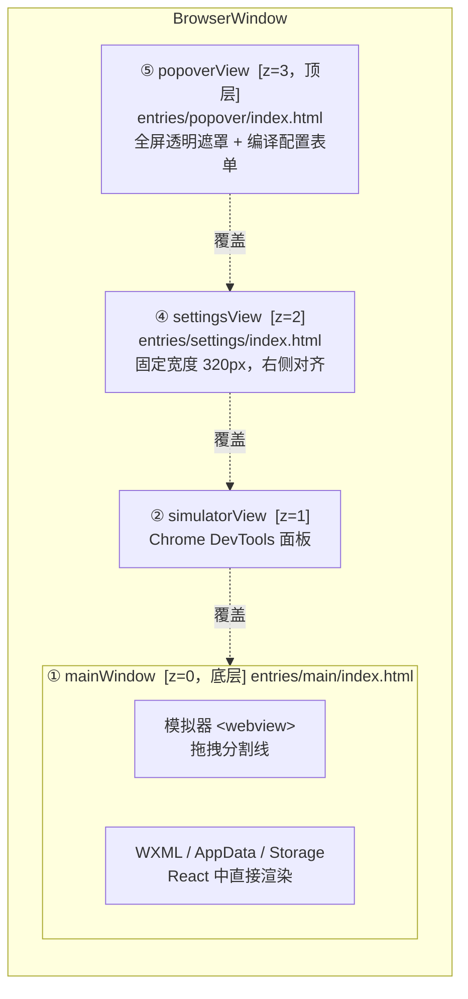

# Dimina DevTools

基于 Electron 的小程序开发者工具。提供模拟器、Chrome DevTools 面板、WXML/AppData/Storage 面板、编译配置等功能。

下游 host 通过 [`@dimina-kit/workbench`](../workbench) 的 `workbench(config)` fluent API 集成并定制 devtools。扩展模型设计见 [`docs/workbench-model.md`](docs/workbench-model.md)。

---

## 两种接入方式

| 级别         | 入口                   | 控制力                | 适合场景       |
| ------------ | ---------------------- | --------------------- | -------------- |
| **零配置**   | `launch()`             | 无                    | 直接运行       |
| **配置驱动** | `createWorkbenchApp()` | 配置 Provider + 扩展点 | 品牌化、深度定制 |

### 零配置

```typescript
import { launch } from '@dimina-kit/devtools/launch'
launch()
```

### 配置驱动

扩展点分两类：**配置 Provider**（构造期、一对一，替换某个内置能力）走 `createWorkbenchApp` 配置字段；**Contribution**（`onSetup` 期、一对多，添加多个同类条目）走 `onSetup(instance)` 上的 typed 方法。所有 Contribution 都 per-context，随 context 自动销毁。

```typescript
import { suppressEpipe } from '@dimina-kit/devtools/bootstrap'
import { createWorkbenchApp } from '@dimina-kit/devtools/app'
import { rendererDir } from '@dimina-kit/devtools/paths'
import { Menu } from 'electron'

suppressEpipe()

createWorkbenchApp({
  // ── 配置 Provider（构造期，一对一）──
  appName: '我的开发工具',
  adapter: myAdapter,
  preloadPath: '/path/to/my-preload.js',
  rendererDir,
  apiNamespaces: ['my'],
  headerHeight: 72,
  brandingProvider: () => ({ appName: '我的开发工具' }),
  icon: '/path/to/icon.png',
  menuBuilder: (mainWindow, menuCtx) => {
    // menuCtx 是 MenuContext（只读 menu 相关状态）
    Menu.setApplicationMenu(/* ... */)
  },

  // ── Contribution（onSetup 期，一对多）──
  onSetup: (instance) => {
    // simulator 自定义 API：per-context
    instance.registerSimulatorApi('login', (params) => myLogin(params))

    // 工具栏：整表替换，随 host 状态（如登录态）重算时再 set 一次
    const refreshToolbar = () => {
      const currentUser = getCurrentUser()
      instance.toolbar.set([
        { id: 'account', label: '当前用户', kind: 'avatar', placement: 'leading', displayInitial: currentUser?.name, avatarUrl: currentUser?.avatar, handler: () => showAccount() },
        { id: 'preview', label: '预览', placement: 'primary', handler: () => preview() },
        { id: 'deploy', label: '发布', placement: 'trailing', handler: () => deploy() },
      ])
    }
    refreshToolbar()

    // 自定义 IPC：经 gated 的 IpcRegistry，不再裸 ipcMain.handle
    instance.ipc.handle('my:action', () => collectStats())

    // host 自己的弹窗须注册为受信 sender 后才能调 instance.ipc
    // const win = createDialogWindow(/* ... */)
    // instance.registerTrustedWindow(win)
  },
  onBeforeOpenProject: async ({ projectPath, instance }) => {
    const ok = await canOpenProject(projectPath)
    return ok
      ? { allow: true }
      : { allow: false, reason: '当前账号没有项目权限' }
  },
  onBeforeClose: ({ context }) => {
    // 窗口关闭前的自定义清理；session 关闭和 view 销毁由框架自动处理
  },
}).start()
```

> Contribution 注册物全部自动进 `context.registry`，host 无需手写 cleanup。devtools 内部仍用 `WorkbenchModule` 组织内置 IPC 模块，但这是实现细节，不再作为对外接入方式导出。

---

## 目录结构

```
src/
  shared/
    types.ts                             # 跨层共享类型
    constants.ts                         # 跨层共享常量
    ipc-channels.ts                      # IPC 频道名称常量
  main/
    api.ts                               # 公共 API 聚合入口（package main）
    app/
      launch.ts                          # 零配置入口
      app.ts                             # createWorkbenchApp 工厂
      bootstrap.ts                       # suppressEpipe / setupCdpPort
      lifecycle.ts                       # Electron app 生命周期注册
    ipc/                                 # 只做 handler 注册，不写业务
      index.ts                           # 聚合 register 函数导出
      simulator.ts                       # simulator attach/detach/resize
      panels.ts                          # panel:list / panel:eval / selectSimulator
      toolbar.ts                         # 品牌 / 工具栏配置
      popover.ts                         # 编译配置弹窗
      settings.ts                        # 项目设置 + workbench 设置
      projects.ts                        # 项目列表管理
      session.ts                         # 编译会话 open/close/status
    services/                            # 按业务领域分，真正的业务能力
      settings/                          # 用户级 workbench 设置读写 + 主题应用
      projects/                          # 项目列表 CRUD（持久化）
      layout/                            # 布局常量 + bounds 计算
      views/                             # ViewManager（settings / popover overlay 等）
      workspace/                         # 项目会话生命周期
      notifications/                     # 主进程 → renderer 的事件通知
      mcp/                               # MCP server
      automation/                        # 自动化 WebSocket 服务
      simulator/                         # simulator dir / referer
      simulator-storage/                 # CDP DOMStorage + 元素 inspect 桥接
      update/                            # UpdateManager + GitHubReleaseChecker
      workbench-context.ts               # 共享状态类型 + 工厂 + 辅助函数
      window-service.ts                  # main / settings 窗口聚合访问
      module.ts                          # WorkbenchModule 协议
      default-adapter.ts                 # 默认 CompilationAdapter
    menu/                                # 应用菜单
    utils/
      paths.ts                           # rendererDir / defaultPreloadPath / simulatorDir
      disposable.ts                      # DisposableRegistry + AggregateError 聚合
      ipc-registry.ts                    # ipcMain.handle 包装 + SenderPolicy 闸门
      sender-policy.ts                   # sender webContents id 白名单
      ipc-schema.ts                      # zod schema 校验工具
    windows/
      main-window/                       # 主窗口创建 + 事件接线
      settings-window/                   # 独立设置窗口
      navigation-hardening.ts            # will-navigate / setWindowOpenHandler 限流

  preload/                               # 按注入目标分
    windows/                             # contextBridge 类型 preload
      main.ts                            # workbench 三窗口 preload，仅暴露 window.devtools.ipc
      simulator.ts                       # simulator webview 的默认 preload
    shared/                              # preload 之间共享
      api-compat.ts                      # setupApiCompatHook
      constants.ts
      types.ts
    instrumentation/                     # 注入到小程序 runtime 的探针
      console.ts                         # 控制台拦截
      app-data.ts                        # Worker setData 拦截 → createAppDataSource
      wxml.ts                            # Vue 组件树提取 → createWxmlSource
      disposable.ts                      # instrumentation 共用的清理工具
    miniapp-snapshot/                    # 面板数据统一快照框架（docs/miniapp-snapshot.md）
      types.ts                           # MiniappSnapshotSource / SnapshotEnvelope
      host.ts                            # createMiniappSnapshotHost → push/pull/__miniappSnapshot
    runtime/
      bridge.ts                          # installSimulatorBridge → window.__simulatorData
      custom-apis.ts                     # installCustomApisBridge → window.__diminaCustomApis
      host.ts                            # sendToHost 推送封装

  renderer/
    entries/                             # 各窗口 HTML + React 挂载点
      main/ popover/ settings/ workbench-settings/
    modules/                             # 先按窗口分，再按区域
      main/
        main.tsx                         # 主窗口 React 根
        features/                        # 主窗口内的业务区域
          project-runtime/               # 项目视图 + 工具栏 + 右侧面板切换
          right-panel/                   # WXML / AppData / Storage 面板
      popover/ settings/ workbench-settings/
    shared/
      components/                        # UI 组件（ui / layout / json-viewer / ...）
      lib/                               # ipc / simulator-url / utils / ...

  simulator/                             # 小程序容器运行时（独立 webview 入口）
    simulator.html
    main.tsx
    simulator-api.ts
    simulator-api-storage.ts
    simulator-api-device.ts
    simulator-api-media.ts
    simulator-api-fs.ts
```

渲染层使用 **React + shadcn/ui + Tailwind CSS**，通过 Vite 构建，产物输出到 `dist/renderer/`。

---

## 配置参考

### WorkbenchConfig

`launch()` 和 `createWorkbenchApp()` 共用：

| 字段               | 类型                 | 默认值              | 说明                               |
| ------------------ | -------------------- | ------------------- | ---------------------------------- |
| `appName`          | `string`             | `'Dimina DevTools'` | 窗口标题                           |
| `adapter`          | `CompilationAdapter` | 内置                | 项目编译适配器                     |
| `panels`           | `BuiltinPanelId[]`   | 全部四个            | 显示哪些内置面板                   |
| `preloadPath`      | `string`             | 内置                | 自定义 preload 脚本路径            |
| `apiNamespaces`    | `string[]`           | `[]`                | 自定义 API 命名空间（如 `['qd']`） |
| `brandingProvider` | `() => { appName }`  | —                   | 品牌信息 provider                  |
| `headerHeight`     | `number`             | `40`                | 头部栏高度（px），同步下发 main + renderer |

### WorkbenchAppConfig（扩展 WorkbenchConfig）

`createWorkbenchApp()` 额外支持：

| 字段            | 类型                                        | 默认值      | 说明                                              |
| --------------- | ------------------------------------------- | ----------- | ------------------------------------------------- |
| `modules`       | `Partial<Record<BuiltinModuleId, boolean>>` | 全部 `true` | 开关内置 IPC 模块组                               |
| `rendererDir`   | `string`                                    | 内置        | 自定义 renderer HTML 目录                         |
| `icon`          | `string`                                    | —           | 窗口/任务栏图标路径（macOS 使用 app bundle 图标） |
| `menuBuilder`   | `(mainWindow, menuContext: MenuContext) => void` | 内置菜单 | 自定义菜单构建器；`menuContext` 为收窄后的 `MenuContext`，不含 `registry`/`senderPolicy` 等内部管线 |
| `onSetup`       | `(instance) => void \| Promise<void>`       | —           | 窗口和 context 创建后的回调，用于注册 Contribution（见下文）|
| `onBeforeOpenProject` | `({ projectPath, instance }) => BeforeOpenProjectResult \| Promise<BeforeOpenProjectResult>` | — | 项目目录校验通过后、关闭当前 session 和编译新项目之前的宿主准入钩子 |
| `onBeforeClose` | `(instance) => void \| Promise<void>`       | —           | 窗口关闭前的回调，session 关闭由框架自动处理      |
| `window`        | `WorkbenchWindowConfig`                     | —           | 窗口尺寸覆盖                                      |
| `updateChecker` | `UpdateChecker`                             | —           | 自定义更新检查器；提供后启用"检查更新"功能        |
| `updateOptions` | `{ checkInterval?, initialDelay?, getCurrentVersion? }` | —  | 仅当 `updateChecker` 提供时生效，默认 1h / 5s     |

### onSetup Contribution

`onSetup(instance)` 收到的 `instance` 上有一组 typed 注册方法，全部 per-context、自动进 `context.registry`：

| 方法 | 说明 |
| --- | --- |
| `instance.registerSimulatorApi(name, handler)` | 注册 simulator 自定义 API，小程序里 `wx.<name>()` 调用（详见下方"Simulator 自定义 API"）。返回 `Disposable` |
| `instance.toolbar.set(actions)` | 原子整表替换工具栏；`actions` 为 `ToolbarActionInput[]`（`{ id, label, handler }`），`id` 重复抛错。host 状态变化（如登录态）时构造新表再 `set` 一次 |
| `instance.ipc` | `IpcRegistry` 实例，`instance.ipc.handle(channel, fn)` 注册自定义 IPC；已绑定 `senderPolicy` 网关 |
| `instance.registerTrustedWindow(win)` | 把 host 自有弹窗 `BrowserWindow` 加入受信 sender 集，否则其发起的 `instance.ipc` 调用会被网关拒绝。窗口关闭即移除 |

`onSetup` 可以返回 Promise；`createWorkbenchApp().start()` 会等待 `onSetup` 解析完成后才继续后续启动流程，因此宿主在 `onSetup` 内注册的 simulator API 会早于 simulator `<webview>` 首次枚举自定义 API。

### 内置面板 ID

`'wxml'` \| `'console'` \| `'appdata'` \| `'storage'`

### 内置模块 ID

`'projects'` \| `'session'` \| `'simulator'` \| `'popover'` \| `'settings'`

---

## Embedding & Extending the Project Panel

宿主（如 qdmp）通过 `createWorkbenchApp({...})` 嵌入 devtools 时，可对项目面板做三个正交扩展：

| 扩展点 | 用途 |
| --- | --- |
| `projectsProvider` | 接管项目列表存储 —— 替换默认 `<userData>/dimina-projects.json`，对接 qdmp 后台 / IDE workspace / 远端工程库 |
| `projectTemplates` + `builtinTemplates` | 注入/覆盖/裁剪"新建项目"模板列表（同 id 覆盖内置；`builtinTemplates` 控制内置策略） |
| `customCreateProjectDialog` | 用宿主自家页面替换内置"新建项目"对话框（main 进程 hook，可 `new BrowserWindow` 加载任意 URL，通过 IPC/postMessage 回传结果） |

### 何时需要哪个扩展点

| 场景 | 需要的扩展点 |
| --- | --- |
| 项目列表来自 qdmp 后台 / 团队工程库 | `projectsProvider` |
| 仅替换可选模板（e.g. 只提供 taro / qdmp 自家脚手架） | `projectTemplates` + `builtinTemplates` |
| 创建项目流程要走宿主自己的 wizard / 登录态 | `customCreateProjectDialog` |

### 最小示例

```typescript
import { createWorkbenchApp } from '@dimina-kit/devtools/app'
import type { ProjectsProvider, ProjectTemplate } from '@dimina-kit/devtools/projects-provider'
import { BrowserWindow } from 'electron'

const provider: ProjectsProvider = {
  async listProjects() {
    return await qdmp.api.listProjects()
  },
  async validateProjectDir(dirPath) {
    return (await qdmp.api.isMiniApp(dirPath)) ? null : '不是合法的小程序工程'
  },
  async addProject(dirPath) {
    return await qdmp.api.addProject(dirPath)
  },
  async removeProject(dirPath) {
    await qdmp.api.removeProject(dirPath)
  },
  async updateLastOpened(dirPath) {
    await qdmp.api.touchLastOpened(dirPath)
  },
  async getCompileConfig(dirPath) {
    return await qdmp.api.getCompileConfig(dirPath)
  },
  async saveCompileConfig(dirPath, cfg) {
    await qdmp.api.saveCompileConfig(dirPath, cfg)
  },
  // 缩略图走云端存储——dataUrl 形如 'data:image/png;base64,...'
  async saveThumbnail(dirPath, imageDataUrl) {
    await qdmp.api.uploadThumbnail(dirPath, imageDataUrl)
  },
  async getThumbnail(dirPath) {
    return await qdmp.api.fetchThumbnail(dirPath)
  },
}

const qdmpBlank: ProjectTemplate = {
  id: 'blank', // 同 id 覆盖内置 blank
  name: 'qdmp 空白工程',
  description: '由 qdmp 维护的官方空白模板',
  source: { type: 'directory', path: '/abs/path/to/template' },
}

createWorkbenchApp({
  projectsProvider: provider,
  projectTemplates: [qdmpBlank],
  builtinTemplates: ['taro-todo'], // 只保留 taro-todo，干掉默认 blank
  customCreateProjectDialog: async ({ parentWindow }) => {
    const win = new BrowserWindow({ parent: parentWindow, modal: true, width: 720, height: 520 })
    await win.loadURL('https://qdmp.example.com/devtools/new-project')
    return await new Promise((resolve) => {
      win.webContents.ipc.once('qdmp:create-project:done', (_e, payload) => {
        win.close()
        // payload 三选一（CustomCreateProjectDialogResult）：
        //   null                  → 用户取消
        //   CreateProjectInput    → 让 devtools 在本地物化模板并注册到 provider
        //   { ready: Project }    → 宿主后端已经创建好，devtools 直接刷新列表
        resolve(payload ?? null)
      })
      win.on('closed', () => resolve(null))
    })
  },
}).start()
```

### `customCreateProjectDialog` 返回值

`hook` 返回 `CustomCreateProjectDialogResult`，三种情形分别对应不同后续动作：

| 返回 | 行为 |
| --- | --- |
| `null` | 用户取消，无副作用 |
| `CreateProjectInput`（`{ name, path, templateId?, extra? }`） | devtools 在本地拷贝/生成模板 → 改写 `project.config.json` → `provider.addProject(path)`；适合"只想换 UI 但物化由 devtools 兜底" |
| `{ ready: Project }` | devtools 跳过物化，只刷新列表并打开该项目；适合宿主后端已经远端创建好项目，本地完全无需落盘 |

物化失败（路径已存在/模板缺失/`provider.addProject` reject）会经 native dialog 弹出错误，再 reject 给渲染层；宿主端无需自己 toast。

### 内置模板

devtools 自带两个 `source`-style 模板，位于 `packages/devtools/templates/`：

- `blank` — 最小空白小程序骨架（pages/index + app.js/json/wxss + project.config.json，约 8 个文件）
- `taro-todo` — 复制自 `dimina/fe/example/taro-todo`，作为 Taro 编译产物的端到端演示工程

`builtinTemplates: 'none'` 排除全部内置；`builtinTemplates: ['taro-todo']` 仅保留指定 id；`projectTemplates` 同 id 注入会覆盖（例如上文 `qdmpBlank` 覆盖了内置 `blank`）。

### Provider 部分实现 / fallback 行为

`ProjectsProvider` 的多数方法是可选的；当宿主只实现 `listProjects` / `addProject` / `removeProject` 时：

- `validateProjectDir` 缺省 → 返回 `null`（不校验）
- `updateLastOpened` 缺省 → 静默 no-op，"最近"排序退化为 `listProjects` 返回顺序
- `getCompileConfig` 缺省 → 返回 `DEFAULT_COMPILE_CONFIG`（`{ startPage: '', scene: 1001, queryParams: [] }`）
- `saveCompileConfig` 缺省 → 静默 no-op，编译配置面板的编辑不会持久化
- `saveThumbnail` / `getThumbnail` 缺省 → save 静默 no-op，get 返回 `null`；项目卡缩略图不显示。实现这两个方法可让远端项目用云端缩略图（详见示例）

> 完整契约、参数语义和默认值见 `src/main/services/projects/types.ts` 的 JSDoc，那是 source of truth。

---

## CompilationAdapter

实现此接口接入自定义构建流程：

```typescript
import type { CompilationAdapter } from '@dimina-kit/devtools/types'

const myAdapter: CompilationAdapter = {
  async openProject(opts) {
    // opts.projectPath  — 小程序项目绝对路径
    // opts.sourcemap    — 是否生成 sourcemap
    // opts.onRebuild    — 热更新回调
    // opts.onBuildError — 构建错误回调
    return {
      port: 3000,
      appInfo: { appName: 'my-app' },
      close: async () => {},
    }
  },
}
```

---

## Preload Instrumentation

模拟器 webview 注入 preload 脚本，在 webview 全局上安装两类东西：**桥接**（把数据通道暴露到 webview）+ **instrumentation**（监听运行时事件并写入桥接）。内置 preload 见 `src/preload/windows/simulator.ts`。

### 必装：桥接

| 函数 | 作用 | 不装会怎样 |
| --- | --- | --- |
| `installSimulatorBridge()` | 暴露 `window.__simulatorData`，承载 `highlightElement` / `unhighlightElement` / `getAppdata` / `getWxml` / `getStorageSnapshot` 等只读 API（供主进程 `executeJavaScript` 拉取） | 元素选区 overlay 不显示；automation `Page.getData` 返回空对象；MCP `simulator_get_overview` 在 hints 中追加 `simulator bridge not ready (window.__simulatorData missing)`。注：Storage 面板走主进程 CDP，不受影响；Console/AppData/WXML 推送走 `sendToHost`，也不受影响 |
| `installCustomApisBridge()` | 暴露 `window.__diminaCustomApis`，承载 `list` / `invoke`，让模拟器侧把主进程注册的 API 代理回小程序 runtime | `registerSimulatorApi` 注册的业务 API 在小程序里调用全部 no-op（参见下方 "Simulator 自定义 API"） |
| `setupApiCompatHook()` | 兼容上游 API 名称变更 | 部分 API 调用兼容性问题 |

下游写自定义 preload 时，这三项原则上都要装。若不需要 `registerSimulatorApi`，`installCustomApisBridge` 可省略。

### 按需：instrumentation

Console 是独立 instrumentation；AppData 与 WXML 已迁移到 **miniappSnapshot** 框架——各自实现一个 `MiniappSnapshotSource`，由 `MiniappSnapshotHost` 统一负责推送 / 拉取 / reload 重同步（详见 `docs/miniapp-snapshot.md`）。

| 探针 | 捕获内容 | 数据通道 |
| --- | --- | --- |
| `installConsoleInstrumentation()` | `console.*`、`window.onerror`、未捕获 rejection | `sendToHost` |
| `createAppDataSource()` | Worker `ub` 消息、setData / page init | miniappSnapshot 框架（`miniapp-snapshot:push`） |
| `createWxmlSource()` | Vue 组件树提取、MutationObserver 自动更新 | miniappSnapshot 框架（`miniapp-snapshot:push`） |

> Storage 面板的数据由主进程通过 CDP `DOMStorage` 域抓取（`src/main/services/simulator-storage`），**不需要 preload 侧 instrumentation**。

各面板的数据流详见下方 "数据流" 章节。

### 自定义 Preload

参考 `src/preload/windows/simulator.ts`：

```typescript
// my-preload.ts
import {
  installSimulatorBridge,
  installCustomApisBridge,
  installConsoleInstrumentation,
  createMiniappSnapshotHost,
  createAppDataSource,
  createWxmlSource,
  setupApiCompatHook,
} from '@dimina-kit/devtools/preload'

// 1. 兼容 hook + 桥接（必装，且应在 instrumentation 之前）
setupApiCompatHook()
installSimulatorBridge()
installCustomApisBridge()   // 若用到 registerSimulatorApi，必装

// 2. Console instrumentation（按需）
installConsoleInstrumentation()

// 3. miniappSnapshot 框架：注册面板数据源后 install()
const snapshotHost = createMiniappSnapshotHost()
snapshotHost.register(createAppDataSource())
snapshotHost.register(createWxmlSource())
snapshotHost.install()

// 4. 自定义 hook
window.addEventListener('error', (e) => {
  console.error('[my-preload]', e.message)
})
```

编译后传入路径：

```typescript
launch({ preloadPath: '/absolute/path/to/my-preload.js' })
```

---

## Simulator 自定义 API

下游通过 `onSetup` 里的 `instance.registerSimulatorApi(name, handler)` 把业务 API 注入到模拟器内运行的小程序。注册 per-context，随 context 销毁。Handler 在 Electron **主进程**执行，能用任何 Node 能力（fs、net、原生模块、持久状态）；模拟器侧拿到 `wx.<name>(params)` 调用后通过 IPC 转发到主进程，await 返回结果，handler 抛错则原型回传给小程序。

> ⚠️ 使用本功能要求模拟器 preload 调用 `installCustomApisBridge()`（详见上方 "Preload Instrumentation"）。内置 preload 已包含此调用；若用了自定义 preload 又漏装，注册的 API 在小程序运行时**没有任何反应**，simulator 端会有 `console.warn`。

### 命名约定

`name` 是 dimina service 层 `invokeAPI(name, opts)` 用的**裸名**，不带 `wx.` 前缀。注册之后小程序里通过 `wx.<name>(...)`（以及在 `apiNamespaces` 配的其它命名空间）调用都会命中：

| 小程序里写 | `registerSimulatorApi` 的 name |
| --- | --- |
| `wx.login(...)` | `'login'` |
| `wx.request(...)` | `'request'` |
| `wx.getStorage(...)` 覆盖内置 | `'getStorage'`（小心：这会**屏蔽** dimina 容器的实现） |

```typescript
createWorkbenchApp({
  onSetup: (instance) => {
    // 提供 wx.login 的实现（dimina 容器默认未实现，注册后才能用）
    const dispose = instance.registerSimulatorApi('login', async ({ success }) => {
      // 主进程上下文：可调用内部 HTTP、读取凭证文件、访问原生模块
      const code = await callInternalAuth()
      return { code }
    })

    // 注册物已进 context.registry，随 context 销毁；
    // 提前取消用返回的 dispose()
  },
})
```

### 行为约定

- **注册时机**：模拟器在启动小程序之前会 `await` 主进程的自定义 API 全量列表并完成注册，因此运行时框架在初始化时一次性枚举 API 表（典型如 Taro 的 `Object.keys(wx)`）也能枚举到 `registerSimulatorApi` 注册的 name。bridge 异常或超时（3s）则降级为"无自定义 API"，不会阻塞小程序启动。
- **命中顺序**：小程序运行时按 `apiRegistry[name] → MiniApp 实例方法 → 扩展模块兜底` 查找，所以 `registerSimulatorApi` 注册的 name **优先于内置实现**——既能给"未实现"的 wx.* 补功能（如 `wx.login`），也能覆盖默认的 wx.* 行为（如 `wx.request`，dimina-kit 本身就在用这条路把 `request` 接到主进程 fetch）。
- **回调风格自动桥接**：小程序用微信风格 `wx.<name>({ success, fail, complete })` 调用时，模拟器会把 handler 的 resolve 派发给 `success`、reject 派发给 `fail`，并在两种情况下都触发 `complete`。handler 本身只需 promise 风格 resolve/reject —— `success/fail/complete` 是渲染端回调 id，转发到主进程前已被剔除，handler 不会收到它们。
- 同名重复注册：后注册的覆盖前者，静默替换。
- `dispose()` 只会移除自己创建的那次注册——如果之后被别人覆盖了，旧的 disposer 是 no-op。
- 调用未注册且容器内也没有的 name：小程序侧拿到 reject，错误信息里带 name。
- Handler 可同步或异步返回；**返回值需可 JSON 序列化**（IPC 限制）。函数、Symbol、Map/Set、循环引用都会丢失。

---

## 模块导出一览

`@dimina-kit/devtools` 的公共入口。`api.ts`（根入口）聚合了所有公共 API，优先从根入口导入。

```
@dimina-kit/devtools                        launch, createWorkbenchApp, buildDefaultMenu,
                                       openSettingsWindow, suppressEpipe, setupCdpPort,
                                       createWorkbenchContext, createMainWindow,
                                       createViewManager, IpcRegistry,
                                       UpdateManager, createGitHubReleaseChecker, ...
@dimina-kit/devtools/launch                 launch(config?), buildDefaultMenu, openSettingsWindow
@dimina-kit/devtools/app                    createWorkbenchApp(config?)
@dimina-kit/devtools/types                  TypeScript 类型定义
@dimina-kit/devtools/bootstrap              suppressEpipe(), setupCdpPort()
@dimina-kit/devtools/context                createWorkbenchContext(opts),
                                       hasBuiltinPanel(ctx, panelId), getDefaultTab(ctx)
@dimina-kit/devtools/create-window          createMainWindow(opts)
@dimina-kit/devtools/paths                  rendererDir, defaultPreloadPath, simulatorDir,
                                       getRendererDir, getPreloadDir, getRendererHtml
@dimina-kit/devtools/projects-provider      ProjectsProvider / ProjectTemplate 等类型
@dimina-kit/devtools/workbench-settings     loadWorkbenchSettings(), saveWorkbenchSettings(), applyTheme()
@dimina-kit/devtools/preload                installSimulatorBridge,
                                       installCustomApisBridge,
                                       installConsoleInstrumentation,
                                       createMiniappSnapshotHost,
                                       createAppDataSource, createWxmlSource,
                                       setupApiCompatHook
                                       （storage 面板数据由主进程 CDP 抓取，无 preload 侧 hook）
```

> `IpcRegistry` 是 host 写自定义 IPC 的网关基类——`onSetup` 里通过 `instance.ipc` 拿到一个已绑定 `senderPolicy` 的实例，无需自行构造。
> 自定义 simulator API 通过 `instance.registerSimulatorApi` 注册，没有独立的导出入口。
> 内置 IPC 模块（`register*Ipc` / `WorkbenchModule`）是 devtools 内部实现，不再对外导出。

---

## WorkbenchContext

`WorkbenchContext` 是所有扩展点的唯一容器。配置字段直接暴露，运行时状态通过 service 访问。host hook 拿到的 `instance.context` 即此类型；`menuBuilder` 拿到的是收窄后的 `MenuContext`（剔除 `registry` / `senderPolicy` / `trustedWindowSenderIds` / `simulatorApis` / `toolbar` 等内部管线）。

```typescript
interface WorkbenchContext {
  adapter: CompilationAdapter
  preloadPath: string
  rendererDir: string
  panels: string[]
  apiNamespaces: string[]
  appName: string
  headerHeight: number
  brandingProvider?: () => Promise<{ appName: string }> | { appName: string }

  // ── Services（运行时状态封装在内部，通过方法访问）──
  windows: WindowService // ctx.windows.mainWindow, ctx.windows.settingsWindow, ...
  views: ViewManager // ctx.views.repositionAll(), ctx.views.getSimulatorWebContentsId(), ...
  notify: RendererNotifier // ctx.notify.projectStatus(), ctx.notify.windowNavigateBack(), ...
  workspace: WorkspaceService // ctx.workspace.getProjectPath(), ctx.workspace.hasActiveSession(), ...

  // ── 扩展容器（host 通过 instance 上的方法写入，不直接操作）──
  simulatorApis: SimulatorApiRegistry  // instance.registerSimulatorApi 写入
  toolbar: ToolbarStore                // instance.toolbar.set 写入
  trustedWindowSenderIds: Map<number, number>  // instance.registerTrustedWindow 写入（webContents.id → 引用计数）

  // ── Internal lifecycle / security (host 不直接消费) ──
  registry: DisposableRegistry // 框架在创建时统一聚合 dispose
  senderPolicy: SenderPolicy   // IpcRegistry 自动校验 sender 白名单
}
```

会话和视图状态封装在对应 service 的私有闭包中，通过方法访问，例如：

- `ctx.workspace.getProjectPath()` / `ctx.workspace.getSession()` / `ctx.workspace.hasActiveSession()`
- `ctx.views.getSimulatorWebContentsId()` / `ctx.views.isSimulatorAdded()` / `ctx.views.getLastSimWidth()`
- `ctx.windows.mainWindow` / `ctx.windows.settingsWindow`

---

## 整体架构

### 视图层级（从上到下 = 从顶层到底层）



层级由 `addChildView()` 调用顺序决定，后添加的 View 在上层。内置面板（WXML / AppData / Storage）不使用独立 WebContentsView，直接在主窗口 React 中渲染；只有 Chrome DevTools / settings / popover 需要 View 覆盖。

### 数据流

按面板 / 场景拆分：

| 面板 / 场景 | 模式 | 路径 |
| --- | --- | --- |
| Console | 推送 | `installConsoleInstrumentation` 经 `runtime/host.ts:sendToHost` → webview `ipcRenderer.sendToHost` 推到宿主 → renderer 监听 `ipc-message` |
| AppData / WXML 树 | 推送 + 拉取 | **miniappSnapshot 框架**：preload `MiniappSnapshotHost` 经 `miniapp-snapshot:push` 推全量快照，renderer `useMiniappSnapshot` 整份投影；面板「刷新」走 `miniapp-snapshot:pull`（详见 `docs/miniapp-snapshot.md`） |
| Storage | 拉取 + 推送 | renderer `ipcInvoke(SimulatorStorageChannel.GetSnapshot)` → 主进程 CDP `DOMStorage` 域；变更事件由主进程通过 `SimulatorStorageChannel.Event` 推回 renderer |
| 元素选区 / `Page.getData` / MCP overview | 拉取 | 主进程 `webContents.executeJavaScript(...)` 或 `Runtime.evaluate(...)` 读 `window.__simulatorData.*`（由 `installSimulatorBridge` 暴露）；面板快照亦可经 `window.__miniappSnapshot.get(id)` 同步读取（由 `MiniappSnapshotHost` 暴露） |

> `src/main/ipc/panels.ts` 暴露 `panel:eval` handler 供外部 host 自定义面板复用，内置 renderer 不消费它。

---

## IPC 通信总览

IPC 频道名常量集中定义在 `src/shared/ipc-channels.ts`，按域分组（`SimulatorChannel` / `ProjectChannel` / `PanelChannel` / `WorkbenchSettingsChannel` 等）。该文件是频道清单的唯一真相源；此处不再维护手抄表，以免与代码漂移。

---

## 已知限制：Electron `chrome.devtools.panels.create()` 不可用

Electron 对 `chrome.devtools.panels.create()` 的支持**长期不稳定**。该 API 调用成功（无报错，返回 panel 对象），但面板 tab 永远不出现在 DevTools UI 中。

**影响范围**：从 Electron 7 到 39 均有报告（[#23662](https://github.com/electron/electron/issues/23662)、[#41613](https://github.com/electron/electron/issues/41613)、[#48705](https://github.com/electron/electron/issues/48705)），非特定版本 bug，而是系统性实现缺陷。官方文档声称完全支持，但实际因竞态条件和实现不完整导致面板无法可靠渲染。Electron 团队无修复计划。

**当前方案**：内置面板（WXML / AppData / Storage）直接在主窗口 React 中渲染，通过 `panel:eval` IPC 调用 `webContents.executeJavaScript()` 从 simulator 拉取数据；Chrome DevTools 仍作为独立 `WebContentsView` 通过 `setDevToolsWebContents()` 挂载。面板切换由 renderer toolbar 的 tab 栏控制，主进程负责 simulator/settings/popover View 的创建、定位和显隐。详见 `src/main/ipc/panels.ts` 和 `src/main/ipc/simulator.ts`。

---

## 调试

- **Cmd+Shift+I** / **Ctrl+Shift+I** — 打开 mainWindow 的 Electron DevTools（调试 React 渲染层）
- 模拟器 webview 的 Chrome DevTools 在编译完成、`dom-ready` 后自动打开
- 开发模式（`!app.isPackaged`）下 mainWindow DevTools 自动以 detach 模式打开

---

## 开发

```bash
pnpm build              # 构建全部（main + preload + renderer）
pnpm build:main         # 仅构建主进程 TypeScript
pnpm build:preload      # 仅构建 preload TypeScript
pnpm build:renderer     # Vite 构建渲染层
pnpm dev                # Watch 模式 + Electron
pnpm check-types        # 类型检查
pnpm test               # 运行测试
```

---

## 安全说明

本工具仅用于本地开发调试。当前的安全配置：

- **Workbench 窗口**（main / settings / popover overlay）均启用 `contextIsolation` 并禁用 `nodeIntegration`；renderer 通过 main preload 经 `contextBridge` 拿到 `window.devtools.ipc`，每个 IPC handler 经 sender whitelist 校验调用方
- **Simulator 加载的小程序代码** 运行在独立 `<webview>` 中（`partition='persist:simulator'`、`nodeIntegration=false`），preload 由 `session.registerPreloadScript` 在 session 层固定，渲染进程无法替换
- **renderer 入口** 启用了保守 CSP；`will-navigate` / `setWindowOpenHandler` 屏蔽外部跳转

仍然不要在 devtools 窗口中加载不受信任的远程内容；本工具不打算在非本地环境部署。

### MCP Server 风险

内置的 MCP server 默认关闭，由 `startMcpServer` 入口显式启动，或通过 workbench 设置中的 `mcp.enabled` 开启。开启后会在本机监听 SSE 端点，向任何可以连接到该端点的 MCP 客户端暴露一组工具，能力包括：读取 DOM 结构、截屏、拉取网络日志、触发导航等。

`workbench_evaluate` 已从 MCP 工具集中移除，workbench 只暴露只读诊断工具（截屏、console 日志、DOM、网络日志等）。`simulator_evaluate` 仍然保留，但 simulator 使用 `<webview>`、`nodeIntegration=false`，其 `evaluate` 仅在页面 JS 上下文执行，不具备 Node API 访问能力。

仅在连接到可信的本机 MCP 客户端或被信任的 AI 工具时启用该功能；不要在公共 WiFi、共享机器或存在远程 SSH 端口转发的场景下开启，以免监听端口被非预期的客户端访问。
