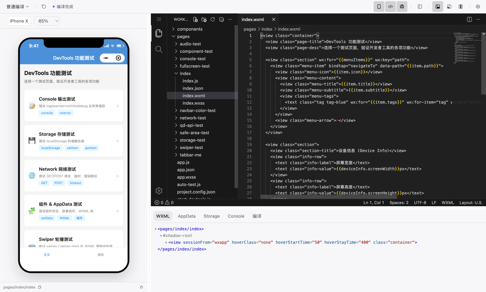

# @dimina-kit/devtools

Dimina DevTools 是调试 [Dimina](https://github.com/didi/dimina) 小程序的桌面工具。它把小程序模拟器、Chrome DevTools、WXML、AppData、Storage、编译日志和 VS Code 工作台放在同一个 Electron 应用中。



## 获取和运行

直接使用桌面应用，可以从项目的 [Releases](https://github.com/EchoTechFE/dimina-kit/releases) 下载已发布的桌面构建。要从源码运行，请先按[仓库根 README](../../README.md#快速开始)准备仓库，然后执行：

```bash
pnpm --filter @dimina-kit/devtools build
pnpm --filter @dimina-kit/devtools start
```

## 作为 Electron 库使用

`@dimina-kit/devtools` 也可以作为 Electron 应用的基础包，用于替换品牌、编译后端、项目来源，或注册宿主自己的小程序 API 和模拟器界面。

```bash
pnpm add @dimina-kit/devtools electron@^43.2.0
```

当前包声明的 Electron peer 版本为 `^43.2.0`。

最小入口是 `launch(config?)`：

```ts
import { launch } from '@dimina-kit/devtools'

await launch()
```

带宿主配置的最小形状：

```ts
import { launch } from '@dimina-kit/devtools'

await launch({
  appName: 'My Miniapp Studio',
  adapter: myCompilationAdapter,
  onSetup(instance) {
    instance.registerSimulatorApi('login', params => login(params))
  },
})
```

配置字段、`CompilationAdapter`、项目 Provider、preload、模拟器 UI、host toolbar 和公共导出已经移到[库集成参考](./docs/library-integration.md)。

## 先读哪些文档

| 目标 | 文档 |
| --- | --- |
| 把 devtools 嵌入自己的 Electron 应用 | [库集成参考](./docs/library-integration.md) |
| 了解目录、构建、调试和安全边界 | [贡献者指南](./docs/contributing.md) |
| 了解窗口、WebContentsView、IPC 和生命周期 | [Electron Container 架构](./docs/electron-container.md) |
| 了解模拟器与页面 render host | [模拟器渲染架构](./docs/simulator-render-architecture.md) |
| 了解 Chrome DevTools 的 Console、Network、Elements 和源码跳转 | [DevTools CDP 路由](./docs/devtools-cdp-routing.mdx) |
| 了解内置 VS Code 工作台 | [编辑器集成](./docs/editor-integration.md) |
| 了解项目窗口的 dock、分屏和原生视图定位 | [项目窗口布局](./docs/project-window-layout.md) 与 [视图 Placement 对账](./docs/view-placement-reconciler.md) |
| 了解页面栈或 TabBar | [页面栈](./docs/page-stack.md) 与 [TabBar](./docs/tab-bar.md) |

## 在仓库中开发

```bash
pnpm --filter @dimina-kit/devtools build
pnpm --filter @dimina-kit/devtools dev
pnpm --filter @dimina-kit/devtools check-types
pnpm --filter @dimina-kit/devtools test
pnpm --filter @dimina-kit/devtools test:e2e
```

`dev` 会先完整构建，再启动 renderer、simulator、主进程和 preload 的监听任务，最后打开 Electron。

## 安全提醒

devtools 面向本地开发。不要在它的窗口或宿主扩展中加载不受信任的远程内容。自定义 IPC 应通过 `onSetup(instance)` 提供的 `instance.ipc` 注册；宿主自己创建的窗口还要先调用 `instance.registerTrustedWindow(win)`。更完整的边界见[贡献者指南](./docs/contributing.md#安全边界)。

## License

[MIT](../../LICENSE)
