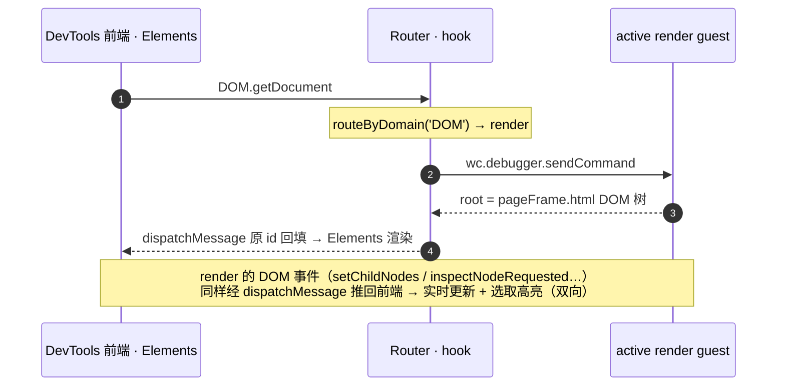

# 嵌入式 DevTools 的 CDP 路由架构

> **一句话**：devtools 右侧那个「开发者工具」是一整套**嵌入式 Chrome DevTools 前端**，但小程序运行时是**三个进程**。本文讲清楚——怎么让**一个**前端，把 Console / Network / Elements 三个面板分别接到**三个不同的后端**上。
>
> **当前落地**：Console、Network、Elements 三条路径都已实现，分别由 `network-forward` 与 `elements-forward` 两个独立服务承载（见 §7）。§4 描述的「单一 owner」`DevtoolsCdpRouter` 是把这两条路径合并的**目标设计**，尚未落地。

<div style={{
  display: 'flex', gap: '12px', flexWrap: 'wrap', margin: '16px 0',
  fontFamily: 'system-ui, sans-serif'
}}>
  <div style={{ flex: '1 1 200px', background: 'hsl(160 30% 12%)', border: '1px solid hsl(160 60% 45%)', borderRadius: '8px', padding: '12px' }}>
    <strong style={{ color: 'hsl(160 70% 70%)' }}>Console</strong><br/>
    <span style={{ opacity: .8 }}>← service-host（逻辑层）</span><br/>
    <code style={{ fontSize: '12px' }}>console.log / 断点 / REPL</code>
  </div>
  <div style={{ flex: '1 1 200px', background: 'hsl(28 40% 12%)', border: '1px solid hsl(28 70% 50%)', borderRadius: '8px', padding: '12px' }}>
    <strong style={{ color: 'hsl(28 80% 68%)' }}>Network</strong><br/>
    <span style={{ opacity: .8 }}>← simulator WCV</span><br/>
    <code style={{ fontSize: '12px' }}>wx.request / fetch / XHR</code>
  </div>
  <div style={{ flex: '1 1 200px', background: 'hsl(210 40% 13%)', border: '1px solid hsl(210 70% 55%)', borderRadius: '8px', padding: '12px' }}>
    <strong style={{ color: 'hsl(210 80% 70%)' }}>Elements</strong><br/>
    <span style={{ opacity: .8 }}>← active render guest</span><br/>
    <code style={{ fontSize: '12px' }}>页面 DOM / CSS</code>
  </div>
</div>

---

## 1. 根本张力：一个前端 ↔ 三个后端

native-host 把一个小程序拆成三个进程（详见 [native-host-abstractions](./native-host-abstractions.md)），三个面板想看的数据各在其中一个进程里：

- **service-host**（隐藏 `BrowserWindow`，`service.html`）跑**逻辑层**——`console.log`、断点、`wx.*` 业务 JS。**Console** 看的是它。
- **simulator WCV**（顶层 `WebContentsView`，`simulator.html`）真正**发起网络请求**——`wx.request`/`downloadFile`/`uploadFile` 都走它的 `fetch`/XHR。**Network** 看的是它。
- **render guest**（每页一个嵌套 `<webview>`，`pageFrame.html`）承载**页面 DOM**。**Elements** 看的是它。

而一个 Chrome DevTools 前端**原生只能 inspect 一个 WebContents**（被 Electron `setDevToolsWebContents` 绑定的那个；本架构里固定绑 service-host）。一个前端、三个后端——这就是 **1 ↔ N 的阻抗失配**，也是 native-host 重构后「Network 面板看不到请求、Elements 显示错 DOM」的总根因。下面这张图是全局骨架，后续每节都在补全它的一条边。

```d2
direction: right

后端: 后端 · 三进程 {
  RG: "render guest\n页面 DOM"
  SH: "service-host\n逻辑层"
  SW: "simulator WCV\n网络栈"
}
分流: CDP 分流 · routeByDomain {
  R1: "DOM · CSS · Overlay\n→ 路由到 render"
  R2: "Runtime · Console · 其余\n→ 默认原样转发 service"
  R3: "Network.*\n→ 注入（单向）"
}
前端: DevTools 前端 · 单个 WebContents {
  style.stroke-dash: 4
  EL: Elements
  CO: Console / Sources
  NW: Network
}

前端.EL -> 分流.R1: DOM 命令
分流.R1 -> 后端.RG: 路由
后端.RG -> 分流.R1: DOM 事件·响应
分流.R1 -> 前端.EL: 推回前端

前端.CO -> 分流.R2: Runtime 命令
分流.R2 -> 后端.SH: 原样转发
后端.SH -> 分流.R2: console·响应
分流.R2 -> 前端.CO: 推回前端

后端.SW -> 分流.R3: Network.* 事件
分流.R3 -> 前端.NW: 推送到面板
```

> 📐 **图中「CDP 分流（逻辑视图）」是逻辑分流视图，不是一个已实现的组件**：今天这层职责由 `elements-forward` + `network-forward` 两个独立服务分别承担；把它们合并成单一 `DevtoolsCdpRouter` 是 §4 的**目标设计（未落地）**。另外，四条边的箭头按真实数据方向定向——service-host / render / 前端三条是双向（命令出、响应/事件入），simulator 是**单向**（只把 Network.* 事件注入前端，无前端→simulator 的命令路径，见 §4「入站/出站」）。

> 🚫 **Emulation 红线**：只有 `routeByDomain` 显式认领的 domain（DOM / CSS / Overlay / DOMSnapshot / DOMDebugger 给 render，Network 给 simulator）才被路由走；其余一切（含 Emulation / Page / Target）默认透传给 service-host。这样 safe-area 服务下的 `Emulation.setSafeAreaInsetsOverride` 永远不会被前端发来的 Emulation 命令污染。


---

## 2. 面板 ↔ target 映射

<table style={{ width: '100%', borderCollapse: 'collapse', fontFamily: 'system-ui, sans-serif', fontSize: '14px' }}>
  <thead>
    <tr style={{ background: 'hsl(0 0% 14%)' }}>
      <th style={{ padding: '8px', textAlign: 'left', border: '1px solid hsl(0 0% 28%)' }}>面板</th>
      <th style={{ padding: '8px', textAlign: 'left', border: '1px solid hsl(0 0% 28%)' }}>目标 target</th>
      <th style={{ padding: '8px', textAlign: 'left', border: '1px solid hsl(0 0% 28%)' }}>机制</th>
      <th style={{ padding: '8px', textAlign: 'left', border: '1px solid hsl(0 0% 28%)' }}>状态</th>
    </tr>
  </thead>
  <tbody>
    <tr><td style={{ padding: '8px', border: '1px solid hsl(0 0% 24%)', color: 'hsl(160 70% 70%)' }}><b>Console</b></td><td style={{ padding: '8px', border: '1px solid hsl(0 0% 24%)' }}>service-host（逻辑层）</td><td style={{ padding: '8px', border: '1px solid hsl(0 0% 24%)' }}>Electron 原生 attach</td><td style={{ padding: '8px', border: '1px solid hsl(0 0% 24%)' }}>✅ 零开销</td></tr>
    <tr><td style={{ padding: '8px', border: '1px solid hsl(0 0% 24%)', color: 'hsl(28 80% 70%)' }}><b>Network</b></td><td style={{ padding: '8px', border: '1px solid hsl(0 0% 24%)' }}>simulator WCV</td><td style={{ padding: '8px', border: '1px solid hsl(0 0% 24%)' }}>CDP 抓取 + dispatchMessage 注入</td><td style={{ padding: '8px', border: '1px solid hsl(0 0% 24%)' }}>✅ 一期（列表/headers/timing）</td></tr>
    <tr><td style={{ padding: '8px', border: '1px solid hsl(0 0% 24%)', color: 'hsl(210 80% 72%)' }}><b>Elements</b></td><td style={{ padding: '8px', border: '1px solid hsl(0 0% 24%)' }}>active render guest</td><td style={{ padding: '8px', border: '1px solid hsl(0 0% 24%)' }}>sendMessageToBackend hook + 路由</td><td style={{ padding: '8px', border: '1px solid hsl(0 0% 24%)' }}>🟢 已落地（默认开启，只读浏览）</td></tr>
    <tr><td style={{ padding: '8px', border: '1px solid hsl(0 0% 24%)', opacity: .6 }}>Sources/Memory/…</td><td style={{ padding: '8px', border: '1px solid hsl(0 0% 24%)' }}>—</td><td style={{ padding: '8px', border: '1px solid hsl(0 0% 24%)' }}>tab 定制隐藏</td><td style={{ padding: '8px', border: '1px solid hsl(0 0% 24%)' }}>✅ 已隐藏</td></tr>
  </tbody>
</table>

---

## 3. 数据流转：一条 `DOM.getDocument` 的旅程

Elements 面板要画 DOM 树，会发一条 `DOM.getDocument`。在扁平 main session 下，它这样走完一个来回：



**为什么不直接把前端 attach 到 render？** 因为 Console 的 REPL eval（`Runtime.evaluate`）必须落在 **service-host 逻辑层**——那才是开发者写业务、下断点的地方。所以前端原生绑 service-host（白拿 Console/Sources/Runtime），只把 Elements 需要的 DOM 系流量「偷」到 render guest。

---

## 4. 一句话原理 + 目标架构 `DevtoolsCdpRouter`

无论实现拆成几个文件，整套机制都能压缩成一句话：

> **前端原生 attach service-host；按 CDP domain，把不属于 service-host 的命令/事件转发到对应后端。**

这个分流决策是一个**纯函数**——`elements-forward/index.ts` 里的 `routeByDomain(method)`，按 domain 前缀匹配返回 `'render' | 'service'`，不查任何注册表：

<div style={{ background: 'hsl(0 0% 11%)', border: '1px solid hsl(0 0% 26%)', borderRadius: '8px', padding: '14px', margin: '10px 0' }}>
<pre style={{ margin: 0, fontFamily: 'ui-monospace, monospace', fontSize: '13px', color: 'hsl(0 0% 82%)', whiteSpace: 'pre-wrap' }}>{`const RENDER_DOMAIN_PREFIXES = ['DOM.','CSS.','Overlay.','DOMSnapshot.','DOMDebugger.']

function routeByDomain(method): 'render' | 'service' {
  for (const p of RENDER_DOMAIN_PREFIXES) if (method.startsWith(p)) return 'render'
  return 'service'                       // 默认：透传给原生 service-host
}`}</pre>
</div>

- **出站**：前端的 `InspectorFrontendHost.sendMessageToBackend` 被包了一层。命中 render 前缀的命令被拦下，交给主进程转发到 active render guest；**其余一切（含 Emulation / Page / Target）原样透传 = 原生 service-host**。Network 面板则由 network-forward 反向注入——它监听 simulator 的 Network.\* **事件**并 dispatch 进前端（前端发出的 Network 命令本身仍透传给 service-host；`getResponseBody` 等命令往返是二期）。
- **入站**：render 的响应/事件、simulator 的 Network 事件，都经 `window.DevToolsAPI.dispatchMessage` 推送回前端（大 payload 走 `dispatchMessageChunk` 分片）。
- **三个后端**：`service-host` 是**隐式默认**（不拦、透传即得）；`render`（elements-forward）认领 DOM / CSS / Overlay / DOMSnapshot / DOMDebugger；`simulator`（network-forward）认领 Network。

> **现状 vs 目标**：今天这两条路径是 `installElementsForward` 与 `createNetworkForwarder` **两个独立服务**，由 view-manager 各自接线，`routeByDomain` 等小工具刻意各自内联。把它们收敛成下面这个**单一 owner** `DevtoolsCdpRouter`（绑在 devtoolsWc 上、pool-swap 重指向时统一 rebind、各后端按 domain 注册成 provider）是**目标设计，尚未落地**——动机见本节末「为什么要收敛成这层」。

<div style={{ background: 'hsl(0 0% 11%)', border: '1px solid hsl(0 0% 26%)', borderRadius: '8px', padding: '14px', margin: '10px 0' }}>
<pre style={{ margin: 0, fontFamily: 'ui-monospace, monospace', fontSize: '13px', color: 'hsl(0 0% 82%)', whiteSpace: 'pre-wrap' }}>{`// —— 目标设计，当前未实现 ——
interface DevtoolsCdpRouter {            // 绑在 devtoolsWc 上，pool-swap 重指向时 rebind
  bindFrontend(devtoolsWc): void         // 装【唯一】的 sendMessageToBackend 包装器 + 提供 dispatch()
  registerBackend(provider): Disposable  // 按 domain 注册一个后端 provider
}
interface CdpBackendProvider {
  domains: string[]                      // 注册期声明 + 断言两 provider domain 不重叠（不参与运行时分流）
  handleCommand(method, params): Promise<result>   // 拦下的出站命令 → 解析为 CDP result（throw → error）
}`}</pre>
</div>

### 整体 domain 路由表

<table style={{ width: '100%', borderCollapse: 'collapse', fontFamily: 'system-ui, sans-serif', fontSize: '13px' }}>
  <thead><tr style={{ background: 'hsl(0 0% 14%)' }}>
    <th style={{ padding: '7px', textAlign: 'left', border: '1px solid hsl(0 0% 28%)' }}>domain</th>
    <th style={{ padding: '7px', textAlign: 'left', border: '1px solid hsl(0 0% 28%)' }}>后端</th>
    <th style={{ padding: '7px', textAlign: 'left', border: '1px solid hsl(0 0% 28%)' }}>机制</th>
  </tr></thead>
  <tbody>
    <tr><td style={{ padding: '7px', border: '1px solid hsl(0 0% 24%)' }}>Runtime / Console / Debugger / Profiler / Log / Sources</td><td style={{ padding: '7px', border: '1px solid hsl(0 0% 24%)', color: 'hsl(160 70% 70%)' }}>service-host</td><td style={{ padding: '7px', border: '1px solid hsl(0 0% 24%)' }}>原生透传（零开销）</td></tr>
    <tr><td style={{ padding: '7px', border: '1px solid hsl(0 0% 24%)' }}>Network（事件）</td><td style={{ padding: '7px', border: '1px solid hsl(0 0% 24%)', color: 'hsl(28 80% 70%)' }}>simulator WCV</td><td style={{ padding: '7px', border: '1px solid hsl(0 0% 24%)' }}>抓 simulator 的 Network.* 事件 → requestId 命名空间化 → 推送到面板前端</td></tr>
    <tr><td style={{ padding: '7px', border: '1px solid hsl(0 0% 24%)' }}>DOM / CSS / Overlay / DOMSnapshot / DOMDebugger</td><td style={{ padding: '7px', border: '1px solid hsl(0 0% 24%)', color: 'hsl(210 80% 72%)' }}>active render guest</td><td style={{ padding: '7px', border: '1px solid hsl(0 0% 24%)' }}>转发 render debugger + 推回前端</td></tr>
    <tr style={{ background: 'hsl(0 50% 12%)' }}><td style={{ padding: '7px', border: '1px solid hsl(0 40% 35%)' }}><b>Emulation</b> 🚫</td><td style={{ padding: '7px', border: '1px solid hsl(0 40% 35%)', color: 'hsl(160 70% 70%)' }}>service-host（红线）</td><td style={{ padding: '7px', border: '1px solid hsl(0 40% 35%)' }}>safe-area 主进程直发，前端 Emulation 绝不路由 render</td></tr>
    <tr><td style={{ padding: '7px', border: '1px solid hsl(0 0% 24%)' }}>Page / Target / Input</td><td style={{ padding: '7px', border: '1px solid hsl(0 0% 24%)' }}>service-host</td><td style={{ padding: '7px', border: '1px solid hsl(0 0% 24%)' }}>透传（结构性默认，同 Emulation）</td></tr>
  </tbody>
</table>

<div style={{ background: 'hsl(0 45% 12%)', borderLeft: '4px solid hsl(0 65% 55%)', padding: '10px 14px', margin: '12px 0', borderRadius: '4px' }}>
  <b style={{ color: 'hsl(0 75% 70%)' }}>Emulation 红线是结构性保证</b>：<code>routeByDomain</code> 的默认分支是「透传给 service-host」，只有它显式认领的 render / Network domain 才被偷走。Emulation 不在认领名单里 → 前端发来的 Emulation 命令永远落在 service-host 路径，<b>绝不</b>触及 render guest 的 <code>setSafeAreaInsetsOverride</code>。<b>安全是默认值，不靠"记得加判断"。</b>
</div>

### 为什么要收敛成这层（vs 维持两套各自打补丁）

1. **消双 hook 冲突**：Elements 已 hook `sendMessageToBackend`；Network 二期（`getResponseBody`）也要 hook 它。两处各自 monkey-patch 会互相覆盖——只有让 router 持**唯一**包装器才安全。
2. **去重**：chunk / dispatch / 轮询这套样板，现在 network-forward 和 elements-forward **各写了一份**，收敛后只需一份。
3. **单 lifecycle owner**：pool-swap 重指向、frontend re-ready 时，由一个 owner 统一 rebind，而不是两个服务各自监听。

> open-in-editor（`setOpenResourceHandler`）和 tab 定制（UI 层）**不碰 embedder 的 CDP 边界**，所以即便将来有了 router 也不并进去（KISS）。

---

## 5. 真机实验：两个 GO/NO-GO 都 GREEN

落地前用一次性探针（`cdp-trace-probe` / `elements-route-spike`，已删）真机跑了两个 go/no-go。下面的数字是当时探针抓到的观测值。两个实验都迫使最初设计改向——**把可选兜底升成主机制、把最危险的一块整块砍掉**：

<div style={{ display: 'flex', gap: '14px', flexWrap: 'wrap', margin: '12px 0' }}>
  <div style={{ flex: '1 1 320px', background: 'hsl(0 0% 11%)', border: '1px solid hsl(0 0% 28%)', borderRadius: '8px', padding: '14px' }}>
    <div style={{ color: 'hsl(45 80% 65%)', fontWeight: 'bold' }}>#1 窗口是否成立？ → <span style={{ color: 'hsl(0 70% 65%)' }}>INVALID</span></div>
    <p style={{ fontSize: '13px', opacity: .9 }}>实测前端 bootstrap 阶段就 eager 拉 DOM，<b>不等点 Elements</b>：</p>
    <pre style={{ fontFamily: 'ui-monospace, monospace', fontSize: '12px', background: 'hsl(0 0% 7%)', padding: '8px', borderRadius: '4px', color: 'hsl(0 0% 80%)' }}>{`t=272ms  DOM.enable        sid=<main>
t=318ms  DOM.getDocument   sid=<main>  ← 拉 service-host DOM`}</pre>
    <p style={{ fontSize: '13px', opacity: .9 }}>→ <code>DOM.documentUpdated</code> 重拉<b>从可选兜底升为主机制</b>。</p>
  </div>
  <div style={{ flex: '1 1 320px', background: 'hsl(0 0% 11%)', border: '1px solid hsl(0 0% 28%)', borderRadius: '8px', padding: '14px' }}>
    <div style={{ color: 'hsl(45 80% 65%)', fontWeight: 'bold' }}>#2 Elements 真能出 render 树？ → <span style={{ color: 'hsl(140 65% 60%)' }}>GO</span></div>
    <p style={{ fontSize: '13px', opacity: .9 }}>把 getDocument 路由到 render，返回的是页面真身：</p>
    <pre style={{ fontFamily: 'ui-monospace, monospace', fontSize: '12px', background: 'hsl(0 0% 7%)', padding: '8px', borderRadius: '4px', color: 'hsl(0 0% 80%)' }}>{`documentURL = …/pageFrame.html?pagePath=pages/home/home
childNodeCount = 2
follow-ups: requestChildNodes / CSS.getMatchedStyles ×4 …`}</pre>
    <p style={{ fontSize: '13px', opacity: .9 }}>→ <b>证伪</b>了"frameId 不一致致空树"的最坏猜测。</p>
  </div>
</div>

**实验删掉了最初设计里最危险的一块**：原方案要为「与 safe-area 共享 render guest 的 debugger」抽一个 CDP broker（动已工作的 safe-area，blast radius 最高）。spike 实证——**直接复用 safe-area 已 attach 的 session（`sendCommand` + 额外 `on('message')`），绝不再 attach、绝不 detach**，零 safe-area 改动即可跑通。故 broker **整块砍掉**。

---

## 6. 能力边界（必须诚实）

扁平 main session 把三个后端的 model 灌进**同一个** target。这对「**只读浏览 render DOM 树 + Network 请求列表**」够用（已实测），但 **DOM(render) ↔ Runtime(service) 跨后端无法关联**，以下**结构性做不到**（不是 bug）：

<table style={{ width: '100%', borderCollapse: 'collapse', fontFamily: 'system-ui, sans-serif', fontSize: '13px' }}>
  <thead><tr style={{ background: 'hsl(0 0% 14%)' }}>
    <th style={{ padding: '7px', textAlign: 'left', border: '1px solid hsl(0 0% 28%)' }}>✅ 一期能做</th>
    <th style={{ padding: '7px', textAlign: 'left', border: '1px solid hsl(0 0% 28%)' }}>🚧 结构性做不到（需策略 B：child-target）</th>
  </tr></thead>
  <tbody>
    <tr>
      <td style={{ padding: '8px', border: '1px solid hsl(0 0% 24%)', verticalAlign: 'top' }}>看 render DOM 树 / 改不了的只读浏览<br/>matched / computed styles（只读）<br/>选取高亮（inspect element）<br/>Network 请求列表 / headers / timing</td>
      <td style={{ padding: '8px', border: '1px solid hsl(0 0% 24%)', verticalAlign: 'top' }}>Console <code>$0</code> 求值（Runtime 落 service，拿不到 render 节点）<br/>Elements → Sources 跳转<br/>Network initiator 栈跳源<br/>样式编辑回写（二期）</td>
    </tr>
  </tbody>
</table>

> 策略 B（`Target.attachedToTarget` + 每后端 sessionId）能解锁上述，但要实现完整虚拟后端、复杂度暴涨，故定为 **later，非永久否决**。

---

## 7. 已落地机制速查

| 机制 | 文件 | 注入层 |
|---|---|---|
| Console | Electron `setDevToolsWebContents`（`view-manager` `pointNativeDevtoolsAtServiceWc`） | 原生 attach |
| Network 注入 | `services/network-forward/` | `DevToolsAPI.dispatchMessage`（事件） |
| Elements 路由 | `services/elements-forward/` | hook `sendMessageToBackend` + 推回前端 |
| 点源码 → Monaco | `view-manager` `injectOpenResourceHandler` | `setOpenResourceHandler` |
| tab 定制 + 默认 Console | `services/views/devtools-tabs.ts` | UI 层 `UI.ViewManager` |

> **Elements 路由两个要点**：
> 1. **复用、不抢占**：直接用 safe-area 已 attach 的那个 debugger session 收发（只在 safe-area 降级、没人 attach 时才自己 `attach('1.3')`），且只 detach 自己 attach 的，绝不动别人的。
> 2. **实时判陈旧，而非快照**：一条事件/响应是否已过期，是按「它来自的那个 wc **此刻是否仍是 active render guest**」当场判定的（代码里的 `isActiveWcId`），没有用任何 generation 计数快照。好处是 `switchTab` / `navigateBack` 切回旧页后，旧 guest 的 DOM 增量事件能**自动恢复**转发——快照式实现会把它永久 strand 在过期态。

---

## 8. 子模块约束

全部落在 `packages/devtools/`，**不动 `dimina/` submodule**。Elements 路由不碰 safe-area；Network/Console 各走独立通道，互不影响。
