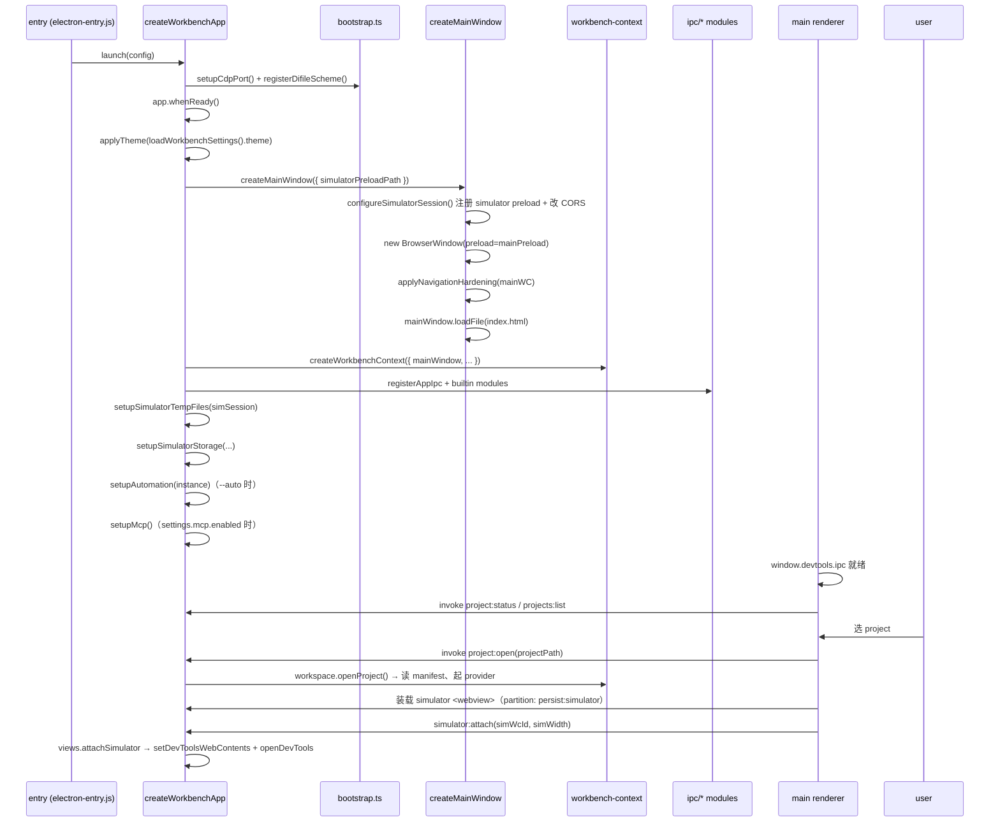

# Electron Container 架构

> 给新加入 dimina-kit devtools 的工程师：本文描述 devtools 整个 Electron 容器的拓扑、IPC、Session、关键服务、两套运行时架构、以及安全与启动序列。读完应能 onboard 到 `src/main/`、`src/preload/`、`src/simulator/` 这三棵代码树。

---

## 1. 窗口拓扑全景图

> 一句话：一个 BrowserWindow（workbench）做主舞台，里面挂多个 WebContentsView 做覆盖层；mini-program 在 `<webview>` 内运行，页面用 `<iframe>` 或子 `<webview>` 承载。

### 1.1 进程清单

| 进程类别 | 数量 | 备注 |
|---|---|---|
| Electron main | 1 | 唯一可触达 fs/net/Electron API 的进程 |
| Renderer（workbench main） | 1 | React + OpenSumi-lite 的 workbench UI |
| Renderer（settings 独立窗口） | 0..1 | 用户打开「开发工具设置」时按需创建，见 `windows/settings-window/create.ts:11` |
| Overlay renderer（settings overlay / popover） | 0..n | 跑在 WebContentsView 里，附在 main window 上 |
| Renderer（simulator `<webview>`） | 1 per project | 跑 mini-program 的 host frame，partition = `persist:simulator` |
| Renderer（page iframe / sub-webview） | n | 默认架构是 `<iframe>`；native-host 架构是 `<webview>` 子页 |
| BrowserWindow（service-host） | 0..1 | 仅 native-host 架构启用；`constructServiceHostWindow` 建窗在 `windows/service-host-window/create.ts:31` |
| Service WebWorker | 0..1 | 默认架构下 dimina-fe 在 simulator 内部起的 service Worker |

### 1.2 窗口与 View 嵌套层级

```
Electron app
└── BrowserWindow (workbench main window)         ← main-window/create.ts:60
    ├── webPreferences.preload = mainPreloadPath   ← 暴露 window.devtools.ipc
    ├── contentView (V)                            ← 通过 new View() 包了一层
    │   ├── mainWebView (主 renderer)              ← workbench React UI
    │   ├── simulatorView : WebContentsView        ← DevTools 面板（Chrome DevTools 实例本身）
    │   │   ← view-manager.ts:228 创建（new WebContentsView），attach 到 simulator <webview>
    │   ├── settingsView : WebContentsView         ← 「设置」覆盖层
    │   └── popoverView  : WebContentsView         ← 通用悬浮层
    │
    └── 主 renderer 内（在 React 树里渲染）
        └── <webview partition="persist:simulator">     ← simulator 宿主 frame
            preload = dist/preload/windows/simulator.js
            │
            ├── 默认架构（dimina-fe Application + MiniApp）:
            │   └── <iframe> ×N                          ← 每个 page 一个
            │   └── service WebWorker                    ← 跑 logic.js
            │
            └── native-host 架构（DIMINA_NATIVE_HOST=1）:
                └── <webview> ×N（DeviceShell 渲染）      ← device-shell.tsx:255
                    preload = dist/render-host/preload.cjs

另起：BrowserWindow (settings window)             ← 用户主动 open settings 时
    preload = mainPreloadPath
    （独立 top-level window，非 overlay）

另起：BrowserWindow (service-host window)         ← 仅 native-host 架构
    partition = persist:simulator
    preload = dist/service-host/preload.cjs
    见 createServiceHostWindow（windows/service-host-window/create.ts:124）
```

### 1.3 关键放置约束

- DevTools 面板（`simulatorView`）是 Chromium 自己的 DevTools UI，挂在主窗口上做 overlay；它通过 `sim.setDevToolsWebContents(simulatorView.webContents)` 绑定到 simulator `<webview>` 的 webContents，见 `view-manager.ts:229`。
- WXML / AppData / Storage 三个右侧 panel 的数据**不是**独立 WebContentsView，是 React 组件读 IPC 数据后画的（见 `renderer/controllers/use-panel-data.ts`）。容器层只负责 simulator / settings / popover 三种 overlay 的生命周期。

---

## 2. 进程间通信 (IPC)

> 一句话：channel 名集中在 `shared/ipc-channels.ts`，按业务域加前缀；main 注册 handler，renderer 通过 contextBridge 注入的 `window.devtools.ipc` 调用。

### 2.1 channel 前缀地图

| 前缀 | 文件（常量）| 域 |
|---|---|---|
| `simulator:attach` / `detach` / `resize` / … | `shared/ipc-channels.ts:11`（`SimulatorChannel`）| simulator overlay 生命周期（含 native-host 的 attach-native / set-native-bounds）|
| `simulator:custom-apis:list` / `invoke` | `shared/ipc-channels.ts:35`（`SimulatorCustomApiChannel`）| renderer 直接调下游注册的 custom API |
| `simulator:custom-apis:bridge-request` / `bridge-response` | `shared/ipc-channels.ts:48`（`SimulatorCustomApiBridgeChannel`）| simulator `<webview>` ↔ main-window renderer 的 custom-apis 代理 |
| `simulator:storage:*` | `shared/ipc-channels.ts:55`（`SimulatorStorageChannel`）| CDP-backed storage 面板 |
| `simulator:element:*` | `shared/ipc-channels.ts:77`（`SimulatorElementChannel`）| CDP-backed 元素审查 |
| `workbench:runtime:native-host` | `shared/ipc-channels.ts:87`（`WorkbenchRuntimeChannel`）| renderer 读一次以判断 native-host 并选 panel 数据源 |
| `simulator:wxml:*` | `shared/ipc-channels.ts:94`（`SimulatorWxmlChannel`）| native-host 下 main 推 WXML 树 |
| `simulator:appdata:*` | `shared/ipc-channels.ts:102`（`SimulatorAppDataChannel`）| native-host 下 main 推 AppData 快照 |
| `workbenchSettings:*` | `shared/ipc-channels.ts:129`（`WorkbenchSettingsChannel`）| 全局开发工具设置 |
| `project:*` | `shared/ipc-channels.ts:141`（`ProjectChannel`）| 当前 project 会话 |
| `projects:*` | `shared/ipc-channels.ts:154`（`ProjectsChannel`）| project 列表 / 模板 / 创建 |
| `dialog:*` | `shared/ipc-channels.ts:176`（`DialogChannel`）| OS dialog |
| `panel:*` | `shared/ipc-channels.ts:182`（`PanelChannel`）| 右侧 panel 切换 + eval |
| `popover:*` | `shared/ipc-channels.ts:191`（`PopoverChannel`）| popover overlay |
| `toolbar:*` | `shared/ipc-channels.ts:201`（`ToolbarChannel`）| toolbar actions |
| `window:*` | `shared/ipc-channels.ts:210`（`WindowChannel`）| 容器层导航 |
| `app:*` | `shared/ipc-channels.ts:216`（`AppChannel`）| preload 路径 / branding / header height |
| `miniapp-snapshot:*` | `shared/ipc-channels.ts:229`（`MiniappSnapshotChannel`）| AppData / WXML 通用 push/pull |
| `automation:*` | `shared/ipc-channels.ts:236`（`AutomationChannel`）| 自动化 ws 端口查询 |
| `settings:*` | `shared/ipc-channels.ts:242`（`SettingsChannel`）| 嵌入式 settings overlay |
| `updates:*` | `shared/ipc-channels.ts:255`（`UpdateChannel`）| UpdateManager |
| `dmb:*` | `shared/bridge-channels.ts:1` | bridge-router 协议（service ↔ simulator）|
| `simulator:dom-ready` / `navigation-bar` / `nav-action` / `tab-action` / `api-call` | `shared/bridge-channels.ts:32`（`SIMULATOR_EVENTS`）| main → simulator window 推送事件 |

### 2.2 invoke vs send

| 模式 | 用途 | 注册端 | 调用端 |
|---|---|---|---|
| `ipcMain.handle(ch, fn)` ↔ `ipcRenderer.invoke(ch, ...)` | 请求/响应、有返回值或异步副作用 | main：`src/main/ipc/*.ts` | renderer：`renderer/shared/api/ipc-transport.ts:30` |
| `ipcMain.on(ch, fn)` ↔ `ipcRenderer.send(ch, ...)` | 单向通知（lifecycle、ack）| 同上 | 同上 |
| `webContents.send(ch, payload)` | main → renderer 主动推送 | — | main 端 |
| `<webview>.send(ch, payload)` | main → simulator webview | — | bridge-router |
| `ipcRenderer.sendToHost(ch, p)` | webview → 主 renderer（不走 main）| — | simulator preload，用于 custom-apis 代理 |

### 2.3 注册端在哪里

```
src/main/ipc/
├── app.ts             ← AppChannel（preload path / branding）
├── bridge-router.ts   ← dmb:* + simulator:* 推送（重头戏，见 §4.3）
├── panels.ts          ← PanelChannel（list / eval / select）
├── popover.ts         ← PopoverChannel
├── projects.ts        ← ProjectsChannel
├── session.ts         ← ProjectChannel（open / close 等）
├── settings.ts        ← SettingsChannel + WorkbenchSettingsChannel
├── simulator.ts       ← SimulatorChannel + SimulatorCustomApiChannel
└── toolbar.ts         ← ToolbarChannel
```

主入口 `registerAppIpc(ctx)` 在 `src/main/app/app.ts:328` 拉起；其余模块通过 `registerBuiltinModules`（`app.ts:206`）里的 `BUILTIN_MODULES[id].setup(context)`（`app.ts:209`）一次性挂载。

### 2.4 renderer 侧 façade

`window.devtools.ipc` 由 `src/preload/windows/main.ts:26-52` 用 `contextBridge.exposeInMainWorld('devtools', { ipc: { invoke, send, on, once, removeListener } })` 暴露。一切 channel 名称都走这层 — preload **不**做白名单（注释在 `windows/main.ts:11-15` 解释了原因），授权全交给 main 端的 `sender-policy.ts` + zod schema。

---

## 3. Session 与 preload 注入

> 一句话：partition 是 Chromium 存储/preload 隔离单位；dimina-kit 用 `persist:simulator` 把所有 mini-program 上下文锁在一起。

### 3.1 partition 表

| partition | 创建位置 | 用途 | 注入的 preload |
|---|---|---|---|
| 默认（main window）| BrowserWindow 默认 session | workbench UI、settings 独立窗、settings/popover overlay | `mainPreloadPath`（`utils/paths.ts:54`）|
| `persist:simulator` | `main-window/create.ts:32` 通过 `session.fromPartition` 取得 | simulator `<webview>` + service-host BrowserWindow + native-host 子 `<webview>` | session 级 `registerPreloadScript({ type: 'frame', filePath: simulatorPreloadPath })`（`main-window/create.ts:36`）|

### 3.2 preload 一览

| 文件（源）| 输出（dist）| 注入方式 |
|---|---|---|
| `src/preload/windows/main.ts` | `dist/preload/windows/main.cjs` | 通过 `webPreferences.preload` 显式挂在 main window / settings window / overlay view 上 |
| `src/preload/windows/simulator.ts` | `dist/preload/windows/simulator.js` | `simulatorSession.registerPreloadScript` 注入 `persist:simulator` 的所有 frame |
| `src/service-host/preload.cjs` | （直接以 cjs 提供）| `webPreferences.preload` 挂在 service-host BrowserWindow |
| `src/render-host/preload.cjs` | （直接以 cjs 提供）| native-host 架构下作为子 `<webview>` 的 `preload` 属性传入，见 `device-shell.tsx:259` |

### 3.3 webPreferences 差异

| 窗口/View | `contextIsolation` | `nodeIntegration` | `sandbox` | `webviewTag` | 备注 |
|---|---|---|---|---|---|
| main window | `true` | `false` | `false` | `true` | `main-window/create.ts:71-80`；`sandbox: false` 是给 preload `require('electron')` 用的 |
| settings window | `true` | `false` | `false` | — | `settings-window/create.ts:19-25` |
| settings overlay view | `true` | `false` | `false` | — | `view-manager.ts:442-448` |
| popover overlay view | `true` | `false` | `false` | — | `view-manager.ts:475-480` |
| simulator `<webview>` | **`false`** | `false` | — | — | `main-window/create.ts:115`；isolation 关掉是因为 dimina runtime 与 user 代码共享同一 JS realm |
| service-host BrowserWindow | `false` | `false` | `false` | — | `service-host-window/create.ts:37-43`，需要直接挂全局的 jsbridge |

### 3.4 expose 的 fallback 模式

`src/preload/shared/expose.ts:16` 的 `exposeOnMainWorld(key, value)`：

1. 优先 `contextBridge.exposeInMainWorld(key, value)`；
2. 失败（即 `contextIsolation: false` 的环境）退化为 `(window as any)[key] = value`；
3. 返回一个 disposer，只能撤销 fallback 路径下的 `window[key]`，且只有 `window[key] === value` 时才删，避免清掉别人的句柄。

native-host preload (`preload/runtime/native-host.ts:89`) 与 custom-apis bridge 都用这条工具，统一处理 isolation on/off 两种宿主。

---

## 4. 关键服务

> 一句话：WorkspaceService 管 project 生命周期，ViewManager 管 overlay view，BridgeRouter 管 mini-program runtime 的消息总线，AutomationService 把 ws 接进来。

### 4.1 WorkspaceService — `src/main/services/workspace/workspace-service.ts`

| 责任 | 入口 |
|---|---|
| 列出 / 添加 / 移除 project | `listProjects` / `addProject` / `removeProject`（`workspace-service.ts:48-52`）|
| 当前 session 打开 / 关闭 | `openProject` / `closeProject`（`workspace-service.ts:55-56`）|
| 编译配置读写 | `getCompileConfig` / `saveCompileConfig`（`workspace-service.ts:72-73`）|
| 缩略图（含远程 host 路径）| `captureThumbnail` / `getThumbnail`（`workspace-service.ts:67-68`）|

provider 注入：远程 host（如 qdmp 的云 workspace）通过 `ProjectsProvider` 接管 fs，默认走 `LocalProjectsProvider`，把 `<userData>/dimina-projects.json` 当后端（`shared/types.ts:222`、`services/projects/project-repository.ts:27`）。

### 4.2 ViewManager — `src/main/services/views/view-manager.ts`

唯一被允许 `new WebContentsView` / `addChildView` / `removeChildView` 的组件。状态都在闭包里（`view-manager.ts:144-162`），对外只暴露动作。

```
attachSimulator(simWcId, simWidth)          ← 把 DevTools 面板绑到 sim webContents，view-manager.ts:208
attachNativeSimulator(simulatorUrl, simWidth)← native-host 下把 simulator 本身建成顶层 WebContentsView，view-manager.ts:266
setNativeSimulatorViewBounds(...)            ← native-host 下设备外框 rect + zoom 下发到嵌套 guest，view-manager.ts:520
showSimulator / hideSimulator               ← view-manager.ts:419 / 429
showSettings / hideSettings                 ← view-manager.ts:440 / 464
showPopover / hidePopover                   ← view-manager.ts:473 / 497
repositionAll                               ← 窗口 resize 时调用，view-manager.ts:505
disposeAll / detachSimulator                ← 关 project 时统一销毁，view-manager.ts:516 / 392
```

`attachNativeSimulator`（`view-manager.ts:266`）只在 native-host 下用：它把 simulator 自己建成一个顶层 `WebContentsView`（不是 renderer 的 `<webview>` guest），用 `cjsSiblingPreloadPath` 的 `.cjs` preload + `webviewTag:true / contextIsolation:false / sandbox:false / partition:'persist:simulator'`——顶层 WebContentsView 不是 guest，能托管 DeviceShell 的每页 render-host `<webview>`（见 §5.2）。`setNativeSimulatorViewBounds`（`view-manager.ts:520`）把 renderer 量出来的设备外框内屏 rect + zoom 应用上去，并把 `zoomFactor` 传播到已挂载的嵌套 render-host guest。

`detachSimulator`（`view-manager.ts:392`）销毁 simulator view，同时顺手销毁 native simulator view（如有）、hide popover、销毁 settings view。

### 4.3 BridgeRouter — `src/main/ipc/bridge-router.ts` (重头戏)

这是 main 进程承担 mini-program runtime 编排的核心。建议把它当成一个状态机：

**两级 session 模型**

| 实体 | 内容 |
|---|---|
| `AppSession`（`bridge-router.ts:68`）| `appSessionId` / `appId` / `pkgRoot` / `root` / `scene` / `serviceWindow` / `serviceWc` / `simulatorWc` / `serviceLoaded` / `resourceBaseUrl`（资源 fetch 的统一 base，通常是 dev server origin）/ `resourceServer`（nullable，仅当 caller 没给 `resourceBaseUrl` 时起的本地降级 server）/ `hostEnv` / `appConfig` / `manifest` / `pages: Map<string, PageSession>` / `activeBridgeId`（DeviceShell 上报的可见 top-of-stack bridgeId，首个信号前 null）/ `poolEntryId`（service 窗来自预热池时的 entry id）/ `onServiceClosed` / `onServiceBoot`（dispose 前要摘掉的两个 service 窗监听器）|
| `PageSession`（`bridge-router.ts:112`）| `bridgeId` / `appSessionId` / `pagePath` / `query` / `isRoot` / `isTab` / `renderWc` / `renderLoaded` / `resourceLoadedSent` / `windowConfig` |

**关键 channel 入口**

| Channel | 注册位置 | 行为 |
|---|---|---|
| `dmb:spawn` | `bridge-router.ts:326`（`handleSpawn`）| 创建 AppSession + service-host window，返回 `serviceWcId / resourceBaseUrl / manifest / rootWindowConfig`。预热池的 acquire/release 也在 `handleSpawn` 里（由 `DIMINA_PREWARM_POOL_SIZE` 开关，见 [`./prewarm-webview.md`](./prewarm-webview.md)，本文不复述池内部）|
| `dmb:page:open` | `bridge-router.ts:331` | 在已有 AppSession 上新建 PageSession，返回 bridgeId/windowConfig |
| `dmb:page:close` | `bridge-router.ts:339` | 关闭非 root 页，root 走 dispose |
| `dmb:page:lifecycle` | `bridge-router.ts:354` | simulator → service 转发 pageShow/pageHide/... |
| `dmb:nav:callback` | `bridge-router.ts:360` | simulator 完成路由后，让 service 端的 success/fail 回调 fire |
| `dmb:dispose` | `bridge-router.ts:379` | 销毁 AppSession（含 sender 合法性校验，`bridge-router.ts:367-371`）|
| `dmb:service:invoke/publish` | `bridge-router.ts:389 / 401` | service → container/render 的消息 |
| `dmb:render:invoke/publish` | `bridge-router.ts:411 / 421` | render iframe/webview → service/container 的消息 |
| `dmb:simulator-api` | `bridge-router.ts:424` | bridge-router raw handler，调 `ctx.simulatorApis.invoke`；renderer 直接调 custom API 走 `simulator:custom-apis:invoke`（`main/ipc/simulator.ts:43`）|
| `dmb:api:response` | `bridge-router.ts:432` | simulator 回 `API_CALL` 的 ack，main 据此调原始 service 端 success/fail |
| `dmb:active-page` | `bridge-router.ts:323`（`ACTIVE_PAGE`）| DeviceShell → main，记录可见 top-of-stack 页的 bridgeId（main 自己没有 z-order 概念）；panel / automation 据此解析「当前页」的 render webContents |

`bridge-router` 还把一个 `BridgeRouterHandle`（`bridge-router.ts:172` 定义，`install` 里挂到 `ctx.bridge`，`bridge-router.ts:308`）暴露给其它 main 服务（simulator-storage / automation / appdata），用 `isNativeHost()` / `getServiceWc()` / `getActiveRenderWc()` / `getActiveBridgeId()` / `resolveRenderWc(bridgeId)` / `onRenderEvent(...)` 解析当前活的 service/render WebContents——getter 每次都重新解析（预热池可能在 respawn 时换窗，缓存句柄会过期）。

**simulator-resident API 派发优先级**（`bridge-router.ts:864` 的 `handleSimulatorApi`）：

```
service-invokeAPI(name, params)
        ▼
NAV_BAR_API_NAMES   ───►  E.NAV_BAR     → simulator 自己改 navigation-bar
NAV_ACTION_NAMES    ───►  E.NAV_ACTION  → simulator 自己 push/pop 页面栈
TAB_ACTION_NAMES    ───►  E.TAB_ACTION  → simulator 自己改 tab-bar
ctx.storageApi && STORAGE_API_NAMES.has(name)
                    ───►  把异步 wx.setStorage/getStorage/… 路由到 service-host 窗的 file:// store
                          （native-host 下统一同步/异步两条写入路径，见 simulator-storage）
ctx.simulatorApis.has(name)  ───► main 进程直接执行（registerSimulatorApi 注册的）
其他                ───►  forwardApiCallToSimulator → E.API_CALL（5s 超时 timer）
                                              ▲
                          simulator 完成 wx.xxx 后回 dmb:api:response
```

**资源协议 `dmb-resource://`**

- 在 `installResourceProtocolHandlers`（`bridge-router.ts:1305`）里 `protocol.handle('dmb-resource', handler)`，同时挂到默认 protocol 和 `simulatorSession.protocol` 上（`bridge-router.ts:1317-1318`）。
- handler（`bridge-router.ts:1306-1312`）从 url.hostname 解析 `bridgeId`，回查 AppSession，把请求重定向到 `ap.resourceBaseUrl`——通常是 spawn 传入的 dev-server origin（可能是 localhost、127.0.0.1 或其它 host；`handleSpawn` 在 `bridge-router.ts:474-475` 接受任意 `opts.resourceBaseUrl` 并补尾斜杠）；只有当 spawn 没带 `resourceBaseUrl` 时才会降级到本地 `DiminaResourceServer`（nullable fallback，见 `dimina-resource-server.ts`）。
- 这条协议让 render/simulator 侧既能保持 CSP / fetch 限制，又能从 mini-program 包内取资源；session 不变 = preload 不变 = 共享 storage。

### 4.4 AutomationService — `src/main/services/automation/index.ts`

- `startAutomationServer(ctx, port)`（`automation/index.ts:48`）起一个 `ws` server，遵循 miniprogram-automator 的 JSON-RPC 协议。
- 端口通过 `AutomationChannel.GetPort`（`automation/index.ts:70`）暴露给 main renderer；这个 IPC 走 workbench sender policy，**simulator webview 拿不到**（注释在 `automation/index.ts:66-68`）。
- `App.callWxMethod` 实现在 `automation/handlers/app.ts:77`：
  - **native-host 优先**：路由方法（navigateTo / redirectTo / reLaunch / switchTab / navigateBack）下，直接在隐藏的 service 窗里跑 `wx.*`（`ctx.bridge.getServiceWc().executeJavaScript('wx.<method>(...)')`，`app.ts:84-95`），让导航走运行中的 mini-app 同一条路径；
  - 默认架构则走 DOM-click 级联（`app.ts:98+`）：路由方法优先尝试 DOM click `[data-path]`；
  - 失败再 fallback 到 page iframe 的 `wx[method]`；
  - 都失败再调 top window 的 `wx[method]` — 这套 mirror 由 `simulator/main.tsx:213-243` 在 simulator top window 安装（注释里写明这是 **automation-only mirror**，因为 dimina-fe 在 page iframe 上的 `wx` 是 partial surface，特别是 `switchTab` 不存在）。

延伸阅读：tab-bar 与 page-stack 这两块的下层细节见 [`./tab-bar.md`](./tab-bar.md) 与 [`./page-stack.md`](./page-stack.md)（相关源码 `simulator/device-shell/tab-bar-state.ts`、`simulator/device-shell/page-stack-controller.ts`）。

---

## 5. 两种运行时架构的并存

> 一句话：默认架构用 dimina-fe + WebWorker + iframe；native-host 架构由 Electron BrowserWindow 接管 service、子 `<webview>` 接管 page，由 `DIMINA_NATIVE_HOST=1` 开关（默认 OFF）。

### 5.1 默认架构

```
simulator <webview>
  ├── new Application()                            ← simulator/main.tsx:155
  ├── service: WebWorker（dimina-fe 自己 spawn 的）
  └── pages: <iframe> ×N，每个 iframe 跑 dimina-fe 的 page runtime
```

挂载点：`src/simulator/main.tsx`，依赖 `container-api` 包提供的 `Application` / `MiniApp`。

### 5.2 native-host 架构

```
service-host BrowserWindow（独立 top-level window，hidden）
  ← handleSpawn → createServiceHostWindow（service-host-window/create.ts:124）
  ← partition 仍是 persist:simulator
  ← 通过 file:// 加载 dist/service-host/service.html
  ← logic.js 不走协议：从 resourceBaseUrl 用 HTTP fetch 下来，再
    injectLogicBundle → serviceWc.executeJavaScript 注入（bridge-router.ts:707）

simulator <webview>（这里跑的是 React DeviceShell，不是 dimina-fe Application）
  └── DeviceShell（device-shell.tsx）
       └── pages: <webview> ×N，partition=persist:simulator，preload=renderHostPreload
            ← device-shell.tsx:255-260
```

（`dmb-resource://` 是 render/simulator 侧的资源代理协议，service-host 不用它取 logic.js。）

flag：`DIMINA_NATIVE_HOST=1`，**主进程是 source of truth**（main 能看到 launch env）。simulator `<webview>` 的 guest preload 读不到 launch `process.env`，所以 `simulator.ts` preload 在 install 时用 `ipcRenderer.sendSync(NATIVE_HOST_ENABLED)` 问 `bridge-router`，main 回 `{enabled, renderHostHtmlUrl, renderPreloadUrl}`（顺带把 render-host 路径算好下发，因为 guest preload 没有 node:path）。`bridge-router.ts` 的 dmb:* handler 始终在跑；开不开 native-host 由这条 sendSync 决定。

`simulator/main.tsx` 据 `window.__diminaNativeHost?.enabled` 选择启动 `DeviceShell + SimulatorMiniApp`（**lazy `import()` code-split**，避免把 native 渲染树拖进默认 bundle）还是默认 dimina-fe `presentView`。DeviceShell 不直接 `import 'electron'`（主世界 nodeIntegration:false）—— 经 `__diminaNativeHost.onSimulatorEvent(channel, cb)` 桥接收 SIMULATOR_EVENTS。

**simulator 为什么是主进程的 `WebContentsView`**：Electron **不支持 webview 套 webview**（`webviewTag` 在 webview guest 里被强制 false），所以若 simulator 本身是个 `<webview>`，DeviceShell 的每页 render-host `<webview>` 挂在里面永远 attach 不上。因此 native-host 下 simulator 改成主进程的顶层 `WebContentsView`（`view-manager.ts:attachNativeSimulator`，`webviewTag:true / contextIsolation:false / sandbox:false` + `cjsSiblingPreloadPath` 的 `.cjs` preload + `persist:simulator`）——顶层 WebContentsView 不是 guest，能托管子 `<webview>`。**native-gated**：renderer 先查 native-host 标志，默认路径仍渲染 renderer `<webview>`，native 才跳过、改由 main 挂 WebContentsView。资源不由 main 起 `DiminaResourceServer`，而是 render/service 宿主从 dev server 同源取（spawn 传 `resourceBaseUrl`，本地 server 仅作 nullable fallback）。

### 5.3 能力对比

| 维度 | 默认架构 | native-host 架构 |
|---|---|---|
| service runtime | WebWorker（dimina-fe spawn）| Electron BrowserWindow（`constructServiceHostWindow`，`service-host-window/create.ts:31`）|
| page render | `<iframe>` | DeviceShell 渲染 `<webview partition="persist:simulator">`，挂在 simulator 的顶层 `WebContentsView` 里（可托管子 webview；见 §5.2）|
| 生命周期信号源 | dimina-fe 自己的 jsbridge | bridge-router 的 `dmb:page:lifecycle` |
| 路由 / tabBar | dimina-fe `HashRouter.syncStack` | React `DeviceShell` + `page-stack-controller.ts` |
| `wx.*` 来源 | page iframe 的 wx（dimina-fe 注入）+ `simulator/main.tsx:213-243` 的 top window mirror | `simulator-mini-app.ts` 的 SimulatorMiniApp shim |
| 调试器 | Chrome DevTools 附在 simulator webContents | 同左；service-host 另开 detached DevTools（`navigateServiceHost`，`service-host-window/create.ts:90-97`，仅 `!app.isPackaged`）|
| 是否启用 | 默认 | opt-in（`DIMINA_NATIVE_HOST=1`，默认 OFF）；设备外框布局保真（圆角 / zoom / 滚动对齐）尚不完整 |

> native-host 运行时 bridge 协议与拓扑细节见 [`./simulator-refactor.md`](./simulator-refactor.md)。

---

## 6. 安全与稳健性

> 一句话：sender 白名单 + 路径白名单 + 资源协议黑盒，三层把 simulator 内容隔在 trusted 之外。

### 6.1 SenderPolicy — `src/main/utils/sender-policy.ts`

`createWorkbenchSenderPolicy(ctx)`（`sender-policy.ts:29`）返回一个 `(sender) => boolean`，被每个 `IpcRegistry` 在 handler 入口先调一次：

允许：
- main window renderer（`isMainSender`）
- settings 独立窗 renderer（`isSettingsWindowSender`）
- settings overlay view / popover overlay view 的 webContents（按 id 查）
- host 通过 `instance.registerTrustedWindow(win)` 报备的 BrowserWindow（`app.ts:88-116`，引用计数）

拒绝：
- simulator `<webview>` —— 它要触发 main 行为必须通过 main renderer 代理（`sendToHost` → host hook → `ipcRenderer.invoke`），见 `sender-policy.ts:17-20` 的注释。
- 任何 destroyed sender 或未知 iframe。

### 6.2 Navigation hardening — `src/main/windows/navigation-hardening.ts`

`applyNavigationHardening(wc, rendererDir)` 装两层：

1. `setWindowOpenHandler` → 全部 `{ action: 'deny' }`；http(s) 用 `shell.openExternal` 走系统浏览器（`navigation-hardening.ts:43`）。
2. `will-navigate` → 只允许 file:// URL 且必须在 `rendererDir` 前缀下；越界直接 preventDefault；http(s) 同样转给系统浏览器（`navigation-hardening.ts:45-60`）。

被这个 hardening 包住的 webContents：main window renderer（`main-window/create.ts:98`）、settings overlay（`view-manager.ts:452`）、popover overlay（`view-manager.ts:484`）、settings 独立窗（`settings-window/create.ts:29`）。

simulator `<webview>` 走另一套（`main-window/create.ts:122-142`）—— 允许 about:blank + localhost，其他外链 shell.openExternal、其他 file:// 直接 preventDefault。

### 6.3 资源协议 `dmb-resource://`

- 注册位置：`bridge-router.ts:1317-1318`，**双重**注册（默认 + simulator session）。
- 拒绝条件：URL hostname 对不上任何 AppSession 的 bridgeId → 404（`bridge-router.ts:1308-1309`）。
- 路径来源：所有 fetch 最后都 redirect 到 AppSession 的 `resourceBaseUrl`（`bridge-router.ts:1310-1311`）——正常是 dev server origin，无 dev server 时降级到本地 `DiminaResourceServer`；两种情况下 mini-program 都只能读 base 暴露的资源，读不到任意 fs。

### 6.4 数据目录隔离（e2e 场景）

只在 e2e 测试侧落地：`e2e/fixtures.ts:43-62` 把 `DIMINA_DEVTOOLS_DATA_DIR`（默认 `/Volumes/jdisk/electron-data/dimina-devtools-e2e`）拼出 per-worker 的 `userDataDir`，通过 `--user-data-dir=...` 传给 Electron。

> 生产 main 进程里**没有**对应的 `setupDataPaths()` — 重复启动测试时的 Chromium cache 是靠 playwright 的 `args` 注入而不是 app 自己 setPath 的。

### 6.5 privileged scheme

`difile://` 在 `bootstrap.ts:15` 通过 `protocol.registerSchemesAsPrivileged` 提前注册（标准 + 安全 + supportFetchAPI + stream + bypassCSP + corsEnabled），用于 `setupSimulatorTempFiles` 把临时文件以 URL 暴露给 simulator。注册必须在 `app.whenReady` 之前。

---

## 7. 启动与生命周期序列

### 7.1 冷启动



### 7.2 关闭项目（保留 workbench）

```
user 点 close project
   ▼
renderer invoke project:close
   ▼
WorkspaceService.closeProject()
   ▼
detachSimulator() (view-manager.ts:392)
   ├─ hidePopover
   ├─ 销毁 settingsView
   └─ 销毁 simulatorView + 重置 simulatorWebContentsId
   ▼
BridgeRouter dispose 链路：ctx.registry.add(() => disposeAppSession(...))
   ├─ ap.serviceWindow.close()（native-host 模式）
   ├─ ap.resourceServer.close()
   └─ pending API_CALL timer 全部 clearTimeout
```

`App.exit`（automation 命令）：`automation/handlers/app.ts:200-203` 直接 await `ctx.workspace.closeProject()`，复用上面这条路径。

### 7.3 关闭窗口（带活跃 session）

`wireAppWindowEvents` 的 `onClose`（`app.ts:266-281`）：
- 有活跃 session 时 `e.preventDefault()`，先 await `config.onBeforeClose(instance)`、再 `closeProject()`、再 `notify.windowNavigateBack()` — 回到 project 列表页，**不** dispose `context.registry`，否则 renderer 还活着但所有 IPC handler 都没了。

---

## 8. 测试覆盖

- 单元测试随各模块 `*.test.ts`（如 `view-manager.test.ts` / `workspace-*.test.ts` / `close-with-active-session.test.ts`）。
- 端到端测试见 `e2e/`：`tabbar.spec.ts`、`navbar.spec.ts`、`page-stack.spec.ts`、`native-host-render.spec.ts`、`prewarm-pool.spec.ts` 等。

---

## 9. 延伸阅读

| 文档 | 关注点 |
|---|---|
| [`docs/simulator-refactor.md`](./simulator-refactor.md) | dimina-fe Native Bridge 协议契约 + native-host 拓扑 |
| `docs/workbench-model.md` | panel / toolbar / branding 抽象 |
| `docs/file-system.md` | 资源协议、temp-files、difile:// 细节 |
| `docs/miniapp-snapshot.md` | AppData / WXML 通用 snapshot 框架 |
| `docs/theme-background-sync.md` | 跨窗口主题色同步 |
| `docs/project-page-layers.html` | 项目页层级可视图 |
| [`docs/tab-bar.md`](./tab-bar.md) / [`docs/page-stack.md`](./page-stack.md) | simulator 路由 / TabBar 细节 |
| [`docs/prewarm-webview.md`](./prewarm-webview.md) | 服务宿主预热池（service 侧 opt-in 已实现；render 侧受 `<webview>` 限制未做） |
