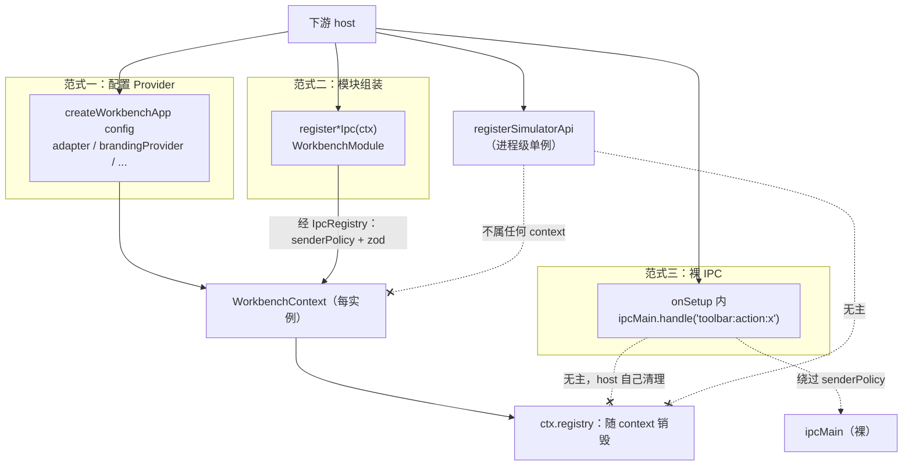
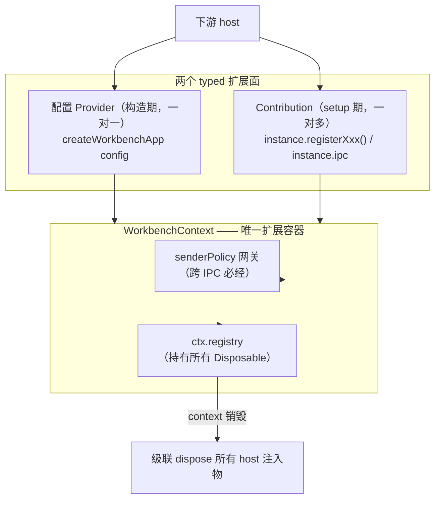
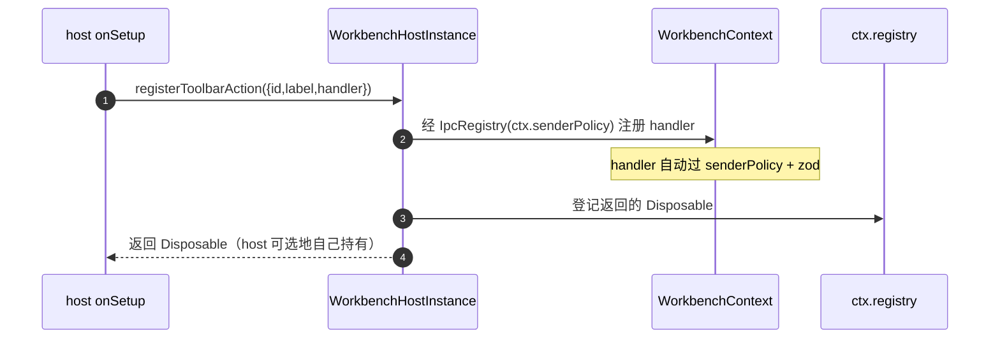
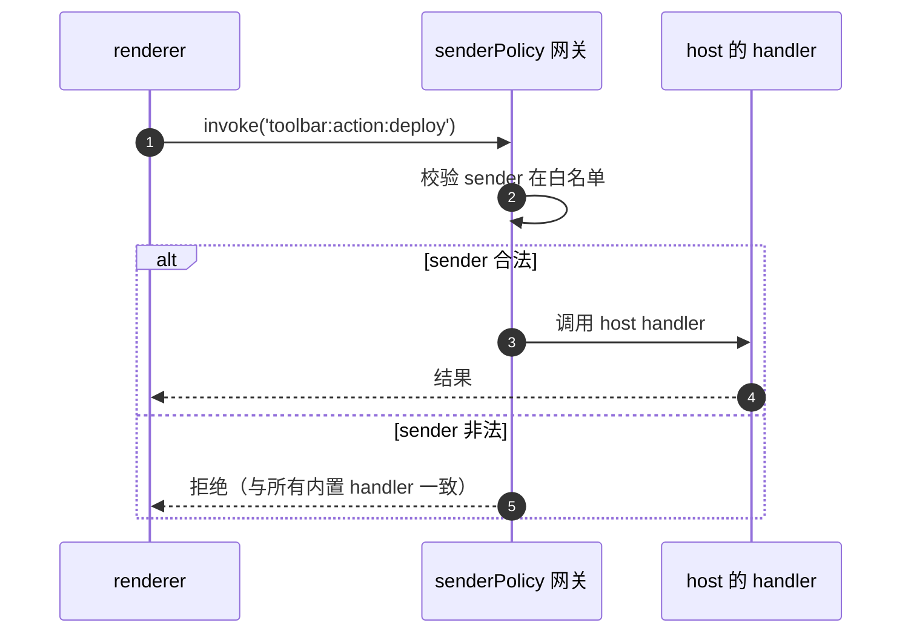
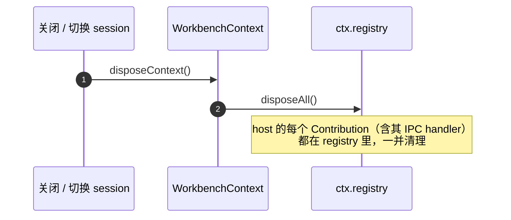

# devtools 扩展模型设计

> 状态：设计稿（Proposal）。落地路径见 §8「迁移：clean break」。
> 配套：这是继 [`miniapp-snapshot.md`](./miniapp-snapshot.md) 之后的第二份结构性设计文档。
> `miniappSnapshot` 统一的是面板**数据**的同步；本文统一的是下游 host 对 devtools 的**扩展**。

## 摘要（TL;DR）

devtools 不是一个独立 app，而是一套供下游 host 集成、定制的开发者工具。host 通过约 30 个**扩展点**注入自己的东西：编译适配器、项目源、品牌、工具栏、自定义 API、自定义面板……每个扩展点都是 devtools 作为**平台**的对外契约，重要程度等同公共 API。

问题在于：这 30 个扩展点散落在**三种互不相干的范式**里（配置 Provider / 模块组装 / 裸 IPC），在安全网关、生命周期归属、可发现性上各行其是。host 无法判断某个扩展点是否安全、是否要自己清理、漏接了会不会有报错。

本文提议一个统一模型。一句话概括：

> **`WorkbenchContext` 是唯一的扩展容器。** 一切 host 注入的东西，都经它注册、由它持有生命周期、跨 IPC 必经它的 `senderPolicy` 网关。

这个核心思想直接换来三个「没有」：**没有进程全局状态、没有裸 IPC、没有无主资源。**

下文按「什么是扩展点 → 现状三范式为何乱 → 四个结构性病灶 → 统一模型 → 各扩展点如何归位 → 怎么迁移 → 取舍」展开。

---

## 1. 背景：什么是「扩展点」

devtools 被下游 host 用 `createWorkbenchApp(config)` 或「模块组装」两种方式集成。集成方需要注入大量自己的实现，典型如：

| 扩展需求 | 例子 |
|---|---|
| **编译适配器** `adapter` | 用 host 自己的编译器替换内置 devkit |
| **项目源** `projectsProvider` | 项目列表来自 host 的后端，而非本地磁盘 |
| **品牌 / 工具栏 / 菜单** | 换 logo、加「部署」按钮、改应用菜单 |
| **simulator 自定义 API** | 让模拟器里运行的小程序能调 `wx.<hostApi>()` |
| **自定义面板 / 自定义 preload** | 加一个 host 专属的调试面板 |

这些「注入点」就是**扩展点**。本文要解决的问题，正是这些扩展点目前没有一套统一的注册、安全、生命周期规则。

## 2. 现状：三种范式并存

经代码核实，现有扩展点可归入三种彼此无关的范式：

| 范式 | 形态 | 代表扩展点 | 注册时机 |
|---|---|---|---|
| **配置 Provider** | `createWorkbenchApp({ ... })` 的字段 | `adapter`、`brandingProvider`、`projectsProvider`、`toolbarActions`、`customCreateProjectDialog`、`updateChecker`、`menuBuilder`、`panels`、`preloadPath` …（十余个） | 构造期，声明式 |
| **模块组装** | `register*Ipc(ctx)` 命令式调用 + `WorkbenchModule` | 8 个 `registerXxxIpc`、`BUILTIN_MODULES`、`modules` 开关 | 构造期，命令式 |
| **裸 IPC** | host 自己调 `ipcMain.handle(...)` | `toolbar:action:*`、`onSetup` 内任意自定义 handler | setup 期，无框架介入 |

此外还有一个**范式内的异类**：`registerSimulatorApi(name, handler)` 形似「注册式」，但它写入的是一个**进程级单例** registry，不挂在任何 `WorkbenchContext` 上。

下图把三条范式路径并排画出。导语：注意它们各自穿过的「安全网关」和「生命周期归属」完全不同——同样是 host 注入物，待遇却三种各异。



可以看到：只有范式一、范式二真正汇入 `WorkbenchContext`；范式三和 `registerSimulatorApi` 都游离在外。这种发散正是下一节四个病灶的根源。

## 3. 诊断：四个结构性病灶

### 病灶一：范式分裂，没有统一注册面

同一类「host 注入行为」用了三种写法。最刺眼的例子是**工具栏**：按钮的**列表**走配置 Provider（`toolbarActions`），按钮的**行为**走裸 IPC（`toolbar:action:*` 由 host 自己 `ipcMain.handle`）。同一个功能的两半，分属两种范式、不在同一处声明。

### 病灶二：安全边界不齐，且安全的那条路没对外开放

所有 `register*Ipc` 都经 `IpcRegistry` —— 它强制 `senderPolicy` 白名单 + zod 入参校验。但这条安全的路并没有铺到所有扩展点上：

- **裸 IPC 完全绕过** `senderPolicy` 和 zod。README 教 host 直接 `ipcMain.handle(...)`，没有任何机制提示该套网关的存在。
- **`IpcRegistry` 根本没对外导出** —— host 即便想走安全的那条路也拿不到。
- **`UpdateManager` 装配时漏传 `senderPolicy`** —— `updates:check/download/install` 三个频道接受任意 sender，是配置驱动路线里唯一一组无网关的内置 IPC。这是个应直接修的 bug。

换言之，安全在这里靠**纪律**维持，而不是结构保证。

### 病灶三：生命周期归属混乱

同样是「host 注入物」，归属却有三种：

- **per-context、自动 dispose**：所有 `register*Ipc` 返回 `Disposable` 进 `ctx.registry`，context 销毁即清理。这是健康的。
- **进程全局**：`registerSimulatorApi` 写进程级单例 —— 多个 `WorkbenchContext` 会串味；它返回的 disposer 被同名注册覆盖后会变成 no-op。`setHeaderHeight` 改一个模块级可变量，不可回滚。
- **完全无主**：`onSetup` 里 host 注册的 IPC handler、`toolbar:action:*` —— 既不进 `ctx.registry` 也无框架感知，host 必须自己 `removeHandler`，否则泄漏。

### 病灶四：可发现性差，漏接无信号

声明了却没接通，往往没有任何报错，问题被推迟到运行时才暴露：

- 漏调 `installCustomApisBridge` → `registerSimulatorApi` 注册的 API 在小程序里**静默失效，不报错**（README 自己承认这一点）。
- 漏注册 `toolbar:action:x` → 点击时 `invoke` reject，但被 renderer 吞掉，无 UI 反馈。
- `extraModules` 是个**幽灵扩展点**：`WorkbenchModule` 的 JSDoc 明写「host 可经 `WorkbenchAppConfig.extraModules` 注入额外模块」，但 `WorkbenchAppConfig` 根本没有这个字段，代码也无处理。文档承诺、实现缺失。
- `panels` 配置在两个 handler 里行为不一致：`panel:list` 只认内置面板、把 host 自定义 ID 静默丢弃，`workbench:getPanelConfig` 又原样返回。

> 病灶四正是 [`miniapp-snapshot.md`](./miniapp-snapshot.md) 里那条 lens 的复发——**没有失败信号的东西会静默漂移**。

## 4. 设计目标与非目标

把上述病灶翻译成可执行的目标：

**目标**

- **G1 单一扩展容器**：一切 host 注入物归 `WorkbenchContext`，绝不进程全局。
- **G2 安全不可绕过**：跨 IPC 的扩展点一律经 `senderPolicy` —— 结构保证，而非纪律。
- **G3 生命周期统一**：一切注册物进 `ctx.registry`，随 context 销毁。
- **G4 漏接有信号**：声明了却没接通，启动期就报，而非运行时静默。
- **G5 类型单一来源**：每个扩展点一处类型定义，消除三套重叠的 config 类型。

**非目标**

- **N1 不强行并成一种 API**：「host 提供一个实现」（branding）和「host 添加多个」（simulator API）基数不同，强行用同一种签名会损害易用性 —— 见 §5「两类扩展」。
- **N2 不做 manifest / VS Code 式 contribution 系统**：host 数量有限，一套声明式插件清单是过度工程。
- **N3 不保留兼容层**：调研（见 §8.1）确认下游是可协调的已知少数，迁移走 clean break —— 旧扩展点随重构一并删除，不留 `@deprecated` shim、不留双轨。

## 5. 模型：两类扩展 + 五条不变量

核心思路：扩展点按**基数**分两类；两类共享**同一组不变量**。范式的混乱来自「按历史出现顺序各搞一套」，正确的切分维度应该是「host 提供一个，还是添加多个」。

### 5.1 两类扩展

**配置 Provider（一对一）** —— host 提供「一个」实现，替换或定制 devtools 的某个内置能力。

涵盖：`adapter`、`brandingProvider`、`projectsProvider`、`customCreateProjectDialog`、`updateChecker`、`menuBuilder`、`preloadPath`、`window`、`icon`、`panels`、`apiNamespaces`、`projectTemplates`、`headerHeight`（收编现在的进程级可变量 `setHeaderHeight`）。

→ 它们留在 `createWorkbenchApp` 配置项，**构造期**确定。这一范式本身是健康的，只需收尾：见病灶四的 `panels` / `extraModules`、病灶二的 `UpdateManager`、G5 的类型合并。

**Contribution（一对多）** —— host「添加多个」同类条目。

涵盖：simulator 自定义 API、工具栏 action、自定义面板、自定义 IPC 模块。

→ 它们通过 `onSetup` 拿到的实例上的 typed `registerXxx` 方法注册，**setup 期**确定。这一范式是当前最乱的（进程全局、裸 IPC 都在这里），是本文重构的主体。

> **前提假设**：Contribution 一律在 `onSetup` 期注册，晚于窗口与 `WorkbenchContext` 的创建。因此 contribution **不能影响窗口/context 的构造参数**——会影响布局初值的 `headerHeight` 正因如此归入配置 Provider 而非 Contribution。此假设对当前 4 类 contribution 成立；将来若出现「必须在窗口创建前注册」的扩展，需另立构造期入口。

### 5.2 五条不变量（两类都遵守）

无论是配置 Provider 还是 Contribution，都受同一组不变量约束。这五条才是「统一」的真正含义——统一的是**规则**，不是签名。

| 不变量 | 含义 |
|---|---|
| **I1 容器归属** | 注册物挂在 `WorkbenchContext` 上，绝不进程全局、绝不模块级可变量。 |
| **I2 IPC 必经网关** | 跨 IPC 的扩展点一律经 `IpcRegistry`（`senderPolicy` + zod）。裸 `ipcMain.handle` 不再是合法路径。 |
| **I3 生命周期** | 注册返回 `Disposable`，进 `ctx.registry`，随 context 销毁级联清理。 |
| **I4 单一声明点** | 每个扩展点一处 typed 声明、一条注册路径；类型单一来源。 |
| **I5 漏接有信号** | 声明与实现不匹配（如 action 有声明无 handler）→ 启动期 `warn`，而非运行时静默。 |

**I4 与 I5 的覆盖边界**需要说清，避免误读：

- **I4** 约束的是框架定义的扩展点。host 经 §5.3 的 `instance.ipc` 自注册的自定义频道**不在** I4 的「单一 typed 声明」范围内，但仍受 **I2** 约束（一样要过 `senderPolicy`）。
- **I5** 只覆盖主进程内可静态检测的声明/实现错配。跨进程的漏接——典型如自定义 preload 漏装 `installCustomApisBridge` 导致 simulator API 静默失效——主进程启动期无从感知，需 preload 侧自检或运行时探测兜底，**不在** I5 范围。

### 5.3 接口草图

下面是 Contribution 注册面的接口草图。`onSetup(instance)` 的入参在类型签名上是 `WorkbenchHostInstance`，运行时实际传入的是它的超集 `WorkbenchAppInstance`。因此把下列 typed、gated、context-owned 的注册方法加到 `WorkbenchHostInstance` 接口时，须同步确认 `app.ts` 构造的 `WorkbenchAppInstance` 也满足扩展后的接口。

```ts
interface WorkbenchHostInstance {
  readonly context: WorkbenchContext

  // ── Contribution 注册（一对多）——全部 per-context、自动进 ctx.registry ──
  registerSimulatorApi(name: string, handler: SimulatorApiHandler): Disposable
  registerToolbarAction(action: ToolbarActionContribution): Disposable  // {id,label,handler}
  registerPanel(panel: PanelContribution): Disposable
  registerIpcModule(module: WorkbenchModule): Disposable

  // ── 受控逃生口：拿到一个已绑定 senderPolicy 的 IpcRegistry ──
  //    替代裸 ipcMain.handle —— 自定义 IPC 也强制过网关、自动 dispose
  readonly ipc: IpcRegistry
}
```

这份草图的关键点：

- `registerToolbarAction` 把按钮的**列表**和**行为**合一 —— `{ id, label, handler }`。`handler` 由框架自动包进 `IpcRegistry`，裸 IPC 路径就此消失。
- `instance.ipc` 是**受控逃生口**：host 仍能注册任意自定义 IPC，但只能通过这个**已 gated 的** `IpcRegistry`，不再有 `ipcMain.handle` 裸调。
- 四个 `registerXxx` 都返回 `Disposable`，框架同时也把它登记进 `ctx.registry` —— host 不调 disposer 也不会泄漏。

### 5.4 目标架构

下图是统一后的目标架构。导语：与 §2 的现状图对照看——三条发散的路径在这里收敛成两个 typed 扩展面，重点注意所有路径最终都汇入 `WorkbenchContext` 这一个容器。



与 §2 现状图的对比一目了然：`senderPolicy` 与 `ctx.registry` 不再是「某条路径才有」的局部特性，而是 `WorkbenchContext` 这个容器的统一属性——任何扩展点接入，都自动获得网关与生命周期管理。

## 6. 各扩展点如何归位

模型确定后，把现有约 30 个扩展点逐一映射到目标范式。下表是完整的迁移映射，并标出每项是否构成 breaking change：

| 扩展点 | 现状 | 目标 | 是否 breaking |
|---|---|---|---|
| `adapter` / `brandingProvider` / `projectsProvider` / `customCreateProjectDialog` / `updateChecker` / `menuBuilder` / `preloadPath` / `window` / `icon` | 配置 Provider | 不变（范式正确） | 否 |
| `customCreateProjectDialog` 返回类型 | `workbench-context` 类型砍掉了 `{ready}` 分支 | 收敛到 `CustomCreateProjectDialogResult`（见 backlog E2） | 否（修类型） |
| `updateChecker` → `UpdateManager` | 装配时漏传 `senderPolicy` | 补传 `senderPolicy` | 否（修 bug） |
| `panels` | 两个 handler 行为不一致 | 单一语义；若要支持自定义面板，走 `registerPanel` | 否 |
| `registerSimulatorApi` | 进程级单例 | `instance.registerSimulatorApi`（per-context）；同一改动里删除旧的进程级全局导出 | 是（clean break，与下游同步迁移） |
| toolbar：`toolbarActions` + `toolbar:action:*` | provider（列表）+ 裸 IPC（行为）分裂 | `instance.registerToolbarAction({id,label,handler})` 合一，handler 经 `IpcRegistry`；删除 `toolbarActions` 字段与裸 `toolbar:action:*` 路径 | 是（clean break） |
| `onSetup` 内裸 `ipcMain.handle` | 绕过 senderPolicy、无主 | 只能经 `instance.ipc`（已 gated 的 `IpcRegistry`）；裸 `ipcMain.handle` 不再是合法用法 | 是（clean break） |
| `register*Ipc` / `WorkbenchModule` | 模块组装命令式 | 保留（深度定制路线）；额外模块经 `instance.registerIpcModule` 接入 | 否 |
| `extraModules`（幽灵） | JSDoc 承诺、无实现 | 实现为 `instance.registerIpcModule`，删掉误导的 JSDoc | 否 |
| `IpcRegistry` | 未导出 | 对外导出（host 写自定义 IPC 的安全基类） | 否（新增导出） |
| `setHeaderHeight` | 进程级可变量 | 收为 `createWorkbenchApp` 配置项 `headerHeight`（归入配置 Provider） | 否 |
| `WorkbenchConfig` / `WorkbenchAppConfig` / `CreateContextOptions` | 三套重叠类型 | 合并/对齐为单一来源 | 否（类型收敛） |

## 7. 调用链路（时序图）

下面三张时序图覆盖统一模型下的三个关键时刻：注册一个 Contribution、Contribution 跨 IPC 被调用、context 销毁时的级联清理。

### 7.1 host 在 `onSetup` 注册一个 Contribution

下图展示一次注册如何自动获得「网关 + 生命周期归属」。导语：注意整个过程 host 不写任何 `ipcMain`、不写任何 cleanup——这两件事都由框架代办。



### 7.2 Contribution 跨 IPC 被调用

下图展示一个已注册的 Contribution 被 renderer 调用时的链路。导语：注意第 2 步的「校验 sender」——这一步在裸 IPC 范式下是不存在的。



裸 IPC 范式下，第 2 步根本不存在 —— 这正是统一模型要消除的安全洞。

### 7.3 context 销毁 → 级联清理

下图展示关闭或切换 session 时的清理链路。导语：注意 host 的每个 Contribution（含其 IPC handler）都在 `registry` 里，所以一次 `disposeAll()` 就能全部清掉。



现状下，裸 IPC 与进程全局的 `registerSimulatorApi` 都不在 `registry` 里，这一步清不到它们 —— 这正是当前的泄漏来源。

## 8. 迁移：clean break

### 8.1 前提——下游是谁

迁移该保兼容还是 clean break，取决于一个事实问题：用 devtools 的下游 host 是「不特定公众」还是「可协调的已知少数」。专门调研的结论是后者，证据：

- `@dimina-kit/devtools` / `@dimina-kit/devkit` 虽公开发布在 npm，但 **npm dependents 为 0**，下载量与发布日完全同步（CI / 镜像噪声，非真实人类安装），公网搜不到任何第三方使用。
- 源码、测试、本设计文档都把下游建模为一个**具体的、已知的**深度集成方（代号 `qdmp`）——团队自己的判断就是「下游 host 是个位数」。
- 两个包仍处 `0.x`，semver 本就允许 minor 破坏。

结论：下游是**可协调的已知少数**（很可能就 `qdmp` 一个）。因此迁移采用 **clean break** —— 每一步都删掉旧路径，不留 `@deprecated` shim、不留双轨；唯一前提是与 `qdmp` 团队同步。

> 执行前需团队确认一件仓库查不出的事：`qdmp` 是否为唯一下游、当前 pin 的版本。确认后即可放手 clean break。

### 8.2 步骤

每步独立可合、可单独 ship、配 e2e；**每步都在同一改动里删除对应的旧路径**：

1. **导出 `IpcRegistry`** + 修 `UpdateManager` 漏传 `senderPolicy`。纯新增 / 修 bug。
2. **`WorkbenchHostInstance`（运行时为其超集 `WorkbenchAppInstance`）加 `registerXxx` + `ipc`**。
3. **`registerSimulatorApi` → `instance.registerSimulatorApi`**。新 API 是 per-context、`onSetup` 期注册；**同一改动里删除**旧的进程级全局 `registerSimulatorApi` 导出与 `simulatorApiRegistry` 单例。`qdmp` 把调用从模块加载期挪进 `onSetup`——一次性的协调改动，不需要 pending 队列、不需要 shim。
4. **toolbar 合一**。`registerToolbarAction({ id, label, handler })` 上线；**同一改动里删除** `toolbarActions` config 字段与裸 `toolbar:action:*` 路径。`qdmp` 改用新 API。
5. **裸 IPC 收口**。`onSetup` 里的自定义 IPC 一律改走 `instance.ipc`；README 删除裸 `ipcMain.handle` 示例。
6. **`extraModules` 幽灵收编**。实现为 `registerIpcModule`，并删掉 `WorkbenchModule` 里那段误导的 JSDoc。
7. **类型收敛**。合并 `WorkbenchConfig` / `WorkbenchAppConfig` / `CreateContextOptions` 的重叠部分；统一 `panels` 行为。
8. **加 G4 信号**。启动期校验「声明了 toolbar action 却没 handler」等错配，发出 `warn`。

## 9. 取舍与边界

任何设计都有代价，这里把权衡讲清楚：

- **为什么不强行并成一种范式**：「一对一 provider」与「一对多 contribution」基数不同。把 branding 这种唯一实现塞进 `register` 调用、或把 N 个 simulator API 塞进构造期 config，都会让 API 别扭。按基数分两类、共享不变量，才是「统一」的正确含义 —— 统一的是**规则**（容器、网关、生命周期、信号），不是**签名**。

- **为什么不做 manifest / 插件系统**：VS Code 式 contribution manifest 是为成百上千第三方插件设计的。devtools 的下游 host 是个位数、且是深度集成方，一套声明式清单 + 激活机制纯属负担。

- **为什么 clean break 而非兼容层**：下游是可协调的已知少数（§8.1）。保留 `@deprecated` shim 只会在一份「消灭扩展面卫生债」的重构里又新造卫生债——而且本仓库已有前车之鉴：`WorkbenchContext` 的两个 `@deprecated` 窗口字段，标了之后迁移停滞至今。`@deprecated` 没有强制删除机制，就只是一个带标签的死代码。clean break 的代价是一次与 `qdmp` 的协调迁移——一次性的、有限的代价。

- **不在本文范围**：`register*Ipc` 模块组装路线（供深度定制用）保留不动；它本就符合五条不变量，只是补一个 `registerIpcModule` 让「加模块」也能在 setup 期完成。

## 10. 与 miniappSnapshot 的关系

本文与 [`miniapp-snapshot.md`](./miniapp-snapshot.md) 是同一种思路在不同维度上的应用——都是把一堆各自为政的机制收敛到「唯一真相 / 唯一容器」上：

| | miniappSnapshot | 本文（扩展模型） |
|---|---|---|
| 统一的对象 | 面板**数据**同步 | host 对 devtools 的**扩展** |
| 乱象 | N 个面板各自增量同步 | ~30 个扩展点分三范式 |
| 收敛到 | 一个 Host + 全量快照投影 | 一个 Context 容器 + 两类扩展 + 五不变量 |
| 核心句 | preload 是唯一真相源 | `WorkbenchContext` 是唯一扩展容器 |

---

## 附录：迁移后，host 加一个扩展长什么样

下面是迁移完成后，下游 host 集成代码的样子——配置 Provider 与 Contribution 各居其位，安全与清理全部自动：

```ts
createWorkbenchApp({
  // ── 配置 Provider（一对一）——构造期 ──
  brandingProvider: () => ({ appName: 'My DevTools' }),
  projectsProvider: myRemoteProjectsProvider,

  // ── Contribution（一对多）——setup 期 ──
  onSetup(instance) {
    // 工具栏按钮：列表 + 行为一处声明，handler 自动过 senderPolicy
    instance.registerToolbarAction({
      id: 'deploy',
      label: '部署',
      handler: () => myDeploy(),
    })
    // simulator 自定义 API：per-context，随 context 销毁
    instance.registerSimulatorApi('login', (params) => myLogin(params))
    // 自定义 IPC：经受控的 IpcRegistry，不再裸 ipcMain.handle
    instance.ipc.handle('my:stats', () => collectStats())
    // 以上每一项都已自动进 ctx.registry，host 无需手写任何 cleanup
  },
})
```

对比迁移前：工具栏要「config 里声明 label + onSetup 里裸 `ipcMain.handle` 行为」两处分写、自定义 API 落进程全局、自定义 IPC 裸奔且要自己 `removeHandler`。统一模型把这些杂乱全部收进了 `WorkbenchContext` 一个容器。
