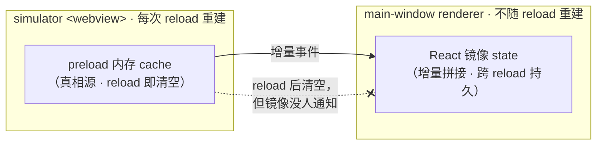
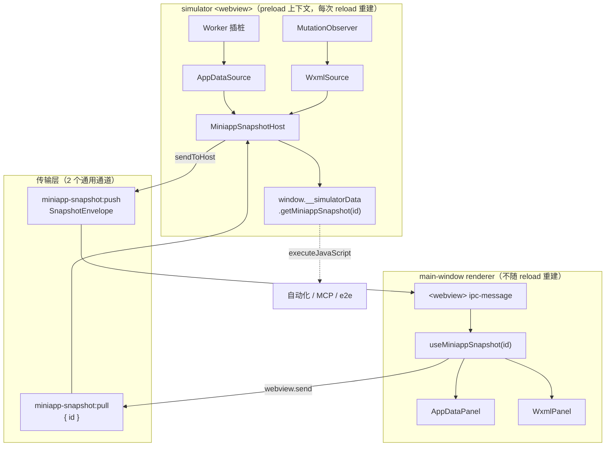
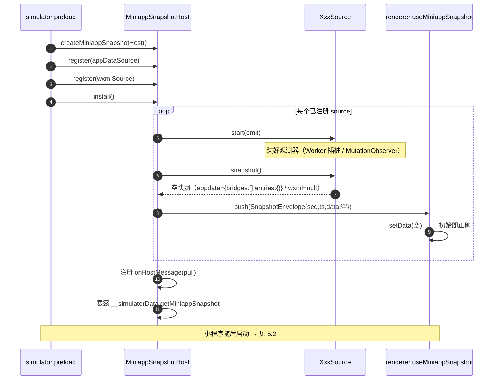
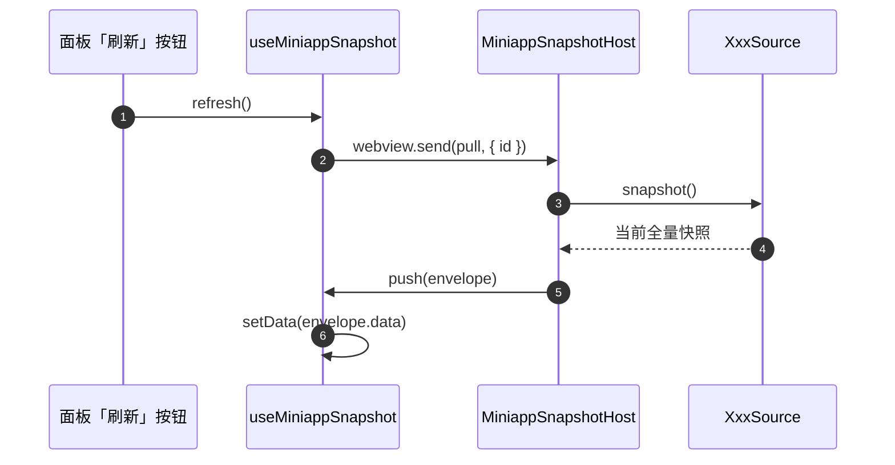
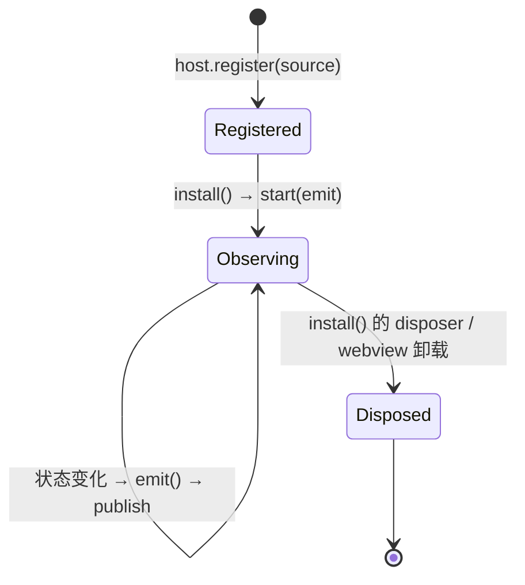

# miniappSnapshot 架构设计

> devtools 面板数据的统一**快照**框架。
> 状态：**已落地（2026-05-20）** —— 框架、WXML 与 AppData 迁移、`workbench:reset` 死代码清理均已完成；
> 自动化访问器 `__miniappSnapshot` 已实现。时间旅行、快照 diff、MCP 工具等见 §8，为后续可选扩展。

## 摘要（TL;DR）

`miniappSnapshot` 是 devtools 各面板（AppData、WXML…）共用的一套数据同步框架。它把面板数据建模为一条**不可变全量快照流**，并坚持一个核心思想：

> **preload 是唯一数据源（单一真相源），renderer 只是快照的纯投影。**

数据源每次只向 renderer 推送**全量、不可变的快照**，renderer 端永远只做「整份替换」，不做任何增量拼接。由此，reload / crash / relaunch 后的重同步成为框架的**结构保证**，新增面板只需实现一个数据源接口即可白送 push / pull / 自动化读取 / 重同步。

下文按「问题 → 现状为何失败 → 思路 → 设计 → 用法 → 还能解决什么 → 如何迁移」展开。

---

## 1. 背景：一类反复复发的 bug

devtools 的右侧面板要把 simulator `<webview>` 里运行的小程序状态，实时映射给开发者。目前每个面板各写一套同步机制，结果反复踩同一类 bug：

| 面板 | 现象 |
|---|---|
| **AppData** | 每次重新编译，多出一个重复的 page tab |
| **WXML** | 重新编译后仍显示上一页的旧树，`sid` 失效 |

这些看似无关的 bug，根因是同一个：**状态失步**。

下图展示失步是怎么发生的——注意 reload 清空了真相源，但没有任何人去通知 renderer 的镜像：



**真相源**（preload 内存 cache）每次 webview reload 都会被新的 JS 上下文清空；而 renderer 的 React **镜像**不随之重建，且它是靠**增量事件**一点点拼出来的——两者必然漂移。

更糟的是：每加一个面板，就要重新实现一遍 push / pull / reload 重同步逻辑，漏掉任何一处，bug 就复发。`miniappSnapshot` 的目标，就是用一套通用机制根治这一整类问题。

## 2. 设计目标与非目标

把上述问题翻译成可执行的目标：

**目标**

- **G1 单一真相源**：preload 持有状态，renderer 只是投影。
- **G2 只传全量不可变快照**：renderer 端零增量拼接。
- **G3 重同步是结构保证**：reload / crash / relaunch 后的重同步由框架结构保证，而非靠开发者「记得去做」。
- **G4 新增面板成本极低**：≈ 实现一个 `MiniappSnapshotSource` + 注册一行，push / pull / 自动化读取 / 重同步全部白送。
- **G5 统一通道**：一套通用通道与协议，不再每个面板各造一条频道。

**非目标**

- **N1 不覆盖流式数据**：Console 日志是 append-only 流，属于另一种数据形态。
- **N2 不接管 Storage**：其数据源是主进程 CDP，且 localStorage 跨 reload 持久，不属于本类 bug。
- **N3 不追求增量传输优化**：先做全量；真有性能压力时，框架内部可透明加 diff，consumer 无感。

## 3. 核心思路与概念

思路很简单：**不要再让 renderer 自己拼状态**。preload 每次把当前的完整状态打包成一份**快照**整体送过去，renderer 收到就整份替换。状态由谁拥有、由谁推送、何时重同步，全部收敛到一处。

为此引入五个概念，先建立词汇表：

| 概念 | 角色 |
|---|---|
| `Snapshot<T>` | 某面板在某一刻的**全量、不可变**状态 |
| `SnapshotEnvelope<T>` | **信封**：快照 + 元数据（`id` / `seq` / `ts`）的传输单元 |
| `MiniappSnapshotSource<T>` | **数据源**：preload 侧观测运行时、产出快照 |
| `MiniappSnapshotHost` | **中枢**：preload 侧管理所有数据源的生命周期与收发 |
| `useMiniappSnapshot<T>` | renderer 侧通用 hook：把信封**投影**成 React state |

### 接口定义

```ts
// 数据源（Source）：一个数据源产出一种快照
interface MiniappSnapshotSource<T> {
  readonly id: SnapshotSourceId          // 'appdata' | 'wxml' | ...
  snapshot(): T                          // 当前全量快照（真相源）
  start(emit: () => void): void          // 开始观测；状态变化时调用 emit()
  dispose(): void                        // 释放观测器
}

// 信封（Envelope）：快照的传输单元
interface SnapshotEnvelope<T> {
  id: SnapshotSourceId
  seq: number    // 全局单调递增，跨 source 共享 —— 排序 / 时间线 / 跨面板关联
  ts: number     // Date.now()
  data: T        // 全量快照
}

// 中枢（Host）
interface MiniappSnapshotHost {
  register<T>(source: MiniappSnapshotSource<T>): void
  install(): () => void                  // 启动所有 source，返回 disposer
}
```

记住一句话：**`MiniappSnapshotSource` 是唯一需要为新面板实现的东西**，其余全部复用。

## 4. 架构总览

整体由三层组成：preload 侧的**数据源 + 中枢**、两条通用**传输通道**、renderer 侧的**通用 hook**。下图展示这三层如何串联——注意所有数据源都汇入同一个 Host，所有面板都复用同一个 hook：



每层的职责分工：

- **数据源**：preload 内每个 source 把观测器（Worker 插桩、MutationObserver）封在内部，对外只暴露 `snapshot()`。
- **中枢**：`Host` 负责全部横切逻辑——启动数据源、接收 `pull`、发出 `push`、暴露自动化访问器、释放资源。
- **renderer**：只有一个通用 hook，按 `id` 把信封投影成 state。

## 5. 调用链路（时序图）

下面四张时序图覆盖框架的四个关键时刻：安装、运行时更新、主动刷新、reload 重同步。

### 5.1 首次加载 / 安装

下图展示 `install()` 启动时发生了什么——注意每个 source 在装好观测器后**立即推送一次初始快照**：



**关键点**：`install()` 对每个 source **必然先 publish 一次初始快照**。这是框架的固定动作，不依赖任何 source「记得」去做。

### 5.2 运行时更新（push）

下图展示小程序运行时状态变化如何流到面板——注意推送的**始终是全量快照**，renderer 端没有 reducer：

```mermaid
sequenceDiagram
  autonumber
  participant APP as 小程序运行时
  participant Src as XxxSource
  participant Host as MiniappSnapshotHost
  participant RD as renderer
  participant UI as 面板组件

  APP->>Src: 状态变化<br/>（setData 的 ub 消息 / DOM mutation）
  Src->>Src: 更新内部 cache
  Src->>Host: emit()
  Host->>Host: seq++ ; 组装 SnapshotEnvelope
  Host->>RD: push(envelope) —— 始终全量
  RD->>RD: 丢弃 seq ≤ 已见 的过期信封
  RD->>RD: setData(envelope.data) —— 纯替换，无 reducer
  RD->>UI: 重渲染
```

**全量 + 单调 `seq`** 带来「后写覆盖」语义：迟到 / 乱序的信封不可能部分污染状态。

### 5.3 主动刷新（pull）

下图展示用户点「刷新」按钮时的链路——注意 pull 与 push 复用**同一条** `publish` 路径：



push 与 pull 走同一条 `publish` 路径，因此不存在「两套快照逻辑」。

### 5.4 重新编译 / reload 重同步（核心）

这是框架要根治的核心场景。下图展示 webview reload 后状态如何自动重同步——注意 renderer 的 `<webview>` 元素本身没变，监听一直在，所以**必然收到新的空快照**：

```mermaid
sequenceDiagram
  autonumber
  participant U as 用户
  participant RD as renderer
  participant WVOLD as 旧 preload 上下文
  participant WVNEW as 新 preload 上下文
  participant Host as 新 Host

  U->>RD: 点「重新编译」
  RD->>WVOLD: webview.reload()
  Note over WVOLD: 整个 JS 上下文销毁，旧 cache 随之消失
  WVNEW->>Host: install() 重新执行
  loop 每个 source
    Host->>RD: push(空快照)
    RD->>RD: setData(空) —— 旧面板状态被替换清掉
  end
  Note over RD: renderer 的 &lt;webview&gt; 元素未变，<br/>ipc-message 监听始终在 → 必收到空快照
  WVNEW->>Host: 新页面启动 → 真实快照陆续 push
  Host->>RD: push(真实快照)
```

**关键点**：reload 重同步 = 5.1 的 install 流程**原样重跑**。没有任何一个 source 需要「记得」去重同步——它本就是 `install()` 的固有步骤。新注册的 source 自动获得这一保证。

### 5.5 source 生命周期

下图汇总一个数据源从注册到释放的状态机——观测期间每次状态变化都触发一次 publish：



## 6. 通道与协议

整个框架只用**两条通用通道**，所有面板共用：

| 通道 | 方向 | 载荷 |
|---|---|---|
| `miniapp-snapshot:push` | preload → renderer（`sendToHost`） | `SnapshotEnvelope<T>` |
| `miniapp-snapshot:pull` | renderer → preload（`webview.send`） | `{ id: SnapshotSourceId }` |

协议要点：

- 全部 source 共用这两条通道，新增面板**不需要新频道**。
- 替代并删除以下旧通道：`simulator:appdata`、`simulator:appdata-all`、`simulator:wxml`、`appdata:getAll:request`、`wxml:refresh:request`。
- `seq` **全局单调**：renderer 据此丢弃过期信封；多面板可按 `seq` 对齐到同一时刻。

## 7. renderer 投影模型

renderer 侧只有一个通用 hook，它把信封流投影成 React state：

```ts
function useMiniappSnapshot<T>(id: SnapshotSourceId, initial: T): {
  data: T
  seq: number
  refresh: () => void
}
```

行为约定：

- 对 `<webview>` 只挂一次 `ipc-message` 监听，**不依赖 `compileStatus.status`**（顺带消除了「监听器在状态翻转时被拆掉」的竞态）。
- `data` 永远是「最后一份快照」，没有任何增量 reducer。
- 面板里的 **UI 态**（如 AppData 当前选中的 tab `activeBridgeId`）留在 renderer，作为对 `data` 的**单点派生**：`userSelected ?? data.currentBridgeId`。

以 `AppData` 为例，改造前后对比：

| | 改造前 | 改造后 |
|---|---|---|
| 通道 | `appdata` 增量 + `appdata-all` 全量 | `miniapp-snapshot:push` 全量 |
| renderer reducer | 2 个（增量 append / 全量 replace） | 0 个（纯 `setData`） |
| `activeBridgeId` | 3 处各算一遍、可能不一致 | 1 处派生 |
| reload 重同步 | install 末尾手写一行 | 框架 `install()` 固有 |

## 8. 这套框架还能解决什么

把「面板数据」统一成**不可变全量快照流**之后，下面这些能力，数据层要么免费、要么近免费：

| 能力 | 说明 | 成本 |
|---|---|---|
| **消灭整类失步 bug** | reload 漂移、`activeBridgeId` 不一致、`entries` 泄漏/乱序复活——结构上不再可能 | 免费 |
| **时间旅行调试** | 每次 push 都是不可变快照，留一个环形缓冲即可前后回放 AppData/WXML 历史状态 | 数据层免费，需时间线 UI |
| **录制 / 导出复现** | 快照流可序列化落盘，作为可复现的 bug 报告，脱离原小程序回放 | 数据层免费，需导入导出 |
| **快照 diff** | 相邻两份快照对比，直接高亮「这次 setData 改了哪些 key」「WXML 增删了哪些节点」 | 数据层免费，需 diff + 高亮 UI |
| **统一自动化 / MCP** | `getMiniappSnapshot(id)` 一个 API 覆盖所有面板；包一层即成 MCP tool，供 AI 调试读取小程序状态 | 近免费 |
| **跨面板时间一致性** | 全局 `seq` 让「AppData@seq=5 与 WXML@seq=6」可对齐，不再各显示不同时刻 | 免费 |
| **面板可单测** | renderer 面板变成 `snapshot → UI` 的纯函数，喂 fixture 即可测，无需真机 | 免费 |
| **下游 host 扩展点** | `host.register()` 即扩展点，下游可注册自定义快照源/面板，契合本项目「面向下游可扩展」方向 | 免费 |
| **性能信号** | Host 看得见每个 push 的频率与体积，可白送一个「setData 频率/体积」观测 | 近免费，需小面板 |
| **统一恢复路径** | recompile / crash / relaunch / 切项目 全部走同一条 `install()→publish` 恢复链 | 免费 |
| **远程 / headless 检查** | 快照可序列化，传输层可换成 WebSocket，面板 UI 与 Electron `<webview>` 解耦 | 需额外传输实现 |

**核心价值**：它不是「修一个 bug」，而是把这一整**类**问题在结构上变成不可能，并顺势把面板数据变成可回放、可 diff、可被 AI 读取的统一资产。

## 9. 取舍与风险

任何设计都有代价，这里把权衡讲清楚：

- **全量传输开销**：AppData / WXML 快照体量都不大，且现状本就每次事件都重建快照。devtools 非热路径，可接受。未来若需要，框架内部可透明改为 diff 传输，consumer 无感。
- **不适用流式数据**：Console 日志是 append-only 流，应另立 `MiniappLogStream` 兄弟抽象，不塞进本框架。
- **Storage 不纳入**：数据源在主进程 CDP，且 localStorage 跨 reload 持久——不属本类 bug；若想统一 renderer 侧体验，可让主进程 storage 服务也发 `miniapp-snapshot:push`，但属可选。
- **seq 归属**：全局 `seq` 给的是「排序」；若要严格「多面板一致切面」，需 Host 对所有 source 同步取样，属后续增强。

## 10. 迁移路径

四步推进，每步独立可合、可测、可单独 ship：

1. **新增框架**：建立 `preload/miniapp-snapshot/`（`types.ts` / `host.ts`）+ 两条通用通道 + renderer `useMiniappSnapshot`。纯新增，不动现有代码。
2. **WXML 试点**：把 `wxml.ts` 改造为 `MiniappSnapshotSource`（它本就只有全量数据、最简单、低风险）。删除 `simulator:wxml` / `wxml:refresh:request`。
3. **AppData 迁移**：把 `app-data.ts` 改造为 `MiniappSnapshotSource`，**删除增量通道与 renderer 增量 reducer** → 同时消灭 `activeBridgeId` 不一致与 `entries` 复活两个 bug。
4. **清理**：删除死代码 `workbench:reset`（无 emitter 的半接线机制）。

每一步都带自己的单测 / e2e，可独立 ship。

## 11. 附录：新增一个面板

完整示例——新增一个 Network 面板，只需「实现一个数据源 + 注册一行 + 用一个 hook」：

```ts
// preload —— 实现一个 source
function createNetworkSource(): MiniappSnapshotSource<NetworkSnapshot> {
  let requests: NetworkRequest[] = []
  return {
    id: 'network',
    snapshot: () => ({ requests }),
    start(emit) { hookFetch((req) => { requests = [...requests, req]; emit() }) },
    dispose() { unhookFetch() },
  }
}

// preload 入口 —— 注册一行
host.register(createNetworkSource())

// renderer —— 一个 hook
const { data, refresh } = useMiniappSnapshot('network', { requests: [] })
```

push / pull / 自动化读取 / reload 重同步，全部自动获得。
