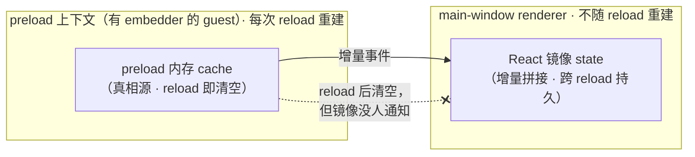
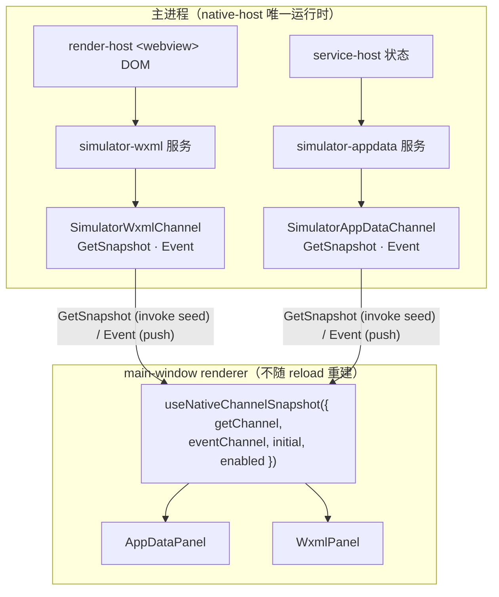
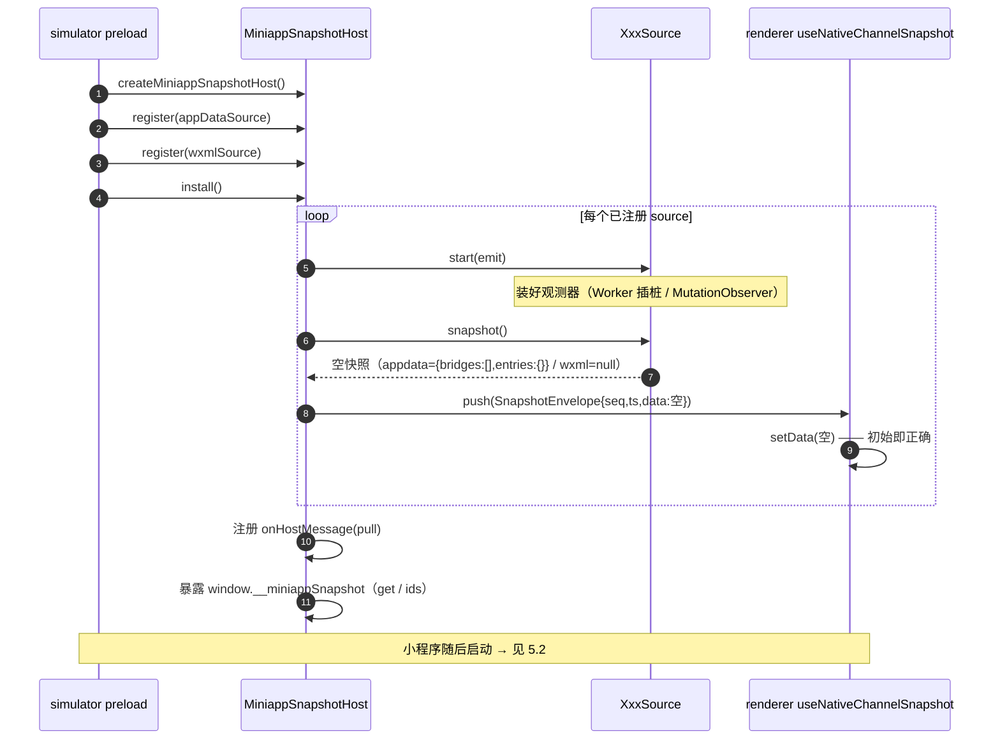
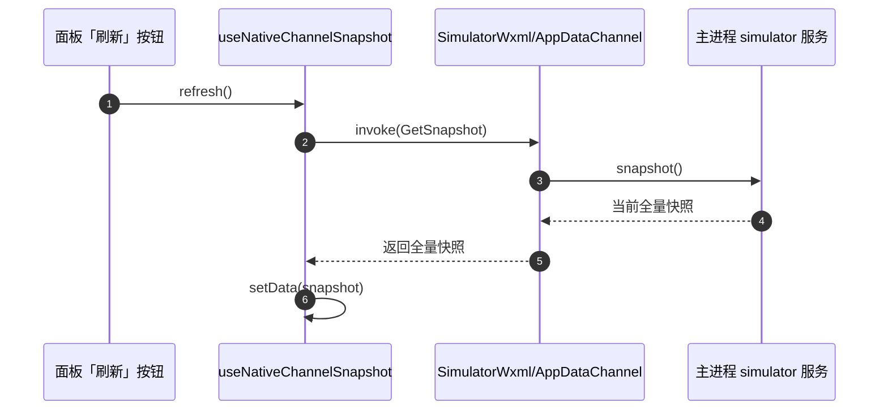
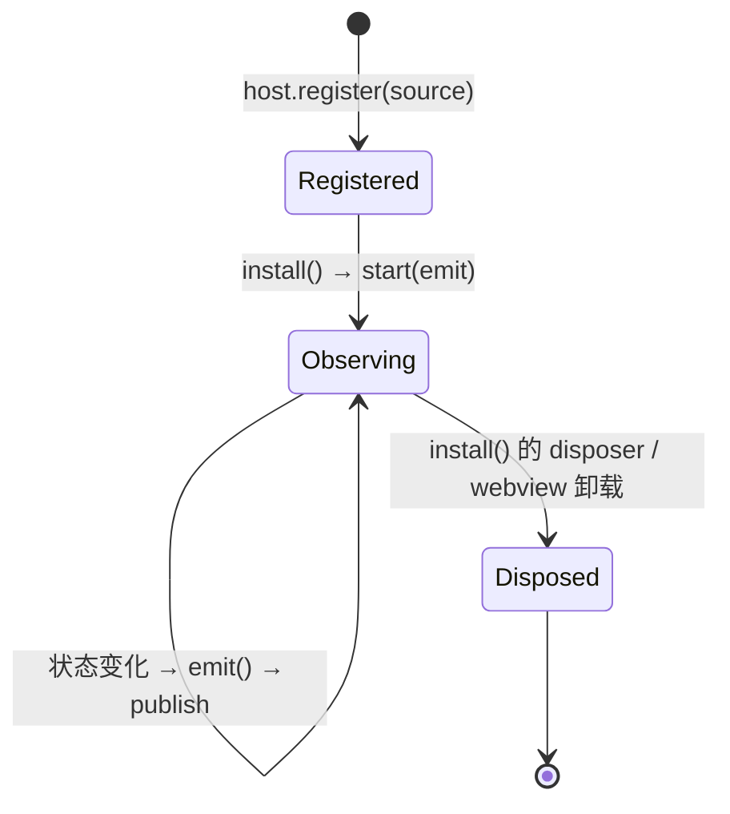

# miniappSnapshot 框架

> devtools 面板数据的统一**快照**框架。
>
> 配套：[`workbench-model.md`](./workbench-model.md) 描述 host 的扩展模型（`workbench(config)` 单入口）；本文描述面板数据的统一快照框架。

## 摘要（TL;DR）

`miniappSnapshot` 是 devtools 各面板（AppData、WXML…）共用的一套数据同步框架。它把面板数据建模为一条**不可变全量快照流**，并坚持一个核心思想：

> **preload 是唯一数据源（单一真相源），renderer 只是快照的纯投影。**

数据源每次只向 renderer 推送**全量、不可变的快照**，renderer 端永远只做「整份替换」，不做任何增量拼接。由此，reload / crash / relaunch 后的重同步成为框架的**结构保证**，新增面板只需实现一个数据源接口即可白送 push / pull / 自动化读取 / 重同步。

## 1. 背景：单一真相源不变式

devtools 的右侧面板要把小程序运行时状态实时映射给开发者。这里的真相源（preload 内存 cache）每次 frame reload 都会被新的 JS 上下文清空，而 renderer 的 React state 不随之重建——若 renderer 靠**增量事件**自己拼状态，两者必然漂移。这套快照框架就是为消除这类漂移而设计的（push/pull/重同步）。

> **native-host 下的实际数据路径**：native-host 是唯一运行时，simulator 顶层帧（`simulator.html`，跑在主进程 WebContentsView 里）**不再**承载页面 DOM / service 状态——页面 DOM 在子 render-host `<webview>` guests、service 逻辑在隐藏 service-host 窗口。因此 **renderer 的面板数据不走本框架的 `miniapp-snapshot:push/pull` 传输**，而是从主进程的专用通道取（WXML→`SimulatorWxmlChannel`、AppData→`SimulatorAppDataChannel`，详见 §4 与 §11）。本框架的快照机制（含 push/pull 传输、`window.__miniappSnapshot` 访问器）作为**可复用的 preload 组合件**仍从 `@dimina-kit/devtools/preload` 导出，供 external/composed preload（在它们自己的同文档 iframe 里有真数据源时）使用。下文的**投影契约**（全量替换、丢弃过期、单点派生）两者共享；§4 / §5.3 / §7 / §10 以内置 native-host 通道路径（`useNativeChannelSnapshot`）为主语，preload 侧的 Host + push/pull 组合件路径见 §6 / §11。



`miniappSnapshot` 用一条不变式消除这类漂移：**preload 持有全部状态并整份推送，renderer 只做投影、零增量拼接。** push / pull / reload 重同步由框架统一提供，新增面板复用同一套机制，不再各写一遍。

## 2. 设计目标与非目标

把上述问题翻译成可执行的目标：

**目标**

- **G1 单一真相源**：preload 持有状态，renderer 只是投影。
- **G2 只传全量不可变快照**：renderer 端零增量拼接。
- **G3 重同步是结构保证**：reload / crash / relaunch 后的重同步由框架结构保证，而非靠开发者「记得去做」。
- **G4 新增面板成本极低**：≈ 实现一个 `MiniappSnapshotSource` + 注册一行，push / pull / 自动化读取 / 重同步全部白送。
- **G5 统一通道**：一套通用通道与协议，不再每个面板各造一条频道。

**非目标**

- **N1 不覆盖流式数据**：Console 日志是 append-only 流，属于另一种数据形态。
- **N2 不接管 Storage**：其数据源是主进程 CDP，且 localStorage 跨 reload 持久，不属于本类 bug。
- **N3 不追求增量传输优化**：先做全量；真有性能压力时，框架内部可透明加 diff，consumer 无感。

## 3. 核心思路与概念

思路很简单：**不要再让 renderer 自己拼状态**。preload 每次把当前的完整状态打包成一份**快照**整体送过去，renderer 收到就整份替换。状态由谁拥有、由谁推送、何时重同步，全部收敛到一处。

为此引入五个概念，先建立词汇表：

| 概念 | 角色 |
|---|---|
| 快照（snapshot） | 某面板在某一刻的**全量、不可变**状态；不是单独的导出类型，而是各 source 自定义的 `T`，经 `SnapshotEnvelope<T>.data` 传输 |
| `SnapshotEnvelope<T>` | **信封**：快照 + 元数据（`id` / `seq` / `ts`）的传输单元 |
| `MiniappSnapshotSource<T>` | **数据源**：preload 侧观测运行时、产出快照 |
| `MiniappSnapshotHost` | **中枢**：preload 侧管理所有数据源的生命周期与收发 |
| renderer 投影 hook | 把信封/快照**投影**成 React state。native-host 下内置面板用 `useNativeChannelSnapshot`（消费主进程 `SimulatorWxmlChannel` / `SimulatorAppDataChannel` 的 `GetSnapshot` seed + `Event` push，见 §4 / §11） |

### 接口定义

```ts
// 数据源（Source）：一个数据源产出一种快照
interface MiniappSnapshotSource<T> {
  readonly id: SnapshotSourceId          // 'appdata' | 'wxml' | ...
  snapshot(): T                          // 当前全量快照（真相源）
  start(emit: () => void): void          // 开始观测；状态变化时调用 emit()
  dispose(): void                        // 释放观测器
}

// 信封（Envelope）：快照的传输单元
interface SnapshotEnvelope<T> {
  id: SnapshotSourceId
  seq: number    // 全局单调递增，跨 source 共享 —— 排序 / 时间线 / 跨面板关联
  ts: number     // Date.now()
  data: T        // 全量快照
}

// 中枢（Host）
interface MiniappSnapshotHost {
  register<T>(source: MiniappSnapshotSource<T>): void
  install(): () => void                  // 启动所有 source，返回 disposer
}
```

记住一句话：**`MiniappSnapshotSource` 是唯一需要为新面板实现的东西**，其余全部复用。

## 4. 架构总览

native-host 下内置面板的实际数据路径分两层：主进程 **simulator 服务**产出快照、经两条**专用通道**（`GetSnapshot` seed + `Event` push）下发，renderer 侧由 `useNativeChannelSnapshot` 投影成 state。下图展示 WXML / AppData 两个面板如何复用同一个 hook：



> 主进程 simulator 服务侧的快照产出仍沿用本框架的语义（全量、不可变、单调 `seq` 丢弃过期）；其 preload 侧的 `MiniappSnapshotHost` + `miniapp-snapshot:push/pull` 传输通道作为**可复用组合件**保留，供 external/composed preload（在自己的同文档 iframe 里有真数据源时）使用，见 §6 / §11。

每层的职责分工（native-host 内置路径）：

- **主进程 simulator 服务**：观测 render-host `<webview>` DOM / service-host 状态，产出全量快照。
- **专用通道**：`SimulatorWxmlChannel` / `SimulatorAppDataChannel`，各暴露 `GetSnapshot`（invoke seed / refresh）+ `Event`（main→renderer push）。
- **renderer**：一个通用 hook `useNativeChannelSnapshot`，按通道把快照投影成 state；WXML / AppData 复用同一份实现。

> composed preload 路径的等价职责分工（preload 内 source 封观测器只暴露 `snapshot()`、`Host` 负责启动/`pull`/`push`/自动化访问器、renderer hook 按 `id` 投影信封）见 §6 与 §10。

> **面板 WXML / AppData 都由 main 取**：native-host 是唯一运行时，页面 DOM 跑在 render-host `<webview>` guests、service 逻辑跑在 service-host 窗口——都不是 simulator preload 能直达的同文档 iframe，所以本框架的 iframe 数据源在这里只会推 null。因此 renderer 的**面板**数据改从主进程的专用通道取：WXML 走 `SimulatorWxmlChannel`、AppData 走 `SimulatorAppDataChannel`（main 侧 simulator-wxml / simulator-appdata 服务 → `GetSnapshot` seed + `Event` push），都不走本框架的 push/pull 传输；renderer 侧由 `useNativeChannelSnapshot`（见 [§11 文件清单](#11-文件清单)）消费这两条通道。
>
> 据此 simulator preload 只注册 **`AppDataSource` 一个 source**，且不是为了面板数据，而是因为它的 `start()` 会装上 `window.__simulatorHook.appData` 钩子并把扁平缓存镜像到 `window.__simulatorData.getAppdata()`——这两个仍被 simulator 顶层帧里的自动化 `getData`（`automation/handlers/page.ts`）、MCP 上下文概览（`mcp/tools/context-tools.ts`）和 e2e automator helper 读取。`WxmlSource` 是纯顶层帧 DOM observer，在 native-host 下只会推 null，故跳过（`createWxmlSource` / `createMiniappSnapshotHost` 仍从 `@dimina-kit/devtools/preload` 导出，供外部/组合 preload 使用）。

## 5. 调用链路（时序图）

下面四张时序图覆盖框架的四个关键时刻：安装、运行时更新、主动刷新、reload 重同步。

### 5.1 首次加载 / 安装

下图展示 `install()` 启动时发生了什么——注意每个 source 在装好观测器后**立即推送一次初始快照**：



**关键点**：`install()` 对每个 source **必然先 publish 一次初始快照**。这是框架的固定动作，不依赖任何 source「记得」去做。

### 5.2 运行时更新（push）

下图展示小程序运行时状态变化如何流到面板——注意推送的**始终是全量快照**，renderer 端没有 reducer：

```mermaid
sequenceDiagram
  autonumber
  participant APP as 小程序运行时
  participant Src as XxxSource
  participant Host as MiniappSnapshotHost
  participant RD as renderer
  participant UI as 面板组件

  APP->>Src: 状态变化<br/>（setData 的 ub 消息 / DOM mutation）
  Src->>Src: 更新内部 cache
  Src->>Host: emit()
  Host->>Host: seq++ ; 组装 SnapshotEnvelope
  Host->>RD: push(envelope) —— 始终全量
  RD->>RD: 丢弃 seq ≤ 已见 的过期信封
  RD->>RD: setData(envelope.data) —— 纯替换，无 reducer
  RD->>UI: 重渲染
```

**全量 + 单调 `seq`** 带来「后写覆盖」语义：迟到 / 乱序的信封不可能部分污染状态。

### 5.3 主动刷新（pull）

下图展示用户点「刷新」按钮时的链路——注意 pull 与 push 复用**同一条** `publish` 路径：



`refresh()` 走 `GetSnapshot` invoke 主动拉一份全量快照，与 `Event` push 下发的是同一份数据形态，因此不存在「两套快照逻辑」。（composed preload 侧的 `miniapp-snapshot:pull` 走对称的 `publish` 路径，见 §6。）

### 5.4 重新编译 / reload 重同步

> 本图描述 composed preload 路径（有 embedder 的 `<webview>` guest + framework Host）的 reload 重同步；native-host 内置面板的等价重同步由主进程 simulator 服务在 reload 后重新 push `Event`（renderer 侧 `useNativeChannelSnapshot` 的订阅一直在）保证。

webview reload 后，preload 上下文与旧 cache 一并销毁，新上下文重新执行 `install()`。renderer 的 `<webview>` 元素本身没变、`ipc-message` 监听一直在，所以**必然收到新的空快照**，旧面板状态被整份替换清掉：

```mermaid
sequenceDiagram
  autonumber
  participant U as 用户
  participant RD as renderer
  participant WVOLD as 旧 preload 上下文
  participant WVNEW as 新 preload 上下文
  participant Host as 新 Host

  U->>RD: 点「重新编译」
  RD->>WVOLD: webview.reload()
  Note over WVOLD: 整个 JS 上下文销毁，旧 cache 随之消失
  WVNEW->>Host: install() 重新执行
  loop 每个 source
    Host->>RD: push(空快照)
    RD->>RD: setData(空) —— 旧面板状态被替换清掉
  end
  Note over RD: renderer 的 &lt;webview&gt; 元素未变，<br/>ipc-message 监听始终在 → 必收到空快照
  WVNEW->>Host: 新页面启动 → 真实快照陆续 push
  Host->>RD: push(真实快照)
```

**关键点**：reload 重同步 = 5.1 的 install 流程**原样重跑**。没有任何一个 source 需要「记得」去重同步——它本就是 `install()` 的固有步骤。新注册的 source 自动获得这一保证。

### 5.5 source 生命周期

下图汇总一个数据源从注册到释放的状态机——观测期间每次状态变化都触发一次 publish：



## 6. 通道与协议

整个框架只用**两条通用通道**，所有面板共用：

| 通道 | 方向 | 载荷 |
|---|---|---|
| `miniapp-snapshot:push` | preload → 其 embedder renderer（`sendToHost`） | `SnapshotEnvelope<T>` |
| `miniapp-snapshot:pull` | renderer → preload（`webview.send`） | `{ id: SnapshotSourceId }` |

> 这两条通道的传输依赖 preload 有 embedder（即 source 跑在一个 `<webview>` guest 的同文档 preload 里）。**native-host 默认 preload 不用它们**：simulator 顶层帧是无 embedder 的 WebContentsView，`sendToHost` 无处可达；且默认 preload 只 `createAppDataSource().start()`（取其 `__simulatorHook`/`__simulatorData` 副作用，见 §4），不 `install()` 也不注册 `WxmlSource`，故没有任何 envelope 会 push。这两条通道随框架代码保留，供 external/composed preload（有 embedder + 同文档数据源时）复用。

协议要点：

- 一条共享 push + 一条共享 pull 服务所有面板；没有 per-panel 通道，新增面板**不需要新频道**。
- `seq` **全局单调**：每个信封只承载一个 source（`publish(source)` 一次发一份），`seq` 仅提供全局排序 / 丢弃过期信封的语义，不保证多面板「同一时刻」的原子切面。

## 7. renderer 投影模型

> 本节描述投影**契约**（全量替换、丢弃过期快照、UI 态单点派生）。native-host 下内置面板由 `useNativeChannelSnapshot`（`use-native-channel-snapshot.ts`）实现这套契约：经主进程通道 `GetSnapshot` seed + `Event` push 取快照，不走 `<webview>` ipc-message。下面的签名取自该实现。

renderer 侧投影 hook 把主进程通道的快照投影成 React state，参数以单个对象传入：

```ts
function useNativeChannelSnapshot<T>(opts: {
  getChannel: string   // invoke 通道：返回当前全量快照（seed / refresh）
  eventChannel: string // push 通道：main→renderer 推送新快照
  initial: T
  enabled: boolean     // 仅在 true 时 seed/订阅（native-host + compile ready）
}): {
  data: T
  refresh: () => void
}
```

行为约定：

- `enabled` 翻 true 时 seed 一次（`invoke(getChannel)`），并订阅 `eventChannel` 的 push；`enabled` 为 false 时不 seed、不订阅（首次以 `useState(initial)` 初始化），但不会把已收到的 `data` 重置回 `initial`。
- `data` 永远是「最后一份快照」，没有任何增量 reducer——`Event` push 与 `refresh()` 的 `GetSnapshot` 都整份替换。
- 面板里的 **UI 态**（如 AppData 当前选中的 tab `activeBridgeId`）留在 renderer，作为对 `data` 的**单点派生**：由 `data.bridges` 推出 id 列表后，`activeBridgeId = selectedBridgeId && bridgeIds.includes(selectedBridgeId) ? selectedBridgeId : bridgeIds.at(-1) ?? null`（用户手选优先，否则跟随最新 page）。

## 8. 这套框架还能解决什么

把「面板数据」统一成**不可变全量快照流**之后，下面这些能力，数据层要么免费、要么近免费：

| 能力 | 说明 |
|---|---|
| **消灭整类失步 bug** | reload 漂移、`activeBridgeId` 不一致、`entries` 泄漏/乱序复活——结构上不再可能 |
| **统一自动化 / MCP** | `window.__miniappSnapshot.get(id)` 一个同步 API 覆盖所有面板，供主进程 / e2e / MCP 经 `executeJavaScript` 读取 |
| **全局排序 / 丢弃过期** | 全局 `seq` 给每份信封一个单调序号，renderer 据此丢弃迟到 / 乱序信封；它提供的是排序语义，不是多面板同一时刻的原子切面 |
| **面板可单测** | renderer 面板变成 `snapshot → UI` 的纯函数，喂 fixture 即可测，无需真机 |
| **统一恢复路径** | recompile / crash / relaunch / 切项目 全部走同一条 `install()→publish` 恢复链 |
| **下游 host 扩展点** | `host.register()` 即扩展点，下游可注册自定义快照源/面板 |

**核心价值**：它不是「修一个 bug」，而是把这一整**类**问题在结构上变成不可能，并把面板数据统一成可被自动化读取的资产。

## 9. 取舍与风险

任何设计都有代价，这里把权衡讲清楚：

- **全量传输开销**：AppData / WXML 快照体量都不大，且每次事件本就重建快照。devtools 非热路径，全量传输可接受。
- **不适用流式数据**：Console 日志是 append-only 流，属于另一种数据形态，不塞进本框架。
- **Storage 不纳入**：其数据源在主进程 CDP，且 localStorage 跨 reload 持久——不属本类 bug。
- **seq 语义**：全局 `seq` 给的是「排序」，不是「多面板一致切面」——多面板按 `seq` 对齐到的是最近一次发布的相对先后，而非同一时刻的原子取样。

## 10. 附录：新增一个面板

完整示例——新增一个 Network 面板，只需「实现一个数据源 + 注册一行 + 用一个 hook」：

```ts
// preload —— 实现一个 source
function createNetworkSource(): MiniappSnapshotSource<NetworkSnapshot> {
  let requests: NetworkRequest[] = []
  return {
    id: 'network',
    snapshot: () => ({ requests }),
    start(emit) { hookFetch((req) => { requests = [...requests, req]; emit() }) },
    dispose() { unhookFetch() },
  }
}

// preload 入口（composed preload）—— 注册一行
host.register(createNetworkSource())
```

composed preload 侧 push / pull / 自动化读取 / reload 重同步，全部自动获得。

native-host 内置面板侧则用 `useNativeChannelSnapshot` 把主进程通道投影成 state（取自 `use-panel-data.ts`）：

```ts
// renderer —— WXML 面板
const nativeWxml = useNativeChannelSnapshot<WxmlNode | null>({
  getChannel: SimulatorWxmlChannel.GetSnapshot,
  eventChannel: SimulatorWxmlChannel.Event,
  initial: null,
  enabled: ready,
})

// renderer —— AppData 面板
const nativeAppData = useNativeChannelSnapshot<AppDataSnapshot>({
  getChannel: SimulatorAppDataChannel.GetSnapshot,
  eventChannel: SimulatorAppDataChannel.Event,
  initial: EMPTY_APP_DATA_SNAPSHOT,
  enabled: ready,
})
```

## 11. 文件清单

| 文件 | 角色 |
|---|---|
| `src/preload/miniapp-snapshot/types.ts` | `MiniappSnapshotSource<T>` / `SnapshotEnvelope<T>` / `MiniappSnapshotHost` 接口定义 |
| `src/preload/miniapp-snapshot/host.ts` | 中枢 `MiniappSnapshotHost`：`register` / `install` + push/pull + `window.__miniappSnapshot` 访问器 |
| `src/preload/instrumentation/app-data.ts` | `AppDataSource`（Worker 插桩 → AppData 快照） |
| `src/preload/instrumentation/wxml.ts` | `WxmlSource`（MutationObserver → WXML 快照）；导出供 composed preload 复用，native-host 默认 preload 不注册它 |
| `src/renderer/modules/main/features/project-runtime/controllers/use-native-channel-snapshot.ts` | native-host 下 renderer 实际用的 hook `useNativeChannelSnapshot`：按主进程通道 seed（`GetSnapshot`）+ push（`Event`）投影成 React state，替代已删除的 `use-miniapp-snapshot.ts` |
| `src/renderer/modules/main/features/project-runtime/controllers/use-panel-data.ts` | 装配 WXML / AppData / Storage 三个面板的数据：WXML / AppData 经 `useNativeChannelSnapshot` 走 `SimulatorWxmlChannel` / `SimulatorAppDataChannel` |
| `src/shared/ipc-channels.ts` | `MiniappSnapshotChannel`（`miniapp-snapshot:push` / `miniapp-snapshot:pull`，供 composed preload 数据源使用）+ `SimulatorWxmlChannel` / `SimulatorAppDataChannel`（native-host 默认数据通道） |

> 面板数据的 host 扩展模型（`workbench(config)` 单入口）见 [`workbench-model.md`](./workbench-model.md)。
