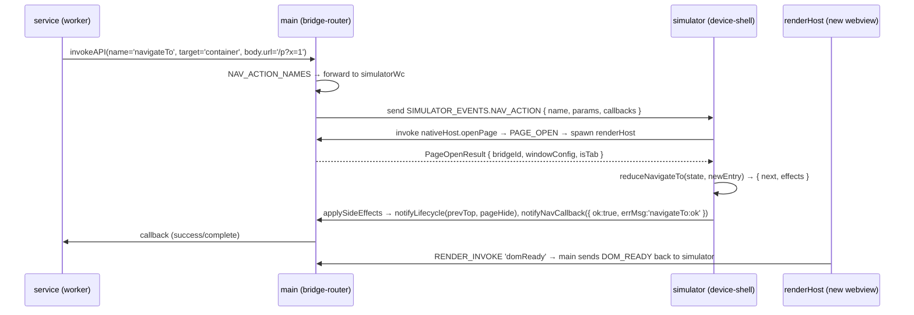

# Simulator 重构方案

> 状态：**草案 v0.2（2026-05-27）**，待评审。
> 基于 4 份调研产出：当前 simulator 现状、dimina 各端 Native 双线程模型、业内小程序 IDE 模型、container/Native bridge 完整契约。
> 配套：[`extension-model.md`](./extension-model.md)、[`miniapp-snapshot.md`](./miniapp-snapshot.md)、`@dimina-kit/workbench` 包（main 上 PR #33 刚合入）。

## 摘要（TL;DR）

当前 simulator 用 `dimina/fe/packages/container`（Application/MiniApp/Bridge/JSCore/WebView）作为承载层；service 跑在 Web Worker、render 跑在 iframe，wx.* 通过 SAB + Proxy 黑盒——Chrome DevTools 接到 Worker 时 `wx.*` 是不透明 Proxy、SAB 同步桥让 worker pause 时死锁、render iframe 干脆不持有 wx。

**重构方向**：

> 把 Electron 当成 iOS/Android 的同类 native 宿主。devtools 自己写一套 Electron 版的 native 承载层，**复用 `@dimina/service` + `@dimina/render` 两个 npm 包**作为运行时核心——让它们跑在 Electron 里时自动走 dimina-fe 已经为真机预留的 **Native 分支**（`globalThis.DiminaServiceBridge.*` / `window.DiminaRenderBridge.*`），跟 iOS（`JSContext` + `DMPEngineInvoke`）/Android（`QuickJS` + `JsCore.kt`）走**完全同一份代码路径**。

**直接收益**：
1. service 跑在独立 BrowserWindow，`webContents.openDevTools()` 一行接上 Chrome DevTools，console 里 `wx.getSystemInfo({...})` 直接跑通、Sources 面板能 step into `globalApi` 内部
2. wx.* / Page / Component 行为契约**自动跟 dimina-fe 真机一致**——因为加载的是同一份 bundle、走同一条 native 分支
3. 不需要任何 dimina-fe 上游 PR——dimina-fe 早就为真机留好了 native 分支，我们只是在 Electron 里实现 native 侧
4. 跟 `@dimina-kit/workbench`（main 新合入的宿主 IPC 骨架）天然契合：承载层就是 workbench 的 `simulatorApis` consumer

**工程边界**：

| 替换（devtools 自写） | 保留加载（@dimina/* npm 包） |
|---|---|
| `dimina/fe/packages/container/**` —— Application / MiniApp / Bridge / JSCore / WebView | `@dimina/service`（service runtime + Page/Component/setData/wx.*） |
| `vite.config.api.js` + `container-runtime.js` | `@dimina/render`（WXML 渲染 + 事件回传 + selectorQuery） |
| simulator `<webview src=simulator.html>` 这套 | `@dimina/common`（工具函数） |

## 1. 现状（事实，含 file:line）

### 1.1 进程/上下文拓扑

| 层 | 宿主 | 引用 |
|---|---|---|
| Workbench window | Electron BrowserWindow（主） | `packages/devtools/src/main/windows/main-window/create.ts:65-81` |
| Simulator 容器 | Workbench 内的 `<webview>` 标签 | `create.ts:79`、`create.ts:100-117` |
| Simulator render | `<webview>` 主 frame，加载 `simulator.html` → 内嵌 dimina-fe `Application`（含 page iframe） | `packages/devtools/src/simulator/main.tsx:76-92` |
| Simulator service | `simulator.html` 包装 `Worker(...)` 创建的 Web Worker | `packages/devtools/src/simulator/simulator.html:77-122` |

### 1.2 双线程通信

- Render ↔ Service 异步：`postMessage`（dimina-fe container Bridge 中转）
- Service → Container **同步 API**：SharedArrayBuffer + `Atomics.wait` 阻塞 Worker，主线程在 `__handleSyncInvoke` 写回结果并 `Atomics.notify`（`simulator.html:13-70`，`simulator/main.tsx:38-60`）
- 内置 API 通过 `miniApp.registerApi(...)` 落到 `apiRegistry`（`main.tsx:118-127`）
- 自定义 API 经 preload 暴露 `window.__diminaCustomApis`（`main.tsx:139`）

### 1.3 为什么 `wx.*` 在 simulator console 里不能用

- **Service Worker scope**：`wx` 是 `dimina/fe/packages/service/src/core/env.js:31` 注册的 Proxy；DevTools 看到的是不透明函数，step into 只能到 Proxy `apply`
- **Page iframe scope**：render 端从不持有 `wx`——所有 `wx.*` 经 Bridge 跨线程发到 service，page console 自然访问不到
- **同步 API 死区**：DevTools 暂停 Worker 调试时主线程仍跑事件循环，但 Worker 已被 `Atomics.wait` 锁住——pause-and-evaluate 必然超时

### 1.4 E2E 怎么绕过的

`packages/devtools/e2e/simulator.spec.ts:141-151` 用 `evalInSimulator(electronApp, '...')` 在 simulator frame 里 `evaluate`，跳过 DevTools console UX。验证了行为，**没解决人肉调试痛点**。

## 2. 调研一：dimina 各端 Native 双线程模型

来源：本仓库 `dimina/` submodule，只读。

### 2.1 对比表

| 维度 | iOS | Android | HarmonyOS | Web/H5（当前 devtools 用的就是这条） |
|---|---|---|---|---|
| Render 容器 | WKWebView | Android WebView | ArkWeb | iframe（`pageFrame.html`） |
| Service 引擎 | JavaScriptCore（`JSContext`） | QuickJS | ArkTS `ThreadWorker` | Web Worker |
| 通信通道 | `WKScriptMessageHandler` + `evaluateScript` | `evaluateJavaScript` + 回调 | `ThreadWorker.postMessage` | `Worker.postMessage` + iframe window 引用 |
| Bridge 注入 | Native 注入 `global.DiminaServiceBridge` | Native 注入 `global.DiminaServiceBridge` | Worker 内置 + main 注入 | JS polyfill |

> **共同点**：service 始终在一个**与 render 物理隔离、不带 DOM 的 JS 上下文**里。devtools simulator 现在走 Web/H5 路线（Worker），架构方向是对的——问题在"这个 Worker 没办法被 Chrome DevTools 当成一等公民去调"。

### 2.2 关键 file:line（精简，详见 v0.1 历史版本）

- iOS Service 引擎：`dimina/iOS/dimina/DiminaKit/Service/DMPEngine.swift:57` `JSContext()`
- iOS Bridge 注入：`Service/DMPEngineInvoke.swift:19-42` `DiminaServiceBridge.invoke` 注入；`Service/DMPEnginePublish.swift:19-39` `publish` 注入；`DMPEngine.swift:86` `DiminaServiceBridge = {}`
- Android Service：`engine_qjs/.../QuickJSEngine.kt:30-31` + `JsCore.kt:75-84` `setInvokeCallback`
- Web Worker：`dimina/fe/packages/container/src/core/jscore.js:21` `new Worker(...)`
- Service 端 `wx` 注册：`dimina/fe/packages/service/src/core/env.js:31` `globalThis.wx = globalApi`（Proxy）
- 环境检测：`dimina/fe/packages/common/src/core/utils.js:359-368` `isWebWorker`

## 3. 调研二：Native bridge 完整协议契约

> 本节是新 simulator 承载层的**实现规范**——devtools 在 Electron 里实现的等价物必须满足这套契约，service/render bundle 才能跑通。来源：dimina/fe/packages/{service,render} + iOS/Android native 实现的逆向。

### 3.1 Service 端 `DiminaServiceBridge` 接口

```typescript
interface DiminaServiceBridge {
  // Service → Native：发起 invoke（target='container' 时调 native API；target='render' 时由 native 转发）
  invoke(msg: MessageEnvelope): unknown   // iOS/QuickJS 可同步返回

  // Service → Render：透过 native 中转，第一参 bridgeId 用于多 mini-app 实例路由
  publish(bridgeId: string, msg: MessageEnvelope): void

  // Native → Service：native 主动给 service 发消息时调用的回调（service 在初始化时赋值）
  set onMessage(handler: (msg: MessageEnvelope) => void): void
  get onMessage(): ((msg: MessageEnvelope) => void) | null
}

interface MessageEnvelope {
  type: string                              // 见 §3.4 全集表
  target: 'service' | 'render' | 'container'
  body: Record<string, unknown>
}
```

**关键调用点**（`dimina/fe/packages/service/src/core/message.js`）：
- `:19` `DiminaServiceBridge.onMessage = this.handleMsg.bind(this)`（service 初始化时注册）
- `:48` `DiminaServiceBridge.publish(msg.body.bridgeId || '', msg)`（service → render）
- `:64` `DiminaServiceBridge.invoke(msg)`（service → container）

### 3.2 Render 端 `DiminaRenderBridge` 接口

```typescript
interface DiminaRenderBridge {
  // Render → Native：iOS/Android 必须传 JSON.stringify 后的字符串；Web 可以传 object
  invoke(msg: string | MessageEnvelope): void

  // Render → Service：透过 native 中转，msg 是 JSON 字符串
  publish(msg: string): void

  // Native → Render：native 给 render 发消息时的回调
  set onMessage(handler: (msg: MessageEnvelope) => void): void
}
```

**关键调用点**：`dimina/fe/packages/render/src/core/message.js:29` `publish`、`:37-42` `invoke`。

### 3.3 消息 envelope 与 type 全集

按发送方/接收方分类（参考 `service/src/index.js` 与 `render/src/index.js` 的事件 listener 覆盖）：

| Type | 方向 | 含义 | container 角色 |
|---|---|---|---|
| `loadResource` | Container → Service / Render | 通知加载小程序资源（service js / render css+js） | 发起 |
| `serviceResourceLoaded` | Service → Container | service 加载完上报 | 接收+聚合 |
| `renderResourceLoaded` | Render → Container | render 加载完上报 | 接收+聚合 |
| `resourceLoaded` | Container → Service | 两端都加载完，通知 service 创建实例 | 发起 |
| `firstRender` | Service → Render | 首屏数据 + 组件初始 props | 透明转发 |
| `appShow` / `appHide` | Container → Service | App 前后台生命周期 | 发起 |
| `stackShow` / `stackHide` | Container → Service | 页面栈进出生命周期 | 发起 |
| `pageShow` / `pageHide` / `pageReady` / `pageUnload` / `pageScroll` / `pageResize` / `pageRouteDone` | Render → Service | 页面生命周期与交互 | 透明转发 |
| `mC` / `mR` / `mU` | Render → Service | Component create / ready / unmount | 透明转发 |
| `t` | Render → Service | 用户事件触发自定义 method | 透明转发 |
| `u` / `ub` | Service → Render | 单条 / 批量 setData 更新 | 透明转发 |
| `triggerCallback` | 双向 | 异步回调结果 | 透明转发 |
| `invokeAPI` | Service → Render | render 端的能力调用（如 webview embed） | 透明转发 |
| `h5SdkAction` | Render → Service | 内嵌 web-view 的 SDK 行为 | 透明转发 |
| `componentError` | Render → Service | 组件错误上报 | 透明转发 |
| `domReady` | Render → Container | DOM 初始化完成，container 可隐藏 loading | 接收 |
| `print` | Container → Render | 调试日志注入（dev only） | 发起 |

**容器（devtools）只需要参与以下角色**：
- **发起**：`loadResource`、`resourceLoaded`、`appShow/Hide`、`stackShow/Hide`、（可选）`print`
- **接收 + 聚合**：`serviceResourceLoaded` + `renderResourceLoaded` → `resourceLoaded`
- **接收**：`domReady`（隐藏 loading）
- **透明转发**：所有 `target: 'service' | 'render'` 的消息按 bridgeId 路由到对应 webContents

### 3.4 启动序列

```
T0  container 创建 Bridge 实例（一个小程序一个），分配 bridgeId
T1  container → service: loadResource (body: appId/pagePath/root/baseUrl/hostEnv)
T1  container → render:  loadResource
T1a service 加载完 → container: serviceResourceLoaded
T1b render 加载完 → container: renderResourceLoaded
T2  container 聚合后 → service: resourceLoaded
T2  service 创建 App + Page 实例 → render: firstRender
T3  render 完成首屏 → container: domReady → container 隐藏 loading
T3  render → service: pageReady
T4  用户交互 → render → service：t / pageScroll / mC / mU / ...
    service → render：u / ub / triggerCallback
    service → container：invokeAPI（target=container 部分）
Tn  container → service: pageUnload / appHide / ...
```

### 3.5 同步 API（关键）

**dimina-fe 没有 `invokeSync` 方法**。同步 API（`wx.getStorageSync` 等）的真机实现完全依赖宿主 JS 引擎本身的同步执行模型：

- **iOS**：`JSContext.evaluateScript` 是同步的——service 调 `DiminaServiceBridge.invoke({type:'invokeAPI', body:{name:'getStorageSync', ...}})` 时 native swift 函数被 JSC 同步调用，直接返回 JSValue。service 拿到返回值。
- **Android**：QuickJS engine 同步执行——`setInvokeCallback(handler)` 的 handler 返回 `JSValue?` 给 JS 端，同样同步语义。
- **Web Worker（当前 devtools）**：Worker 异步——只能用 SAB + `Atomics.wait` 模拟同步（即现状）。
- **Electron BrowserWindow（新方案）**：BrowserWindow 的 V8 上下文里没有"原生 JSContext 同步"语义；但 service 内置 sync API 实现（`packages/devtools/src/simulator/simulator-api-storage.ts` 全文）都是**纯 localStorage / 派生计算**——没有跨进程依赖。所以新方案的策略是：**把所有 `*Sync` 实现就地搬到 service-host preload，service window 内执行**（partition 共享让 localStorage 一致）。详见 §4.5e。

### 3.6 Native 实现对照表（iOS / Android → Electron 等价物）

| 操作 | iOS（Swift） | Android（Kotlin） | Electron 等价物（devtools 自写） |
|---|---|---|---|
| `DiminaServiceBridge.invoke` 注入 | `JSContext.setObject(..., "invoke")` | `QuickJSEngine.setInvokeCallback` | preload: `globalThis.DiminaServiceBridge.invoke = (msg) => ipcRenderer.send(C.INVOKE, msg)` |
| `DiminaServiceBridge.publish` 注入 | `JSContext.setObject(..., "publish")` | `QuickJSEngine.setPublishCallback` | preload: `globalThis.DiminaServiceBridge.publish = (bid, msg) => ipcRenderer.send(C.PUBLISH, bid, msg)` |
| Native → Service onMessage | `evaluateScript("DiminaServiceBridge.onMessage(...)")` | `evaluateJavaScript("...")` | preload: `ipcRenderer.on(C.TO_SERVICE, (_e, msg) => globalThis.DiminaServiceBridge.onMessage?.(msg))` |
| `DiminaRenderBridge.invoke` 注入 | `WKScriptMessageHandler` | `JavascriptInterface` | render preload: `window.DiminaRenderBridge.invoke = (s) => ipcRenderer.send(C.INVOKE, s)` |
| Service → Render publish | `DMPChannelProxy.serviceToRender` → `webview.evaluateJavaScript(...)` | `Bridge.messagePublish` | main process router 按 bridgeId 查到 webContents，`webContents.send(C.TO_RENDER, msg)`，render preload 调 `DiminaRenderBridge.onMessage(msg)` |

## 4. 调研三：业内小程序 IDE 模型（精简，详 v0.1）

四家 IDE 简表 + 选型结论：

| | 微信 | 支付宝 | 百度 | 抖音 |
|---|---|---|---|---|
| 壳 | NW.js | Electron | Electron | Electron |
| Service 承载 | hidden WebView | V8 Isolate | Master WebView | V8 Isolate + V8 Inspector |
| Chrome DevTools 直调 wx.* | ✓ | ✓（推断） | ✓（推断） | ✓ |

**结论**：四家都是"独立 webContents 或 V8 Isolate + Chrome DevTools 一等公民"。dimina 走 hidden BrowserWindow（同微信结构、Electron 替 NW.js）成本最低，且跟我们已有的 dimina-fe Native 分支天然吻合。

## 5. 推荐方案：Electron 作 native 宿主，devtools 自写承载层

### 5.1 核心 insight 与不变量

1. **Electron BrowserWindow = iOS/Android native 同类宿主**。承载层做的事跟 iOS `DMPEngine` + `DMPWebViewInvoke` + Android `JsCore.kt` + `DiminaWebView.kt` 一一对应。
2. **`@dimina/service` 和 `@dimina/render` bundle 零修改使用**。它们检测 `isWebWorker` 后自动走 native 分支（`globalThis.DiminaServiceBridge.*`），跟真机走完全同一份代码。
3. **不动 dimina submodule**——除了 bundle 消费，没有任何上游 PR 依赖。
4. **plug 进 `@dimina-kit/workbench`**：承载层就是 workbench `simulatorApis` 的 consumer，不重复造 IPC 骨架。

### 5.2 进程拓扑

```
Workbench BrowserWindow (workbench renderer + main process)
  │
  ├── Simulator BrowserWindow (新)  ← 承载 simulator UI（DeviceShell + Page Stack）
  │     ├─ DeviceShell (React)：设备 chrome / 状态栏 / TabBar
  │     ├─ Page Stack：每页一个 <webview>
  │     │    └─ <webview> 加载 pageFrame.html → 加载 @dimina/render bundle
  │     │       preload 注入 window.DiminaRenderBridge
  │     │       DevTools 可独立 attach
  │     └─ HashRouter：URL 协议 ?appId&entry&page
  │
  └── ServiceHost BrowserWindow (新, hidden, show:false)
        加载 service.html → 加载 @dimina/service bundle
        preload 注入 globalThis.DiminaServiceBridge + 内置 *Sync 本地实现
        DevTools 自动 detach 打开 (开发期) / 工具栏按钮触发 (用户期)
        ← Chrome DevTools console 直调 wx.*，Sources 可 step into

Main Process
  └── BridgeRouter (新)
        负责一个 mini-app 实例对应一组 { simulator webContents, service webContents }
        消息按 bridgeId 路由
        提供 `simulatorApis` provider 给 @dimina-kit/workbench
        生命周期：spawn / dispose / crash recovery
```

### 5.3 五大模块

| 模块 | iOS/Android 对应 | 职责 | 文件落点（建议） |
|---|---|---|---|
| **ServiceHost** | `DMPEngine` + `DMPEngineInvoke` + `DMPEnginePublish` / `QuickJSEngine` + `JsCore` | 创建 hidden BrowserWindow，preload 注入 `DiminaServiceBridge`，加载 `@dimina/service` bundle | `src/service-host/{create.ts, preload/*, sync-impls/*, service.html}` |
| **RenderHost** | `DMPWebView` + `DMPWebViewInvoke` / `DiminaWebView` | 每页一个 `<webview>`，preload 注入 `DiminaRenderBridge`，加载 pageFrame.html | `src/render-host/{create.ts, preload/*, pageFrame.html}` |
| **BridgeRouter** | `DMPChannelProxy` / `Bridge.kt` | main 进程消息路由，按 bridgeId 转发，聚合 resourceLoaded，提供 hostEnv snapshot | `src/main/ipc/bridge-router.ts` |
| **SimulatorMiniApp** | `DMPApp` / Android `App` | mini-app 实例：apiRegistry、生命周期、appShow/Hide、stackShow/Hide、registerApi/invokeApi | `src/simulator/simulator-mini-app.ts` |
| **DeviceShell** | iOS UI / Android UI | React 组件：设备 chrome、状态栏、TabBar、视图栈管理（替代 dimina-fe `Application`） | `src/simulator/device-shell/**` |

### 5.4 IPC 协议（main 进程 channel）

集中在 `src/shared/bridge-channels.ts`，三方共享：

| Channel | 方向 | 同步? | 载荷 | 说明 |
|---|---|---|---|---|
| `dmb:spawn` | renderer → main | invoke | `{ simulatorWcId, appId, scene, pagePath, query, apiNamespaces, hostEnvSnapshot }` | spawn 一组 (service window, page webviews)，返回 bridgeId |
| `dmb:dispose` | renderer → main | send | `{ bridgeId }` | 销毁该 bridge 持有的所有 webContents |
| `dmb:service:invoke` | service → main | send | `{ bridgeId, msg }` | 对应 `DiminaServiceBridge.invoke`，main 按 `msg.target` 转发或处理 |
| `dmb:service:publish` | service → main → render | send | `{ bridgeId, targetBridgeId, msg }` | 对应 `DiminaServiceBridge.publish` |
| `dmb:render:invoke` | render → main | send | `{ bridgeId, msg }` | 对应 `DiminaRenderBridge.invoke` |
| `dmb:render:publish` | render → main → service | send | `{ bridgeId, msg }` | 对应 `DiminaRenderBridge.publish` |
| `dmb:to-service` | main → service | send | `{ msg }` | service preload 调 `DiminaServiceBridge.onMessage(msg)` |
| `dmb:to-render` | main → render | send | `{ msg }` | render preload 调 `DiminaRenderBridge.onMessage(msg)` |
| `dmb:simulator-api` | service → main → simulator-renderer | invoke | `{ bridgeId, name, params }` | `simulatorApis` 入口（plug `@dimina-kit/workbench`） |

**bridgeId 路由**：一个 mini-app spawn 一个 bridgeId。多 mini-app 同时存在时，BridgeRouter 内表 `bridgeId → { serviceWc, renderWcs[], simulatorWc, currentMiniApp }` 用于消息分发。

### 5.5 ServiceHost 详细设计

#### a. 宿主参数

```ts
new BrowserWindow({
  show: false,
  webPreferences: {
    partition: 'persist:simulator',         // 跟 simulator window 共享 localStorage
    nodeIntegration: false,
    contextIsolation: false,                // service bundle 通过 globalThis 写 wx 等，需共享 realm
    sandbox: false,                         // preload 需要 require('electron')
    preload: serviceHostPreloadPath,
    devTools: true,
  },
})
```

加载 URL：`file://...service-host/service.html?bridgeId=...&appId=...&apiNamespaces=...`

#### b. service.html

```html
<!doctype html>
<html><head><meta charset="utf-8"><title>dimina service host</title></head>
<body>
  <!-- preload 已注入 DiminaServiceBridge / __diminaSpawnContext / sync impls -->
  <script src="./vendor/dimina-service.bundle.js"></script>
  <!-- service bundle 加载完后，env.js 已把 globalThis.wx 设为 Proxy(globalApi)；
       接着 patch 所有 *Sync 走本地实现（preload 已在 globalThis 上准备好 impls） -->
  <script src="./sync-api-patch.js"></script>
</body></html>
```

#### b'. **关键：宿主侧 logic.js 预注入到 AMD 注册表**（Codex 验证发现）

`dimina/fe/packages/service/src/core/loader.js:19-31`：

```js
if (isWebWorker) {
  globalThis.importScripts(logicResourcePath)   // Worker 路径
}
// Native 路径直接跳到这里
const appMod = modRequire('app')                 // ← 内存 AMD 注册表查找
const pageMod = modRequire(pagePath)             // ← 不存在就 throw
```

**含义**：Native 分支不会自己 fetch logic.js；service bundle 期待 `modDefine('app', ...)` / `modDefine(pagePath, ...)` 已经在 AMD 注册表里。Worker 路径靠 `importScripts` 加载的 logic.js 在执行时调 `modDefine` 注册自己；Native 路径需要**宿主**完成这一步。

iOS/Android 真机的做法：native 读 logic.js 内容 → `JSContext.evaluateScript(content)` / `WebView.evaluateJavaScript(content)` 同步执行 → logic.js 自动调 `modDefine` 注册。

**Electron 等价做法**（BridgeRouter spawn 时执行）：

```ts
// main process, BridgeRouter spawn 序列
const logicContent = await fs.readFile(`${appPackageRoot}/${root}/logic.js`, 'utf8')
serviceWc.webContents.once('did-finish-load', async () => {
  await serviceWc.webContents.executeJavaScript(logicContent, true /* useDifferentObject */)
  // 此时 modDefine('app', ...) / modDefine(pagePath, ...) 已就绪
  serviceWc.send(C.TO_SERVICE, { msg: makeLoadResource({ target: 'service', ...opts }) })
  // service 收到 loadResource 后调 modRequire 能正确解析
})
```

同样 render 端也要预注入 page wxml/wxss/js 编译产物（在 pageFrame.html 加载后、loadResource 之前）。

#### c. preload 注入（伪代码）

```ts
// src/service-host/preload/index.ts
const { ipcRenderer } = require('electron')
import * as C from '../../shared/bridge-channels'

// 1. worker-shape：模拟"无 DOM"
import './worker-shape'

// 2. 实现 DiminaServiceBridge —— 跟 iOS DMPEngineInvoke + DMPEnginePublish 同形
let onMessageFn: ((msg: unknown) => void) | null = null
Object.defineProperty(globalThis, 'DiminaServiceBridge', {
  value: Object.create(null, {
    onMessage: {
      get: () => onMessageFn,
      set: (fn) => { onMessageFn = fn },
      enumerable: true,
    },
    invoke: {
      value: (msg: unknown) => ipcRenderer.send(C.SERVICE_INVOKE, { bridgeId: BID, msg }),
      writable: false, enumerable: true,
    },
    publish: {
      value: (bid: string, msg: unknown) =>
        ipcRenderer.send(C.SERVICE_PUBLISH, { bridgeId: BID, targetBridgeId: bid, msg }),
      writable: false, enumerable: true,
    },
  }),
  writable: false, configurable: false,
})

ipcRenderer.on(C.TO_SERVICE, (_e, { msg }) => onMessageFn?.(msg))

// 3. spawn context（appId / hostEnvSnapshot 等，供 sync-api-patch 用）
globalThis.__diminaSpawnContext = parseFromUrl(location.search)
```

#### d. worker-shape

```ts
// src/service-host/preload/worker-shape.ts
// 真机 service（JSContext/QuickJS）没有 DOM。这里把容易被误用的 globals 拦掉，
// 业务代码不小心写 DOM 在 devtools 阶段就暴露。
const block = (key: string) =>
  Object.defineProperty(globalThis, key, {
    get() { throw new Error(`[service] "${key}" not available in service context`) },
    configurable: false,
  })

['document', 'history', 'sessionStorage'].forEach(block)
// 保留：console, setTimeout, setInterval, fetch, URL, TextEncoder/Decoder,
// performance, localStorage（sync impls 要用）
```

#### e. sync-api-patch（替代 SAB）

**事实基础**：`packages/devtools/src/simulator/simulator-api-storage.ts` 全文 + `simulator-api.ts:185-199`——所有内置 `*Sync` 都是纯 `localStorage` / 派生计算，无跨进程依赖。

```ts
// src/service-host/preload/sync-api-patch.ts —— service.js 之后加载
import { setStorageSync, getStorageSync, removeStorageSync, clearStorageSync, getStorageInfoSync }
  from './sync-impls/storage'   // 移植自 src/simulator/simulator-api-storage.ts
import { getSystemInfoSync, getAccountInfoSync } from './sync-impls/system-info'

const ctx = globalThis.__diminaSpawnContext  // { appId, hostEnvSnapshot, ... }

const patch = (ns: any) => {
  if (!ns) return
  ns.getStorageSync = (a) => getStorageSync.call(ctx, a)?.data ?? ''
  ns.setStorageSync = (a, b) => setStorageSync.call(ctx, { key: a, data: b })
  ns.removeStorageSync = (a) => removeStorageSync.call(ctx, { key: a })
  ns.clearStorageSync = () => clearStorageSync.call(ctx)
  ns.getStorageInfoSync = () => getStorageInfoSync.call(ctx)
  ns.getSystemInfoSync = () => getSystemInfoSync.call(ctx)
  ns.getAccountInfoSync = () => getAccountInfoSync.call(ctx)
}
patch(globalThis.wx); patch(globalThis.dd); patch(globalThis.qd)
```

### 5.6 RenderHost 详细设计

每个 page 一个 `<webview>`（或 BrowserView）：

```html
<!-- DeviceShell 内的 page slot -->
<webview src="render-host/pageFrame.html?bridgeId=..&appId=..&pagePath=.."
         preload="file://...render-host/preload.js"
         partition="persist:simulator"></webview>
```

preload 注入：

```ts
// src/render-host/preload/index.ts
const { ipcRenderer } = require('electron')

let onMessageFn: ((msg: unknown) => void) | null = null

window.DiminaRenderBridge = {
  invoke(msg) {
    const parsed = typeof msg === 'string' ? JSON.parse(msg) : msg
    ipcRenderer.send(C.RENDER_INVOKE, { bridgeId: BID, msg: parsed })
  },
  publish(s) {
    ipcRenderer.send(C.RENDER_PUBLISH, { bridgeId: BID, msg: JSON.parse(s) })
  },
  set onMessage(fn) { onMessageFn = fn },
  get onMessage() { return onMessageFn },
}

ipcRenderer.on(C.TO_RENDER, (_e, { msg }) => onMessageFn?.(msg))
```

> render 端继续按 dimina-fe `pageFrame.html` 入口、`@dimina/render` bundle 加载——零修改复用。

### 5.7 BridgeRouter（main process）

```ts
// src/main/ipc/bridge-router.ts
interface BridgeSession {
  bridgeId: string
  appId: string
  serviceWc: Electron.WebContents
  renderWcs: Map<string /*pageBridgeId*/, Electron.WebContents>
  simulatorWc: Electron.WebContents       // DeviceShell 所在窗口
  serviceLoaded: boolean
  renderLoaded: Set<string>
  currentMiniApp: { apiRegistry: Record<string, Function> }
}

const sessions = new Map<string, BridgeSession>()

export function installBridgeRouter(ctx: WorkbenchContext) {
  ipcMain.handle(C.SPAWN, async (e, opts) => {
    const bridgeId = uuid()
    const serviceWindow = createServiceHostWindow({ bridgeId, ...opts })
    // 初始 page webview 在 simulator window 内自创建，不在这里 spawn
    const session: BridgeSession = { bridgeId, ..., serviceWc: serviceWindow.webContents, renderWcs: new Map(), ... }
    sessions.set(bridgeId, session)
    if (!app.isPackaged) serviceWindow.webContents.openDevTools({ mode: 'detach' })

    // 启动序列：T1 双向 loadResource
    session.serviceWc.send(C.TO_SERVICE, { msg: makeLoadResource({ target: 'service', ...opts }) })
    // render 的 loadResource 在 page webview attach 后由 simulator UI 发起

    return { bridgeId, serviceWcId: serviceWindow.webContents.id }
  })

  // 透明转发 service↔render；按 bridgeId 路由
  ipcMain.on(C.SERVICE_INVOKE, (e, { bridgeId, msg }) => {
    const s = sessions.get(bridgeId)
    if (!s) return
    if (msg.target === 'render') {
      forwardToRender(s, msg)
    } else if (msg.target === 'container') {
      handleContainerMsg(s, msg)         // 含 *ResourceLoaded 聚合、domReady 等
    }
  })

  ipcMain.on(C.SERVICE_PUBLISH, (e, { bridgeId, targetBridgeId, msg }) => {
    forwardToRender(sessions.get(bridgeId)!, msg, targetBridgeId)
  })

  ipcMain.on(C.RENDER_INVOKE, (e, { bridgeId, msg }) => {
    const s = sessions.get(bridgeId)
    if (!s) return
    if (msg.target === 'service') forwardToService(s, msg)
    else if (msg.target === 'container') handleContainerMsg(s, msg)
  })

  ipcMain.on(C.RENDER_PUBLISH, (e, { bridgeId, msg }) => {
    forwardToService(sessions.get(bridgeId)!, msg)
  })

  // simulator API（host 注册的能力，对应 @dimina-kit/workbench 的 simulatorApis）
  ipcMain.handle(C.SIMULATOR_API, async (e, { bridgeId, name, params }) => {
    const s = sessions.get(bridgeId)!
    return await s.simulatorWc.executeJavaScript(
      `window.__diminaSimulatorApis?.invoke(${JSON.stringify(name)}, ${JSON.stringify(params)})`,
    )
  })

  ipcMain.on(C.DISPOSE, (e, { bridgeId }) => {
    const s = sessions.get(bridgeId)
    if (!s) return
    s.serviceWc.close()
    for (const wc of s.renderWcs.values()) wc.close?.()
    sessions.delete(bridgeId)
  })
}

function handleContainerMsg(s: BridgeSession, msg: MessageEnvelope) {
  switch (msg.type) {
    case 'serviceResourceLoaded': s.serviceLoaded = true; maybeFireResourceLoaded(s); break
    case 'renderResourceLoaded':  s.renderLoaded.add(msg.body.bridgeId); maybeFireResourceLoaded(s); break
    case 'domReady':              s.simulatorWc.send('simulator:hide-loading', { bridgeId: s.bridgeId }); break
    case 'invokeAPI':             // host 的 simulatorApis
      handleSimulatorApi(s, msg.body); break
    case 'print':                 // dev debug
      break
  }
}
```

### 5.8 SimulatorMiniApp 与 DeviceShell

- `SimulatorMiniApp`：维护 apiRegistry / lifecycle / pageStack，跟 dimina-fe `MiniApp` 公开接口（构造、`registerApi`、`apiRegistry`、`invokeApi`）一一对应。但内部 spawn ServiceHost + RenderHost，不再 spawn Worker
- `DeviceShell`：React 组件，提供设备 chrome / TabBar / 状态栏；`presentView(miniApp)` / `dismissView()` 跟 dimina-fe `Application` 公开接口对齐。**实现可以参考 dimina-fe Application 源码**（但代码自写）

### 5.9 跟 `@dimina-kit/workbench` 集成

workbench 暴露 `simulatorApis` config 项（每个 entry 是 RPC handler，会自动投影为 `wx.<name>`）。承载层做的事：

```ts
// 在 host 入口
workbench({
  simulatorApis: {
    chooseImage: async (params) => { /* host 实现 */ },
    login: async () => { /* host 实现 */ },
    // ...
  },
  // ... 其他 contribution points
})

// BridgeRouter 内部：当 service 端调 wx.chooseImage 时，
// → DiminaServiceBridge.invoke({ type:'invokeAPI', target:'container', body:{ name:'chooseImage', params } })
// → main 收到 SERVICE_INVOKE → handleContainerMsg → handleSimulatorApi
// → 委派给 workbench 的 simulatorApis['chooseImage'](params)
// → 结果通过 invokeAPI 的 callbackId 路由回 service
```

devtools 内置 API（`packages/devtools/src/simulator/simulator-api-*.ts`）也按这条路径注入到 workbench `simulatorApis`，host 可覆盖。

### 5.10 同步 API（消除 SAB）

按 §3.5 + §5.5e：**所有 `*Sync` 在 service window preload 内本地实现**，partition 共享让 `localStorage` 跟 simulator window 一致。零跨进程同步往返。

### 5.11 Chrome DevTools UX

- 开发期：service window 自动 `openDevTools({ mode: 'detach' })`；workbench 工具栏新增"Service Console"快捷按钮
- 用户操作期：service DevTools console 输 `wx.getSystemInfo({ success: r => console.log(r) })`——
  - `wx` 是 dimina-fe service `env.js` 的 `globalApi` Proxy
  - DevTools Sources 面板能看到 `@dimina/service` IIFE bundle（但**当前无 sourcemap**——Codex 验证发现 `dimina/fe/packages/service/dist/service.js` 不带 `sourceMappingURL`）。短期：接受 bundle 形态调试体验（仍能下断点、step into，只是看到的是已 minify/bundle 的代码）。长期：跟 dimina-fe 上游协调让 `@dimina/service` build 输出 sourcemap（这是个无侵入的 build 配置改动，跟"不改 dimina submodule 代码"红线不冲突，因为只动 build 输出）
  - 断点能命中 `globalApi.getSystemInfo`，step into 进 `DiminaServiceBridge.invoke({...})`，这一步进入 preload 函数体（**devtools 自己的源码，sourcemap 完整**）
  - 再 step 就到 IPC 边界——跟 iOS native `swift` 边界、Android `kotlin` 边界对应。这是合理的"用户态/宿主态"分界

### 5.12 NavigationBar 微信对齐

simulator UI 的 NavigationBar 完全按微信 MiniProgram 规范实现，不参照 dimina 各端 native（用户指示：仅在 devtools 对齐）。spec 调研见 chat 记录中的微信 NavigationBar 规范报告。

**视觉**：`src/simulator/device-shell/{navigation-bar.tsx, menu-capsule.tsx, navigation-bar.css, menu-capsule.css}`
- status bar 高度：iOS 44, Android 24（spawn-time 注入到 hostEnvSnapshot）
- nav bar 高度：44（spec 标准）
- 标题对齐：iOS center / Android left
- 返回箭头（页面栈 > 1 时）/ 返回首页按钮（homeButtonVisible 时）
- loading 转圈（show/hideNavigationBarLoading）
- 颜色动画（`wx.setNavigationBarColor.animation` → CSS transition 4 种 timingFunc）
- `navigationStyle: custom` 整体透明 + 胶囊保留

**胶囊** `src/simulator/device-shell/menu-button-geometry.ts`：
- iOS 87x32, top = statusBarHeight + 4, right = 7
- Android 95x32, top = statusBarHeight + 6, right = 10
- 纯函数 geometry，service-host sync-impls 与 React 组件共享

**API 路由**（`src/main/ipc/bridge-router.ts` `NAV_BAR_API_NAMES`）：
- 5 个 navigation-bar API（setNavigationBarTitle / setNavigationBarColor / show|hideNavigationBarLoading / hideHomeButton）走 `simulator:navigation-bar` IPC，路径 `service.invokeAPI → main.handleSimulatorApi → simulatorWc.send → DeviceShell useEffect → setState`
- callback fire-and-forget 立即返回 `{ errMsg: '<name>:ok' }`（UI 更新异步，与微信行为对齐）
- `wx.getMenuButtonBoundingClientRect()` 走 sync 本地实现（`src/service-host/sync-impls/menu-button.ts`），从 spawn-time hostEnvSnapshot 派生

**约束**：
- `setNavigationBarColor.frontColor` 严格限 `#ffffff | #000000`（DeviceShell.applyColorMutation 拒绝其他值）
- `navigationBarTextStyle: white|black` 同时影响标题颜色 + status bar 字体颜色（通过 NavigationBar `--white|--black` modifier 类）

### 🆕 5.13 PageStack + 多 webview

> 来源：`packages/devtools/src/simulator/device-shell/page-stack-controller.ts`（纯 reducer）+ `device-shell.tsx`（薄包装）。

**数据结构**：

```ts
interface ShellState {
  stack: PageEntry[]                          // 当前可见栈：bottom = 当前 tab 根页，top = 最新 navigateTo/redirectTo/reLaunch 产物
  tabStacks: Record<string, PageEntry[]>      // 按 tab pagePath 缓存的子栈；switchTab 来回不丢已 navigateTo 的页
  currentTabPath: string | null               // 当前激活 tab 路径；无 tab 配置时为 null
}
```

`PageEntry` = `{ bridgeId, pagePath, query, isTab, windowConfig, navBar }`。每个 entry 对应一个 `<webview>`，按 bridgeId 复用 mount。

**5 个 reducer 的步骤**（均为 `(state, ...) => { next, effects: SideEffect[] }`，effect 是 `lifecycle | closePage` 两类）：

| API | 步骤 |
|---|---|
| navigateTo | 1) 校验非 tab；2) push newEntry 到 stack；3) 同步写入 `tabStacks[currentTabPath]`；4) emit `pageHide(prevTop)`；5) ack `:ok` |
| navigateBack | 1) 校验栈深 >1；2) 计算 popCount = min(delta, depth-1)；3) emit `pageUnload + closePage` 每个 popped；4) emit `pageShow(newTop)`；5) 若 newTop.isTab 更新 currentTabPath |
| redirectTo | 1) 校验非 tab；2) 替换 stack 顶；3) 同步写入 `tabStacks[currentTabPath]`；4) emit `pageUnload + closePage(prevTop)`；5) ack `:ok` |
| reLaunch | 1) 收集 stack ∪ tabStacks 的所有 alive bridgeId；2) emit `pageUnload + closePage` 每个旧页；3) 重建 stack=[newEntry]、tabStacks（若 isTab 则仅 newEntry）；4) currentTabPath ← newEntry.isTab ? path : null；5) ack `:ok` |
| switchTab | 1) snapshot 当前 stack → `tabStacks[prevTabPath]`；2) 命中缓存则恢复 cached 子栈，否则用 freshlyOpenedEntry 起新栈；3) 写入 `tabStacks[targetPath]` + 切 currentTabPath；4) emit `pageHide(prevTop)` if prevTop≠newTop；5) emit `pageShow(newTop)` 仅当从缓存恢复（新页由 renderer init 路径自己发 pageShow） |

**main / simulator / service 三方时序**（navigateTo 为例）：



### 🆕 5.14 TabBar 实现

> 来源：`packages/devtools/src/simulator/device-shell/{tab-bar.tsx,tab-bar-state.ts}` + `bridge-router.ts:TAB_ACTION_NAMES`。

**app-config.json `tabBar` schema**（与微信对齐）：

```ts
interface TabBarConfig {
  color?: string                  // 文字默认色
  selectedColor?: string          // 选中文字色
  backgroundColor?: string
  borderStyle?: 'black' | 'white'
  position?: 'bottom' | 'top'
  custom?: boolean
  list: { pagePath; text?; iconPath?; selectedIconPath? }[]
}
```

**8 个动态 API**（`TabActionPayload['name']`，全部走 `applyTabAction` reducer 返回 `{ state, ok, errMsg }`）：

| API | 状态变换 |
|---|---|
| setTabBarStyle | 仅替换 `config.{color,selectedColor,backgroundColor,borderStyle}`；颜色经 `sanitizeColor` 过滤（拒绝 `< > " ' ; { } ( ) \` 等危险字符，rgba/hsla/hex 通过） |
| setTabBarItem | 替换 `config.list[index].{text,iconPath,selectedIconPath}`；index 非整或越界 → fail |
| showTabBar | `state.visible = true` |
| hideTabBar | `state.visible = false` |
| setTabBarBadge | `state.badges[index] = String(text)`；同时清掉同 index 的 redDot |
| removeTabBarBadge | `state.badges[index] = ''`（不影响 redDot） |
| showTabBarRedDot | `state.redDots[index] = true`；同时清掉同 index 的 badge |
| hideTabBarRedDot | `state.redDots[index] = false`（不影响 badge） |

**icon 路径解析规则**（`tab-bar.tsx` 内的 `resolveIconUrl`）：

- 以 `http://` / `https://` / `data:` / `file://` 开头 → 原值
- 其他 → `joinUrl(resourceBaseUrl, appId, iconPath)`（指向 main 进程的 dimina-resource-server）

### 🆕 5.15 Bridge Envelope 协议参考

> 来源：`packages/devtools/src/shared/bridge-channels.ts`（所有 SIMULATOR_EVENTS / IPC payload 定义） + `bridge-router.ts`（路由器实现）。

**service → container `invokeAPI` envelope**：

```ts
{ type: 'invokeAPI', target: 'container', body: { name, params: { ...userParams, success, fail, complete } } }
```

`bridge-router.ts:handleSimulatorApi` 按 name 分流到四类目标：

| 类别 | 名字示例 | 路由 |
|---|---|---|
| Navigation Bar API（5 个） | setNavigationBarTitle / setNavigationBarColor / show\|hideNavigationBarLoading / hideHomeButton | `simulatorWc.send(NAV_BAR)` → fire-and-forget ok 回调（UI 异步更新） |
| Route Action API（5 个） | navigateTo / navigateBack / redirectTo / reLaunch / switchTab | `simulatorWc.send(NAV_ACTION)` → DeviceShell 调 reducer + ack via `NAV_CALLBACK` |
| TabBar Action API（8 个） | setTabBarStyle / setTabBarItem / show\|hideTabBar / set\|removeTabBarBadge / show\|hideTabBarRedDot | `simulatorWc.send(TAB_ACTION)` → applyTabAction + ack via `NAV_CALLBACK` |
| Host registry / Simulator window forward（其余） | getSystemInfo / chooseImage / login / fs.* / chooseMedia / … | 优先 `ctx.simulatorApis.invoke`；落空走 `forwardApiCallToSimulator` (API_CALL request/response with timeout) |

**container → service 的 lifecycle 消息**（`PAGE_LIFECYCLE` → service `onMessage`）：

| event | 触发点 |
|---|---|
| pageShow | navigateBack 完成 / switchTab cache 命中 |
| pageHide | navigateTo 完成 / switchTab 离开当前 tab |
| pageUnload | navigateBack 弹栈 / redirectTo / reLaunch / switchTab 丢弃非 tab 上层 |
| stackShow / stackHide | （reserved — 当前 reducer 未触发，但 contract 已保留） |
| appShow / appHide | 由 main 在 app spawn / dispose 时直接发，不经 reducer |

**main ↔ simulator `SIMULATOR_EVENTS`（完整列表）**：

```ts
SIMULATOR_EVENTS = {
  NAV_BAR,          // main → sim    : 5 个 nav-bar 动态 API
  TAB_ACTION,       // main → sim    : 8 个 tabBar 动态 API
  NAV_ACTION,       // main → sim    : 5 个路由 API
  API_CALL,         // main → sim    : 兜底的 simulator-window-resident API call（带 requestId / timeout）
  API_RESPONSE,     // sim → main    : 对应 API_CALL 的响应
  DOM_READY,        // main → sim    : renderHost domReady 转发，用于 mount 顺序协调
}
```

### 5.16 关键文件改动清单

| 文件 | 动作 |
|---|---|
| `packages/devtools/src/service-host/{service.html, preload/*, sync-impls/*, sync-api-patch.ts}` | 新增 |
| `packages/devtools/src/render-host/{pageFrame.html, preload/*}` | 新增（pageFrame.html 可直接 copy + 改 import 路径） |
| `packages/devtools/src/main/windows/service-host-window/create.ts` | 新增 |
| `packages/devtools/src/main/ipc/bridge-router.ts` | 新增 |
| `packages/devtools/src/shared/bridge-channels.ts` | 新增 |
| `packages/devtools/src/simulator/simulator-mini-app.ts` | 新增（替 dimina-fe `MiniApp`） |
| `packages/devtools/src/simulator/device-shell/**` | 新增（替 dimina-fe `Application`） |
| `packages/devtools/src/simulator/main.tsx` | 重写：删 `__handleSyncInvoke`、删 SAB 包装、改用新的 `SimulatorMiniApp` / `DeviceShell`、`createJSCore` 不再需要 |
| `packages/devtools/src/simulator/simulator.html` | 删 SYNC_INFRA / SYNC_PATCH / Worker 包装；变成纯 React 入口 |
| `packages/devtools/src/preload/runtime/custom-apis.ts` | `installCustomApisBridge` 改装到 service window；qdmp lockstep |
| `packages/devtools/vite.config.api.js` + `container-runtime.js` | 删除（container-api 不再用） |
| `packages/devtools/vite.config.simulator.ts` | 更新：去掉 externalContainerAssets plugin；新增 service-host / render-host 入口 |
| `packages/devtools/vite.config.service-host.ts` | 新增 |
| `packages/devtools/vite.config.render-host.ts` | 新增 |
| `packages/devtools/package.json` | 新增 dep `@dimina/service` + `@dimina/render`（取代经 container-api 间接依赖） |
| `packages/devtools/e2e/simulator.spec.ts` | 新增"service DevTools console 直调 `wx.getSystemInfo()`"用例 |

## 6. 实现路径

### Phase 0 — PoC（1-2 天，`_spike/native-runtime/`）

**目标**：验证三个核心未知；以最小代码跑通 hello world。

**写**（≤500 行）：
- `_spike/native-runtime/main.ts` — Electron entry：起 simulator window + service window
- `_spike/native-runtime/service-host/{service.html, preload.ts}` — 注入 DiminaServiceBridge
- `_spike/native-runtime/render-host/{pageFrame.html, preload.ts}` — 注入 DiminaRenderBridge
- `_spike/native-runtime/bridge-router.ts` — 最简 main 进程路由（4 个 channel）
- `_spike/native-runtime/hello-world/` — 写死 appId 的最小小程序编译产物（单页 + 按钮 + setData + wx.getSystemInfo）

**验收**：
- [ ] simulator 渲染 hello world 页面
- [ ] 点击按钮 → service 接到 `t` → setData → render 渲染更新
- [ ] service DevTools 自动打开
- [ ] console 输入 `wx.getSystemInfo({success: r => console.log(r)})` 返回真实数据
- [ ] Sources 面板能在 `@dimina/service` bundle 的 `globalApi.getSystemInfo` 内部下断点 + step into

**🆕 PageStack + TabBar 行为验收**（Phase 1 后段补充）：
- [ ] spawn 返回的 `SpawnResult` 必须带 `manifest`（`{ entryPagePath, pages, tabBar? }`），DeviceShell 据此初始化 tabPool / currentTabPath
- [ ] navigateTo / switchTab → `PAGE_OPEN` 必须给每个新 page 分配独立 bridgeId（不复用 root bridgeId），并在 simulator 端 mount 新 `<webview>`
- [ ] TabBar 点击切换：`handleTabClick` → `switchTab` reducer → `pageHide` 旧 tab + `pageShow` 新 tab（仅缓存命中时）；新 tab fresh open 时不重复 `pageShow`
- [ ] navigateBack delta=1 → 触发 `pageUnload + closePage` for popped + `pageShow` for new top；newTop.isTab 时 currentTabPath 同步更新
- [ ] reLaunch 清栈：tabStacks 全清并对每个 alive bridgeId 发 `pageUnload + closePage`；若新页 isTab=true 则 tabStacks 仅含新页

**门槛**：满足上述五条 + 5 条 PageStack 行为则 PoC 通过，Phase 1 启动。

### Phase 1 — 承载层正式落地（约 1-2 周）

- ServiceHost / RenderHost / BridgeRouter / SimulatorMiniApp / DeviceShell 全部按 §5 落地
- 删除 `simulator.html` 的 SAB / Worker 包装、`simulator/main.tsx:38-60` 的 `__handleSyncInvoke`
- sync handler 移到 `service-host/sync-impls/`
- 现有 unit / e2e 测试保持绿（特别 `simulator-api-storage`/`-fs`/`-media` 系列）
- 删除 `container-runtime.js` + `vite.config.api.js`，dep 直接换成 `@dimina/service` + `@dimina/render`

### Phase 2 — workbench 集成 + qdmp lockstep（与 Phase 1 后段并行）

- BridgeRouter 暴露 `simulatorApis` provider 接口
- 把现有 `simulatorApis` 系列（simulator-api-*.ts）按 workbench config 形态接入
- `installCustomApisBridge` 改装目标从 simulator window → service window；qdmp lockstep 改 preload 加载路径
- workbench 工具栏新增"Service Console"按钮

### Phase 3 — DevTools UX 收尾 + worker-shape 收紧

- preload `worker-shape.ts` 关掉 `document` / `history` / `sessionStorage` 写口；跑一遍业务回归
- 新增 e2e 用例：真启 electron → 用 Playwright/CDP 在 service DevTools console 输 `wx.getSystemInfo()` 断言返回非 stub
- 文档（本文件 + extension-model.md）状态从"草案"→"已定稿"

### Phase 4（v2，远期）

评估迁 `utilityProcess + V8 Inspector`——主要是"service 真无 DOM"的强约束。如果 Phase 3 worker-shape 收紧够用，v2 可推后。

## 7. 风险

### 7.1 Codex 已验证风险（2026-05-27）

| 验证目标 | 结果 | 处理 |
|---|---|---|
| service Native 分支可达性 | 🟢 `isWebWorker===false` 必走 Native，IIFE 单次求值 | 无 |
| render 承载是否纯 window-based | 🟢 无 Worker-only 代码 | 无 |
| Bridge envelope/publish 协议 | 🟢 iOS/Android `evaluateJavaScript` 模式可复刻 | 见 §5.5 / §5.6 / §5.7 |
| Bridge 注入时机 | 🟡 preload 必须先于 `<script src>` 装好对象 | preload 顺序由 Electron 保证，文档已注明（§5.5c） |
| `@dimina/service` 产物形态 | 🟡 IIFE 单文件，**dist 无 sourcemap** | 短期接受 bundle 调试；长期向 dimina-fe 上游争取 sourcemap build flag |
| service 模块加载 | 🔴 Native 分支跳过 `importScripts`，**宿主必须自己注入 logic.js 到 AMD 注册表** | 见 §5.5b'（BridgeRouter spawn 序列预执行 logic.js content） |

### 7.2 待 PoC 实测验证的风险

1. **`<script src="dist/service.js">` 在 Electron BrowserWindow 里加载 IIFE 是否如期** — Codex 标 UNVERIFIED，PoC 必跑
2. **partition 共享 cookie/session 副作用**：service window 跟 simulator window 共享 `persist:simulator`，service 端 fetch 会带 simulator cookie——跟真机一致，但需确认 host 的 navigation-hardening 不影响 service window
3. **多 mini-app 同时存在**：BridgeRouter `bridgeId` 路由必须严格按 envelope `body.bridgeId` 隔离；Phase 1 加用例覆盖
4. **render `<webview>` vs `BrowserView`**：每页一个 `<webview>` 易管理但 Electron 弃用议程上；`BrowserView` 更稳但布局复杂——PoC 阶段先用 `<webview>` 跑通，Phase 1 再决策

### 7.3 工程协调风险

1. **跟 qdmp lockstep**：custom-apis preload 安装目标迁移到 service window，qdmp 要同步改 preload 加载路径
2. **测试基线**：现有 `simulator-api.test.ts` 等 unit 测试以 simulator renderer context 编写，sync 部分移到 service-host 后 mock 边界要重写；新增 e2e（按 [refactor 后必须真启 electron] 纪律）必须真启 electron + 自动开 DevTools + CDP 断言 `wx.getSystemInfo()`
3. **dimina-fe sourcemap 上游协调**：`@dimina/service` build 产出 sourcemap 不影响功能，是个低风险无侵入 PR；先在 §7.1 标黄、Phase 2/3 推进

## 8. 否决项

- **A. 沿用 Worker，只想办法让 DevTools console 里调 `wx.*`**：Proxy + Worker scope 跨边界，DevTools 无法穿透 step into。**否决理由：治标不治本**。
- **B. service 跟 render 共享同一个 frame（iframe + main frame 两段 JS）**：能解决调试 UX，但破坏双线程语义——所有真机端 service 都是独立 JS 上下文，跟 render 共享 realm 会让"render 直接读 service 变量"成为可能并被业务依赖。**否决理由：与真机模型偏离过大**。
- **C. v1 直接上 `utilityProcess + V8 Inspector`**：模型最干净，但 (1) DevTools 接入要自己起 CDP frontend 或导用户去 `chrome://inspect`，UX 退步；(2) Electron `utilityProcess` 的 inspector port 默认行为在不同 Electron 大版本间有过 break；(3) v1 价值是"先把人肉调试解锁"。**否决理由：性价比不如 hidden BrowserWindow，留作 v2**。
- **D. 同步 API 继续用 SAB**：跨进程后 SAB 不可达（不跨进程共享）。且本仓库 sync API 全是 localStorage / 派生计算（`simulator-api-storage.ts`），不需要跨进程。**否决理由：方案已不需要 SAB**。
- **E. 用 iframe 而非 hidden BrowserWindow 跑 service**：iframe 与 render 共享 DevTools target，无法独立 attach。**否决理由：调试目标不可分**。
- **F. 改 dimina-fe 让 MiniApp 接受 `createJSCore` 工厂**（v0.1 草案曾考虑）：违反 CLAUDE.md "submodule 改动先 ask"；且当前方案完全在 devtools 内闭环，dimina-fe 零改动。**否决理由：不必要的耦合**。
- **G. fork dimina-fe 进 devtools 内**：维护成本失控，且会让 dimina-fe 与 simulator 永久分叉，违背"跟真机走同一份代码"的核心目标。**否决理由：架构债**。
- **H. 完全自写双线程 runtime（不再加载 `@dimina/service` + `@dimina/render` bundle）**：工程量数倍于当前方案；wx.* / Page / Component 行为契约要重新跟 dimina-fe 真机对齐——任何漂移都是 simulator vs 真机的 bug 源。**否决理由：不解决问题且制造问题**。
