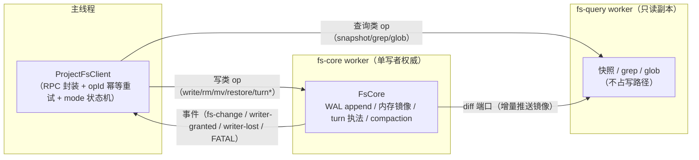
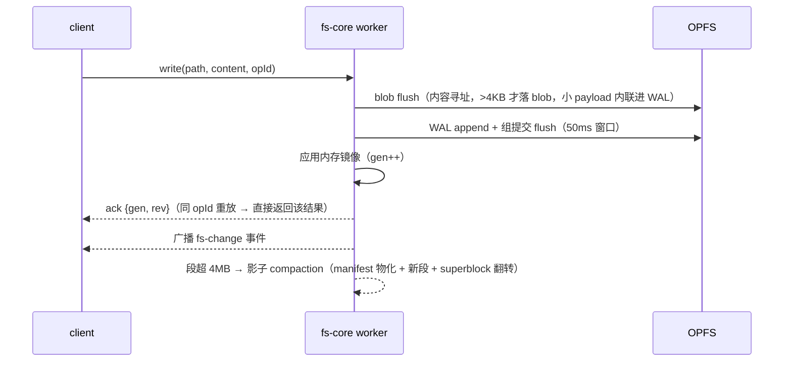
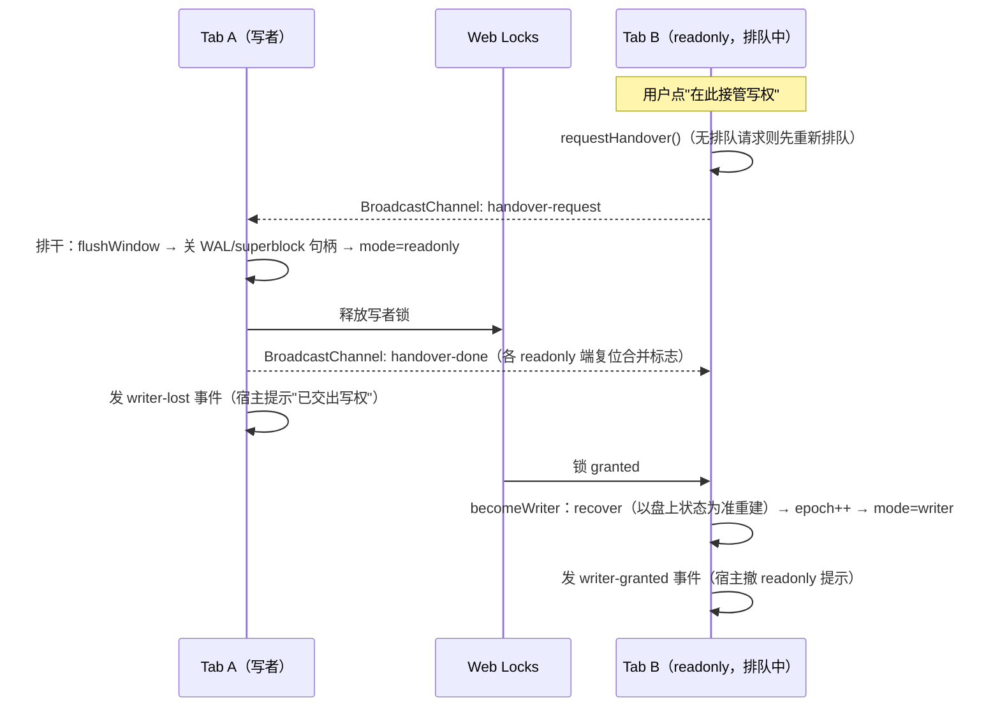
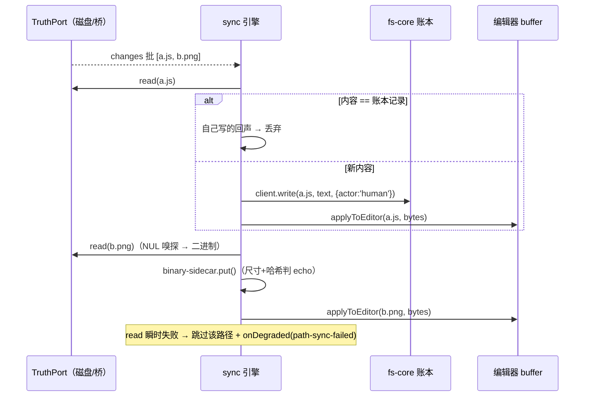

# @dimina-kit/fs-core

浏览器端 OPFS WAL 文件系统内核：单写者权威（Web Locks 选主 + 协作交接）、WAL-first 写序、checkpoint/restore 回滚、agent 写权 turn 门控，零运行时依赖。

给两类宿主用：

- **fs-core 即真相源**的宿主（如 qdmp-web-workbench）：项目文件直接活在 OPFS 账本里，导出/落盘是下游动作（`/disk-mirror`、`/zip`）。
- **磁盘才是真相源**的宿主（如 dimina-kit workbench/devtools）：fs-core 只做记账与 agent 写权执法，`/sync` 引擎负责磁盘↔账本双向对账。

## 安装

```bash
npm i @dimina-kit/fs-core
```

## 快速上手

```js
import { ProjectFsClient } from '@dimina-kit/fs-core/client'

// 宿主需把 dist/fs-core.worker.js 与 dist/fs-query.worker.js 部署到可访问 URL，
// client 以 module worker 加载它们。coreUrl/queryUrl 的缺省值 /ide/fs/ 是最初
// dwc 宿主的部署形状；其它宿主都应显式传入自己的 URL。文件名/位置的单一权威
// 见 `@dimina-kit/fs-core/worker-files` 的 resolveWorkerFiles()。
const fs = await ProjectFsClient.connect({
  projectId: 'my-project',
  coreUrl: '/ide/fs/fs-core.worker.js',
  queryUrl: '/ide/fs/fs-query.worker.js',
})
await fs.write('app.json', '{}')
const { content } = await fs.read('app.json')

// 错误处理按符号匹配（错误码契约见 `/protocol`）：
import { isFsCoreErrorCode } from '@dimina-kit/fs-core/protocol'
try {
  await fs.write('app.json', '{}')
} catch (e) {
  if (isFsCoreErrorCode(e, 'readonly')) {
    /* 另一个标签页持有写权 —— 见下文「多标签页单写者」 */
  }
}
```

### Worker 产物部署

`dist/fs-core.worker.js` 与 `dist/fs-query.worker.js` 是单文件自包含 ESM（无 import 语句、零依赖），宿主按**字面文件名**从 `dist/` 拷贝/托管即可，以 module worker（`{ type: 'module' }`）加载。构建脚本请消费 `@dimina-kit/fs-core/worker-files` 的 `resolveWorkerFiles()`（ESM/CJS 双形态）拿文件名与路径，不要手拼。

需要 OPFS（`navigator.storage.getDirectory`）与 `createSyncAccessHandle`（worker 内），即 Chromium ≥ 102 一类环境；不依赖 COI。

## 架构总览

三个执行体，一条权威链：



- **fs-core worker** 是唯一权威：持有 OPFS 写句柄，所有写序列化在一条 `enqueue` 链上。
- **fs-query worker** 是它的只读投影：core 经专用 MessagePort 推增量 diff，重查询（全量快照、grep、glob）在这里跑，不打扰写路径。
- **client** 只是主线程的便利面：Promise API、写超时后按同 `opId` 幂等重试恰一次、把 worker 事件翻译成 `mode`/`onChange`。

### 持久层布局（OPFS，无物化文件树）

```
<projectId>/blobs/<h2>/<sha256>   内容寻址、不可变、写后 flush
<projectId>/manifests/<gen>.json  compaction 产物（CRC 记录在 superblock）
<projectId>/wal.<startGen>        分段 append-only 日志，禁止原地重写/truncate
<projectId>/superblock            双槽定长 64B×2；只写非当前槽，flush 后翻转
```

### WAL-first 写序

每个写类 op 严格按 **blob flush → WAL append（组提交 flush）→ 应用内存镜像 → ack(opId) → 广播** 的顺序执行。ack 语义：**已 ack 必恢复；未 ack 可能恢复**——超时重试用同 `opId` 消歧（fs-core 对已知 opId 直接返回既有结果，不重放副作用）。



崩溃恢复（worker 启动时）：superblock 双槽选优 → 加载 manifest（CRC 校验）→ 按段升序回放 WAL 有效前缀（帧级 CRC，坏尾截断）→ 重建内存镜像与 opId 窗口。

## 多标签页单写者与协作交接

同一 `projectId` 只有一个写者：Web Locks `'dwc:writer:<projectId>'` 排队互斥，**禁 steal**。

- 后开的标签页 3s 拿不到锁即以 **readonly** 服务（`fs.mode === 'readonly'`，经 `onModeChange` 订阅变化），排队请求保留，锁 granted 后自动升级为写者。
- readonly 端可调 `fs.requestHandover()` **主动请求交接**：现任写者排干（flush + 关句柄）后释放锁，本端排队请求随之 granted。何时发起是宿主的 UI 策略（典型：在"另一个标签页持有写权"提示上放"在此接管"动作），fs-core 只提供机制、绝不自动重发；同一 pending 周期内重复调用被合并。只有 readonly 会真正行动：writer/dead/starting 上调用是 no-op（如实返回 `{mode}`），draining 以错误码 `'draining'` 拒绝。
- **锁仲裁本身失败**（Web Locks 层异常，非"被人占着"）一律 FATAL——绝不无锁当写者，也绝不静默滞留 readonly。能跑 fs-core（OPFS SyncAccessHandle）的环境必有 Web Locks，仲裁失败只可能是异常环境，诚实死掉比装活好。
- **拿到锁但升级失败**（恢复/开句柄抛错）同样 FATAL，且**必定释放锁**——失败的 worker 绝不占着锁当死写者，后面排队的标签页正常接手。



交出写权的一端**不会**自动重新排队（否则两个 tab 会互相抢）；它再次调用 `requestHandover()` 时才重新排队并广播。

## Agent 写权：turn 门控与回滚

agent（`actor: 'agent'`）的写必须发生在一个活跃 turn 内，执法在 fs-core worker 侧（`checkTurn` 与 WAL append 同一同步块，无竞态窗口）——调用方伪造不了：

1. `turnBegin(turnId)`：铸造 turn，同时自动打一个 checkpoint 锚（回滚点）；有 TTL 与 per-turn op 限额（跑飞的 agent 刹车）。
2. turn 内的 `write/edit/rm/mv`：携带 `{actor:'agent', turnId}`；宿主可另经 `armAgentTokenGate(token)` 上第二道令牌门（令牌只有内核持有，防同 realm 内伪造）。
3. `diff(turnId)`：该 turn 的全部改动清单（WAL 审计标注免费提供）。
4. `restore(cpId)`：回滚到锚点；非 force 时做冲突执法——锚点之后存在人类写则拒绝（附 `humanPaths`），审计环覆盖不到的历史一律保守拒绝。
5. `turnEnd(turnId)`：撤销 turn（同步置位，立即生效）。

`@dimina-kit/fs-core/agent-tools` 提供 MCP 形状的工具表包装（`fs_read`/`fs_write`/`fs_restore`/…，execute 自动注入 turnId，模型伪造不了别的 turn）。

## 两套磁盘机制的划界（永不合流）

- **`/disk-mirror`**：OPFS 真相源 → 本地目录的**单向导出**（File System Access，防抖全量比对写盘）。适用于"fs-core 即真相源"的宿主（如 qdmp-web-workbench）想把内容落到本地磁盘。
- **`/sync`**：**外部真相源 ↔ fs-core 账本的双向对账引擎**（TruthPort 抽象外部真相源；echo 判据、FIFO 序列化、二进制侧车）。适用于"磁盘才是真相源、fs-core 只记账"的宿主（如 dimina-kit workbench 经 `/__fs` 桥 + SSE watch）。
- 一个宿主真需要双向时，正确姿势是给 `/sync` 写一个 poll 形态的 TruthPort 适配器，而不是把 `/disk-mirror` 养成第二个同步引擎。
- **未来 poll 适配器须自持的不变量**（引擎只服务 push 形态宿主，不内置 poll 侧机制）：poll 宿主自己驱动出站扫描（读账本→写真相源），因此必须自己防"刚从真相源灌入的变更被自己的出站扫描原样回写"——抑制记录须**一次性消费**（命中即清除，不是常驻内容缓存）、匹配须区分文本/字节/删除三种形态、且**绝不能把真相源"读不到"（瞬时 I/O 失败）推断为删除**。

## `/sync` 同步引擎

宿主注入两件东西，拿回一个引擎：

```ts
import { createSyncEngine } from '@dimina-kit/fs-core/sync'

const engine = createSyncEngine(client /* fs-core 账本 */, truthPort /* 外部真相源 */, {
  applyToEditor: async (rel, bytes) => { /* 入站变更灌进编辑器 buffer；bytes===null 是删除 */ },
  onDegraded: (d) => { /* 降级上抛：watcher-dead / path-sync-failed（见下） */ },
})
await engine.populateLedger() // 全量播种 + 对账残留
engine.start()                // 订阅 truthPort.changes，开始入站对账
```

核心机制：

- **ledgerTurn FIFO**：入站批与 `onHumanSave` 记账走同一条 FIFO，二者永不交错——飞行中保存的同路径入站通知总能看到保存完成后的账本记录。
- **echo 判据**（双向都是内容比较）：入站字节 == 账本记录 → 是自己上次写的回声，丢弃；出站保存 == 账本记录 → 冗余，跳过。
- **二进制分层**：NUL 嗅探分类，二进制永不进字符串账本，由 `binary-sidecar` 的 `{size, sha256}` 索引承接（echo 判据 = 尺寸+哈希相等）。二进制无 WAL 审计/回滚（审计面是字符串契约）。
- **降级必须 loud**（`onDegraded`）：
  - `{kind:'watcher-dead'}`——变更订阅死了，此后账本只反映打开时镜像 + 已处理的批；
  - `{kind:'path-sync-failed', rel, stage:'truth-read'|'reconcile', error}`——单路径对账失败被跳过（真相源读失败 / 账本写失败）。
  静默跳过会让账本漂移而无人知晓，所以事件与 console 告警**同时**发。



watch 事件是 coalesced/有损的（macOS FSEvents 会合并突发、丢递归删除的子项）——TruthPort 适配器在喂给引擎**之前**先经 `watch-expander` 做 stat 级核对展开，引擎信任到手的批。

## 宿主接入清单

**形态一：fs-core 即真相源**（qdmp 形状）

1. `ProjectFsClient.connect()`，项目加载时播种（注意换项目要"rm 旧 + 覆盖写新"的重置语义，`seed()` 是"非空即跳过"）。
2. 订阅 `onModeChange` 呈现多标签页写权状态；readonly 提示上挂 `requestHandover()` 动作。
3. 二进制资产自建 `binary-sidecar`（`retainBytes: true`），导出/编译经 `overlay()` 与账本文本合并。
4. 需要落盘 → `/disk-mirror`；需要打包 → `/zip`。

**形态二：磁盘即真相源**（workbench 形状）

1. 实现 `TruthPort`（read/write/delete/walk/changes），watch 批先过 `watch-expander`。
2. `createSyncEngine()` + `populateLedger()` + `start()`；人类保存落盘**之后**调 `onHumanSave`（记账是 best-effort，绝不阻塞保存本身）。
3. 接 `onDegraded` 到宿主可见的通道（状态条/诊断面板），不要只留 console。
4. agent 写走 turn 门控面（`turnBegin`/`agentWrite`/`diff`/`restore`），磁盘与账本一致后再回灌编辑器。

两种形态都请从 `/protocol` 导入错误码/事件名做符号匹配，不要抄 worker 源码里的字符串字面量。

## 入口一览

| 子路径 | 用途 |
| --- | --- |
| `@dimina-kit/fs-core/client` | `ProjectFsClient.connect({ projectId })`：读写/快照/grep/glob、`mode`/`onModeChange`/`requestHandover`（多标签页单写者）、turn API |
| `@dimina-kit/fs-core/agent-tools` | fs_read/fs_write/fs_restore 等 agent 工具面（fs-core 侧 turn 执法） |
| `@dimina-kit/fs-core/disk-mirror` | File System Access 目录镜像（防抖增量写盘，`pick(handle)` 可注入已授权句柄） |
| `@dimina-kit/fs-core/sync` | 磁盘↔账本同步引擎（TruthPort 适配外部真相源；`onDegraded` 降级上抛） |
| `@dimina-kit/fs-core/sync/binary-sidecar` | 二进制侧车：分类（NUL 嗅探）、`{size, sha256}` 索引、echo 判据、可选 bytes 保留 + `overlay()` 合并 |
| `@dimina-kit/fs-core/sync/watch-expander` | watch 批扩展 helper（stat 级核对，供 TruthPort 适配器组装 `changes`） |
| `@dimina-kit/fs-core/protocol` | 线上契约：错误码/事件名/消息形状（消费方按符号匹配，不抄 worker 源码字符串；`/client` 亦有 re-export） |
| `@dimina-kit/fs-core/worker-files` | Node 侧 worker 产物清单：`FS_CORE_WORKER_FILES` + `resolveWorkerFiles()`（ESM/CJS 双形态） |
| `@dimina-kit/fs-core/zip` | 快照打包为 ZIP |

## License

MIT
