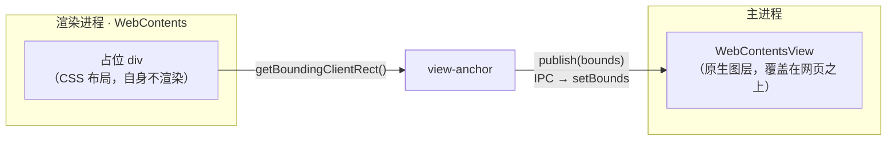

# view-anchor

让一块主进程原生视图（Electron `WebContentsView`）始终贴住一个 DOM 元素的屏幕矩形。它测量目标元素的 `getBoundingClientRect()`，把矩形交给注入的 `publish` 回调（由你接上 IPC → `setBounds`），并在元素位移或缩放时重新发布。

核心不依赖 React、Electron 或任何宿主布局引擎；涉及 React 的代码只在适配层。

<iframe
  src="./anchor-3d.html"
  title="view-anchor 交互演示"
  style={{ width: '100%', height: '560px', border: '0', borderRadius: '12px' }}
/>

## 架构



`WebContentsView` 是主进程对象，位置只能由主进程 `setBounds` 设定；而布局是渲染进程用 CSS 算的。两边不直接接触，view-anchor 就是它们之间的桥：占位 div 在 DOM 里占位但不渲染，原生视图浮在其上，由 view-anchor 维持贴合。`publish` 是注入的，所以核心对 Electron 一无所知——测试里它是 spy，生产里是一次 IPC 发送。

## createViewAnchor(target, opts)

命令式核心，把一块原生视图绑定到一个元素，返回 `{ update, dispose }`。

```ts
const handle = createViewAnchor(target, {
  present: true,                 // 是否挂载原生视图
  publish: (bounds) => { ... },  // 接收实时矩形，负责 IPC → setBounds
})
```

| 状态 / 调用 | 行为 |
|---|---|
| `present: true` | 立即发布测量矩形，之后在每次 `ResizeObserver` 触发、窗口 `resize` 时**同步**重新发布。 |
| `present: false` | 停止观察，发布一次 `{0,0,0,0}`。 |
| `update(opts)` | 按新选项同步重新应用（重置去重基线，强制重发一次）。 |
| `dispose()` | 停止观察、移除监听，此后不再发布（也不补发零矩形）。 |

测量矩形按 `Math.round` 取整；**width/height 钳到 ≥0（0=隐藏信号），但 x/y 允许负**——元素滚出上 / 左边缘时原点本就该是负的，钳零会把原生视图钉在边缘而非跟随它移出屏外（各消费者的 IPC schema 自己定 origin 策略）。

**同步发布，不走 RAF**：原生 overlay 是跨进程 `WebContentsView`，`setBounds` 本就比渲染进程的 DOM 绘制晚约 1 个合成帧；再用 RAF 推迟一帧 → 拖拽时 overlay 可见拖尾（放大时露背景最明显）。在触发回调里直接测量+发布去掉这一自加的帧。RAF 原本承担的「合并同帧多次触发」由**同值去重**接管：若本次测量矩形与上次已发布的逐字段相等就丢弃，所以一次连续拖拽里每个不同矩形至多发一次。`update` 会先把去重基线清空，保证状态变化（zoom 骑在 `publish` 闭包里、不在 `Bounds` 里）即使几何不变也重发一次。

撤销安全：没有排队的帧可以「跑赢」状态变化——每次发布开头同步读 `disposed`/`present`，`update`/`dispose` 之后的触发立即 bail。

## present / 零矩形 语义

- **`present`** —— 「原生视图是否该挂载」的唯一事实来源，与 DOM 生命周期解耦。
- **`{0,0,0,0}`（ZERO）** —— 收起信号。宿主把零面积读作「摘除子视图，但保留其 `WebContents` 存活」，即收起而非销毁，重新挂载瞬时且状态完整。
- **dispose 后保持静默** —— 不补发零矩形。元素真正消失时，应由调用方先发 ZERO 再 dispose（适配层已替你处理）。

## createPlacementAnchor(target, opts) — 显式可见性变体

`createViewAnchor` 用零矩形 `{0,0,0,0}` 兼任「收起」信号，可见性是从几何推断的。`createPlacementAnchor` 把可见性提升为显式判别式，发的是 `Placement` 而非 `Bounds`：

```ts
const handle = createPlacementAnchor(target, {
  visible: true,                 // 调用方意图：视图是否该在屏
  publish: (placement) => { ... },
})
```

| 状态 / 选项 | 行为 |
|---|---|
| `visible: true` | 发 `measurePlacement(target)`（`{ visible:true, bounds }`），并在每次 `ResizeObserver` / `resize` 触发**同步**重发。 |
| `visible: false` | 发 `{ visible:false }`（**不是**零矩形），停止观察。 |
| `guardDisplayNone`（默认 false） | 开启后，测出零面积的 target（display:none / 卸载 / 首帧未稳）发 `{ visible:false }` 而非 `{ visible:true, bounds:0×0 }`，并挂 `IntersectionObserver` 捕捉 `ResizeObserver` 不上报的 display:none 切换。 |
| `followScroll`（默认 false） | 捕获阶段监听 `window` 的 `scroll`，祖先滚动容器滚动 target 时重测重发。 |
| `followGeometry`（默认 false） | 按需开窗的 RAF 几何哨兵，捕捉无 DOM 事件上报的祖先 transform / reflow 位移；几何静止几帧后自动关窗，空闲时零成本。可由 `pulse(durationMs?)` 显式开窗。 |

去重携带判别式（`samePlacement`），所以可见性翻转绝不会被同值合并掉——即使几何看上去一样。真正 0×0 但在屏的视图（`{ visible:true, bounds:{...,width:0} }`）与隐藏视图（`{ visible:false }`）由此可区分，而零矩形约定下二者会塌缩成同一个值。

## useViewAnchor(opts)

React 适配层，返回一个挂到占位元素上的 ref 回调。

```tsx
const ref = useViewAnchor({
  present,            // boolean
  publish,            // (bounds) => void
  deps: [signature],  // 可选：会移动矩形、但 DOM 看不见的状态
})
return <div ref={ref} />
```

| 时机 | 行为 |
|---|---|
| 挂载 | `createViewAnchor(el, opts)` |
| `opts` / `deps` 变化 | `update` |
| 卸下（`ref → null`）或卸载 | 先发一帧零矩形，再 `dispose` |

**`deps`** —— `ResizeObserver` 只响应纯几何变化。会移动矩形却不改变被观察元素尺寸的状态（布局拓扑签名、路由切换、兄弟标签页 `display:none`）要放进 `deps`。数组长度需在每次渲染间保持稳定。

> 适配层已处理 React 18 StrictMode 的 effect 双触发，以及 hidden→shown 重挂载——保证恰好发布一次真实矩形、不误发零矩形。

## 文件

| 文件 | 作用 |
|---|---|
| `src/view-anchor.ts` | 正向命令式核心 `createViewAnchor` / `createPlacementAnchor` / `measurePlacement`。无 React、无 Electron。 |
| `src/react.ts` | React 适配层 `useViewAnchor`（基于 `createViewAnchor`）。 |
| `src/size-advertiser.ts` | 反向命令式核心 `createSizeAdvertiser`。 |
| `src/measure-loop.ts` | 反向专用的 RAF 合并 / 去重 / dispose 引擎 `createMeasureLoop`（不导出）。 |
| `src/types.ts` | `Bounds`、`Placement`、各核心的选项与句柄类型、反向的 `AdvertisedAxis` / `AdvertisedSize`。 |
| `src/index.ts` | 对外公开面。 |

正向运行时依赖只有 `react`（仅适配层）和浏览器 API（`ResizeObserver`、`getBoundingClientRect`、`window` 的 `resize` 监听）。`requestAnimationFrame` 只在反向 `createSizeAdvertiser`（经 `createMeasureLoop`）和 `createPlacementAnchor` 的 opt-in `followGeometry` 哨兵里用；正向的 `createViewAnchor` 同步发布、不走 RAF。
