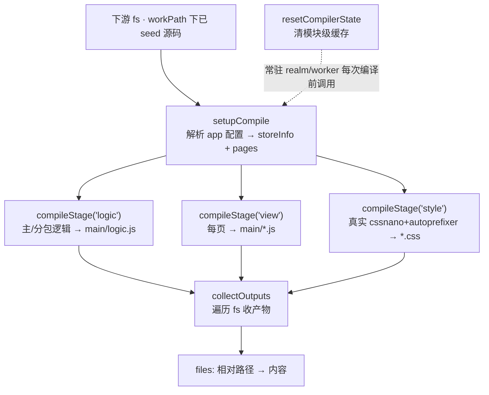

# @dimina-kit/web-compiler

把小程序源码编译成 dimina 产物的编译器——**不需要真实文件系统**，因此既能在浏览器（Web Worker）里跑，也能在 Node 里跑。

它本身不重写编译逻辑：真正干活的是 `dimina` 子模块 fe workspace 里的 `@dimina/compiler`，那套代码通篇 `import fs from 'node:fs'` + `fs.xxx`。本包把 `node:fs` 换成一个**转发 shim**，并且**自己不带任何 fs 实现**——**由下游注入一个 `node:fs` 替代品**（`compileMiniApp({ fs })`），compiler 一行不改就跑在你的 fs 上；项目目录（`workPath`）也由下游指定。最省事的 fs 就是 [memfs](https://github.com/streamich/memfs)。

产出两个自包含 bundle：

| 入口 | 产物 | 运行环境 | wasm 工具链 |
| --- | --- | --- | --- |
| `@dimina-kit/web-compiler` | `dist/compile-core.node.js` | Node | 原生 esbuild/oxc 保持 external，运行时从 node_modules 解析 |
| `@dimina-kit/web-compiler/browser` | `dist/compile-core.browser.js` | 浏览器 / Worker | 不打包，由宿主 worker 注入（见下） |

## 架构

本包是**编译器与文件系统之间的一层适配**。真正的编译逻辑在 `dimina` 子模块的 `@dimina/compiler`（通篇 `import fs from 'node:fs'`），本包用一个**无后端的 fs 转发 shim** 把它每一次 `fs.xxx` 指向下游注入的 fs——自己不带任何 fs、不认识 OPFS/网络、不搬二进制，子模块一行不改。源码放哪、`workPath` 是什么、fs 用 memfs 还是别的，全由下游决定。

```
   下游（Node 进程 / 浏览器 Worker）——拥有并 seed 源码
   ┌──────────────────────────────────────────────┐
   │ fs 实现: memfs / OPFS-hydrate 进 memfs / …    │  workPath 下已 seed 源码
   └───────────────────────┬──────────────────────┘
                           │ compileMiniApp({ fs, workPath })  注入
                           ▼
   ┌──────────────────────────────────────────────┐
   │ @dimina-kit/web-compiler                       │
   │  src/shims/fs.js  无后端转发层 setFs/resetFs    │  每次 fs.xxx → 转到下游 fs
   │  src/shims/*      oxc/esbuild/less… 浏览器替身  │  (浏览器 wasm 工具链由宿主注入)
   └───────────────────────┬──────────────────────┘
                           │ 相对引用，不改子模块
                           ▼
   ┌──────────────────────────────────────────────┐
   │ dimina 子模块 · @dimina/compiler（实体编译逻辑）│  import fs from 'node:fs'
   └──────────────────────────────────────────────┘
```

## 编译流程与 stage 接缝

`compileMiniApp` 内部拆成四个可单独调用的**接缝**（浏览器/Node 两个 bundle 都导出），下游因此能**常驻 worker 复用 realm**、按 **stage 级并行**编译（三个 worker 各跑一个 stage，产物互不相交、`Object.assign` 取并集即得整份构建；参考实现见 `dimina-web-client` 的 coordinator/stage worker）：



| 接缝 | 职责 |
| --- | --- |
| `setupCompile({ fs, workPath })` | 解析 app 配置 + 构建 miniprogram_npm，返回 `{ storeInfo, pages, appId, name, targetPath, workPath }`（`storeInfo` 可序列化，跨 worker 传） |
| `compileStage({ stage, pages, storeInfo, fs })` | 编译单个 stage（`logic`/`view`/`style`），产物写回 fs；各 stage 产物互不相交 |
| `collectOutputs({ fs, targetPath })` | 遍历 fs，把 `targetPath` 前缀下的产物读成 `{ 相对路径: 内容 }` |
| `resetCompilerState()` | 清掉编译器模块级缓存；**常驻 realm/worker 复用前必须调用**，否则第二次编译被污染 |

> `compileMiniApp` 就是「setupCompile → 三个 compileStage → collectOutputs」的组合，产物与直接调它完全一致；接缝只是把并行/复用的编排权交给下游。

## 用法

### API

```ts
compileMiniApp(options: {
  fs: DiminaFs        // 必填：下游注入的 node:fs 替代品，已 seed 好项目源码
  workPath?: string   // 项目根（下游 seed 源码的目录），默认 '/work'
}): Promise<{
  appId: string
  name: string
  files: Record<string, string>   // 产物：相对产物根的路径 → 内容
}>

initToolchain(): Promise<void>     // 占位，保持 API 稳定；浏览器版由宿主注入 wasm 工具链
```

`fs` 是唯一入口：compiler 的每一次读写都落到你传入的 fs 上，产物也写回它、编译完由本包遍历取出。下游要实现的同步子集（基于 compiler 的实际调用面）：

```ts
interface DiminaFs {
  // 读
  existsSync(path): boolean
  readFileSync(path, 'utf8'): string
  readdirSync(path): string[]
  readdirSync(path, { withFileTypes: true }): Dirent[]   // Dirent 带 isDirectory()/isFile()
  statSync(path): { isFile(): boolean; isDirectory(): boolean }
  // 写（compiler 把产物写回 fs）
  writeFileSync(path, data): void
  mkdirSync(path, { recursive }): void
  copyFileSync(src, dest): void
  rmSync(path, { recursive, force }): void
}
```

> 全部**同步**：`compileMiniApp` 可达的编译路径上 compiler 只用同步 fs（唯一的 callback 版 `fs.readdir` 在 CLI/watch 路径，不经此入口）。所以异步后端（网络 / IndexedDB 的异步 API）实现不了 `readFileSync`。

### Node（用 memfs 当 fs）

memfs 完整实现了上面的契约，`Volume.fromJSON(files, cwd)` 的第二参就是项目目录，键写相对路径即可：

```js
import { Volume, createFsFromVolume } from 'memfs'
import { compileMiniApp } from '@dimina-kit/web-compiler'

const workPath = '/project'                    // 项目目录由下游决定
const vol = Volume.fromJSON({
  'app.json': JSON.stringify({ pages: ['pages/index/index'] }),
  'pages/index/index.js': 'Page({})',
  'pages/index/index.wxml': '<view>hello</view>',
  'pages/index/index.wxss': '.x{color:red}',
}, workPath)

const { appId, name, files } = await compileMiniApp({
  fs: createFsFromVolume(vol),
  workPath,
})
```

Node 下 compiler 的原生 `esbuild` / `oxc-parser` 等保持 external，运行时需能从 node_modules 解析（做法见 `scripts/kit-resolve-hook.js`）。

### 浏览器 / Worker

浏览器 bundle 刻意不打包 wasm 工具链（把 esbuild-wasm、oxc-parser 的 wasm 内联进单个 bundle 会破坏它们的运行时）。宿主 worker **只需注入这两个 wasm hook**（`__esbuildTransform` + `__oxcParseSync`），再建 fs、编译：

```js
// 1. 宿主以 pristine 方式加载 wasm 工具链并挂到全局
globalThis.__esbuildTransform = (input, options) => esbuild.transform(input, options)
globalThis.__oxcParseSync = oxcParseSync

// 2. worker 自带 memfs（或任意 DiminaFs 实现），seed 源码
import { Volume, createFsFromVolume } from 'memfs'
import { compileMiniApp, initToolchain } from '@dimina-kit/web-compiler/browser'

await initToolchain()                          // no-op，仅为兼容保留
const vol = Volume.fromJSON(files, '/project') // files: { 相对路径: 内容 }
const result = await compileMiniApp({ fs: createFsFromVolume(vol), workPath: '/project' })
```

> **CSS 工具链已内联。** 浏览器 bundle 打包了**真实的 `cssnano` + `autoprefixer`**（与 node/dmcc 同版），所以 wxss 产物压缩/前缀与 dmcc **逐字节一致**——宿主**不用**为 CSS 注入任何东西，`process.cwd`/`__filename`/`os.homedir` 都由构建时的 banner/define/shim 兜好了。宿主要注入的只有 esbuild + oxc 两个 wasm hook。（构建时设 `REAL_CSS=0` 可退回不压缩的 no-op,仅用于排查。）

### 源码分发：OPFS（下游提供，本包不碰）

上面单 worker 的例子里源码是 postMessage 传进 worker 的。多个 worker（stage 并行）时再逐个 postMessage 源码就会**把整份源码结构化克隆 N 份**（main→coordinator→3 worker = 克隆 4 次，大项目几 MB × 4）。浏览器里更省的做法是 **OPFS**（Origin Private File System）——page 和它所有 worker 共享的 per-origin 文件系统:**下游把源码写进 OPFS 一次,把目录 handle 递给各 worker,源码零克隆**。

关键是**归属边界**：**OPFS 由下游创建、命名、填充,并把 `FileSystemDirectoryHandle` 递给 worker;本包只见注入进来的（memfs）fs,完全不认识 OPFS,也不创建它**。而且编译器要的是**同步** fs,OPFS 的目录/元数据是异步的喂不了它 → 每个 worker 拿到 handle 后**先 hydrate 成 memfs** 再走注入。

```js
// —— 页面（下游）：源码写进 OPFS 一次,拿目录 handle,递给 worker ——
async function writeSourceToOpfs(token, files) {          // files: { 相对路径: 内容 }
  const root = await navigator.storage.getDirectory()
  const base = await root.getDirectoryHandle(token, { create: true })
  for (const rel of Object.keys(files)) {
    const parts = rel.split('/'); const name = parts.pop()
    let dir = base
    for (const seg of parts) dir = await dir.getDirectoryHandle(seg, { create: true })
    const fh = await dir.getFileHandle(name, { create: true })
    const w = await fh.createWritable(); await w.write(files[rel]); await w.close()
  }
  return base                                             // FileSystemDirectoryHandle
}
const srcDir = await writeSourceToOpfs('proj-1', files)
worker.postMessage({ srcDir, workPath: '/project' })      // handle 结构化克隆=零拷贝,源码不过 postMessage

// —— worker（下游）：读递来的 handle → hydrate 进 memfs → 注入本包 ——
import { Volume, createFsFromVolume } from 'memfs'
import { compileMiniApp, resetCompilerState } from '@dimina-kit/web-compiler/browser'

async function filesFromDir(dir, prefix = '') {           // 只读递来的 handle,不碰 navigator.storage
  const out = {}
  for await (const [name, h] of dir.entries()) {
    const rel = prefix ? `${prefix}/${name}` : name
    if (h.kind === 'directory') Object.assign(out, await filesFromDir(h, rel))
    else out[rel] = await (await h.getFile()).text()
  }
  return out
}
self.onmessage = async ({ data: { srcDir, workPath } }) => {
  const files = await filesFromDir(srcDir)                 // OPFS → { 相对路径: 内容 }
  const vol = Volume.fromJSON(files, workPath)             // hydrate 进 memfs(同步 fs,编译器要的)
  resetCompilerState()                                    // 常驻 worker 复用必调
  const result = await compileMiniApp({ fs: createFsFromVolume(vol), workPath })
  self.postMessage(result)
}
```

> OPFS 只是**源码分发的真相源**（一次写、多 worker 独立读、零克隆），编译仍在 memfs 上。这与 dmcc「以真实 fs 为源」一致,且不需要 SharedArrayBuffer。三个 stage worker 各自这样 hydrate,再各跑一个 stage,即下面的 stage 级并行。

### 常驻 worker 复用 与 stage 级并行

冷启动的大头是 wasm 工具链加载（数秒），编译本身在 memfs 上很快。所以让 worker **常驻**、只热身一次、之后每次编译前 `resetCompilerState()` 清缓存即可复用同一 realm：

```js
import { compileMiniApp, resetCompilerState } from '@dimina-kit/web-compiler/browser'

resetCompilerState()                            // 复用前必须:否则模块级缓存污染第二次编译
const r = await compileMiniApp({ fs, workPath })
```

要进一步和 dmcc 一样按 **stage 级并行**（三个常驻 worker 各跑一个 stage），用分阶段接缝:主线程 `setupCompile` 一次，把 `storeInfo`/`pages` 发给三个 worker，各自对**已 seed 同源的 fs** 跑一个 stage，产物互不相交、`Object.assign` 取并集即整份构建：

```js
import { setupCompile, compileStage, collectOutputs, resetCompilerState } from '@dimina-kit/web-compiler/browser'

// 每个 worker 各自:(fs 已 seed 相同源码,例如从 OPFS hydrate)
resetCompilerState()
const { storeInfo, pages, targetPath } = await setupCompile({ fs, workPath })
await compileStage({ stage: 'style', pages, storeInfo, fs })   // 本 worker 只跑分到的 stage
const partial = collectOutputs({ fs, targetPath })            // 该 stage 的产物子集

// 主线程:合并三个 worker 的 partial(互不相交)
const files = Object.assign({}, logicPart, viewPart, stylePart)
```

> stage 级并行的完整参考实现（OPFS 源分发 + coordinator + 三 stage worker）在 `dimina-web-client` 的 `demo/coordinator.worker.js` / `demo/compiler.worker.js`。本包只提供接缝，**并行/复用/源码分发的编排权全在下游**。

## fs 契约与约定

- **本包不带 fs 实现。** `src/shims/fs.js` 是个转发层，`compileMiniApp({ fs })` 在一次编译期间把 compiler 的 `fs.xxx` 指向你的 fs（`setFs`/`resetFs`）；不注入则任何 `fs.*` 调用直接抛错。
- **项目目录由下游定。** `workPath`（默认 `/work`）就是你 seed 源码的目录；产物写在编译器的 `targetPath` 下，本包遍历 `fs` 把该前缀下的文件读出、还原成相对路径返回。
- **只走文本。** 键=相对路径、值=文本内容；二进制资源（图片等）要由你的 fs 自己写进去——本包只负责编译，不搬运二进制。
- **产物写回同一个 fs。** compiler `writeFileSync` 把产物写进你的 fs，所以传入的 fs 必须可写。
- **同步契约，不需要 `fs.promises`。** `DiminaFs` 只要求上面那些**同步**方法——`compileMiniApp` 的编译路径不碰任何 async fs，所以你的 fs 实现**不必**提供 `promises`。（本包为满足 `node:fs/promises` 这个别名保留了一个 `.promises` 门面，只是把调用转发到你 fs 的 `promises`；当前编译路径一次都不会走到它。）反过来，纯异步后端——只有 Promise 版读写、没有同步方法——**没法**当 fs 用，因为 `readFileSync` 这类同步调用是硬要求。

`@dimina/compiler` 自己并不知道 fs 被换掉了。

## 依赖前置

编译器实体源码在 `dimina` 子模块里，dart-sass 等在其 fe workspace。构建前确保子模块已初始化、依赖已装：

```bash
git submodule update --init dimina
pnpm install
```

## 构建

```bash
pnpm --filter @dimina-kit/web-compiler build          # node + browser
pnpm --filter @dimina-kit/web-compiler build:browser  # 仅浏览器版
pnpm --filter @dimina-kit/web-compiler build:node     # 仅 node 版
```

## 测试

测试里用 memfs 扮演「下游 fs」：

```bash
pnpm --filter @dimina-kit/web-compiler test:node        # Layer1: 编译 base 示例、校验产物
pnpm --filter @dimina-kit/web-compiler test:appid       # appId fallback 守卫
pnpm --filter @dimina-kit/web-compiler test:decompose   # stage 接缝各自独立、产物互不相交
pnpm --filter @dimina-kit/web-compiler test:realm-reuse # resetCompilerState 后复用 realm 与全新 realm 一致
```

## 结构

- `src/compile-core.js` — 内联编排 dmcc 的 compile 函数;导出 `compileMiniApp` 与四个分阶段接缝 `setupCompile`/`compileStage`/`collectOutputs`/`resetCompilerState`（`compileMiniApp` 即前三者的单-realm 组合）。校验并 `setFs` 注入的 fs、编译后遍历 fs 收产物。相对路径引用同仓 `dimina` 子模块的 compiler 源码。
- `src/browser-entry.js` — 浏览器入口，`compileMiniApp()` + 四个接缝 + `initToolchain()`（no-op）。
- `src/shims/fs.js` — **无后端的 fs 转发层**（`setFs`/`resetFs`/`getFs`）；compiler 所有 `fs.xxx` 走它，未注入即抛错。
- `src/shims/*` — 其余 node 内置与原生依赖的浏览器替身（oxc/esbuild/less/`os.homedir`/…）。
- `scripts/build-compiler.js` — esbuild 打包。onLoad 给 logic/view/style-compiler 与 utils 追加 `__reset*` 导出（喂给 `resetCompilerState`，不改子模块源码）；浏览器分支内联真实 `cssnano`+`autoprefixer`（autoprefixer pin 到 node/dmcc 解析的同一份，避免 esbuild 解析到多加 `-ms-` 前缀的另一版本）。
- `scripts/{register-kit,kit-resolve-hook}.js` — node 测试用的 ESM resolve hook（默认解析优先、从 dimina-kit workspace 根解析 bare 依赖兜底）。
